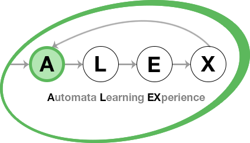

    

# ALEX

Automata Learning EXperience (ALEX) is an extension of [LearnLib][learnlib] that allows you run automated tests on web 
applications and JSON-based REST APIs using active automata learning.

Users model [Selenium][selenium]- or HTTP-based test inputs for their application, which are used to automatically infer 
an automaton model (a [Mealy machine][mealy]), which represents the behavior of the web application.

## Requirements

To run ALEX, install the following software on your machine:

- [Docker][docker]
- [Docker Compose][docker-compose]

## Installation

### Production

1. [Download](https://github.com/LearnLib/alex/releases/latest) the `docker-compose.deploy.yml` file for the latest version.
2. Run `docker-compose -f docker-compose.deploy.yml pull`
3. Run `docker-compose -f docker-compose.deploy.yml up`
4. Open `127.0.0.1` in a web browser to access the frontend.

**Services**

| Port | Service            |
|------|--------------------|  
| 80   | Frontend           |
| 8000 | API                |

### Development

1. Checkout the repo
2. Run `docker-compose -f docker-compose.develop.yml pull`
3. Run `docker-compose -f docker-compose.develop.yml up`
4. Open `http://127.0.0.1:4200` in a web browser to access the frontend

**Services**

| Port | Service            |
|------|--------------------|  
| 4200 | Frontend           |
| 8000 | API                |
| 4444 | Selenium Hub       |
| 5900 | Chrome VNC server  |
| 5901 | Firefox VNC server |

For both, the Chrome and the Firefox VNC server, you can use the password `secret`.

## Credentials

After the first start, you can log in as an admin using the account below:

Email: *admin@alex.example*  
Password: *admin*

## Further links

### Documentation

* [User manual](https://learnlib.github.io/alex/book/2.0.0/)
* [Examples](https://learnlib.github.io/alex/book/2.0.0/contents/examples/todomvc/)
* [Developer docs](https://learnlib.github.io/alex/book/2.0.0/contents/dev-docs/development/)

### Downloads

* [Releases](https://ls5download.cs.tu-dortmund.de/alex/builds/releases/)
* [Nightly builds](https://ls5download.cs.tu-dortmund.de/alex/builds/nightly/)

### Background & related tools

* [Active automata learning](https://scholar.google.de/scholar?hl=de&q=active+automata+learning)
* [LearnLib](https://learnlib.de/)
* [AutomataLib](https://github.com/Learnlib/automatalib)

[learnlib]: https://github.com/LearnLib/learnlib
[mealy]: https://en.wikipedia.org/wiki/Mealy_machine
[selenium]: https://www.seleniumhq.org/
[ltsmin]: http://ltsmin.utwente.nl/
[docker]: https://www.docker.com/
[docker-compose]: https://docs.docker.com/compose/