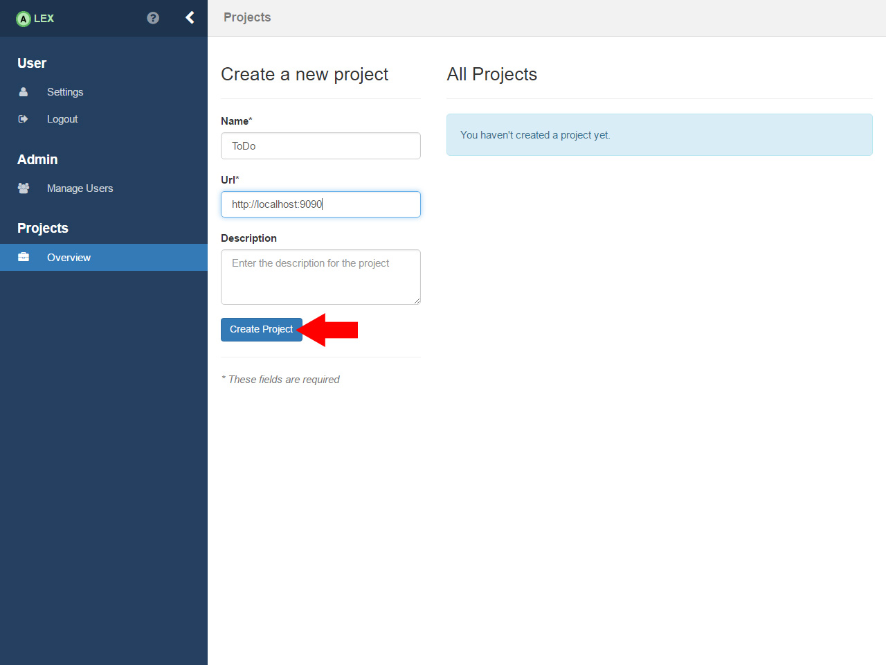
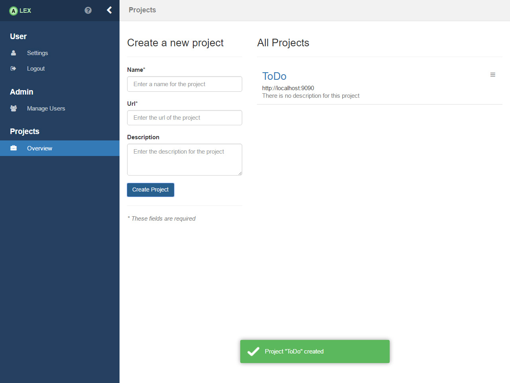
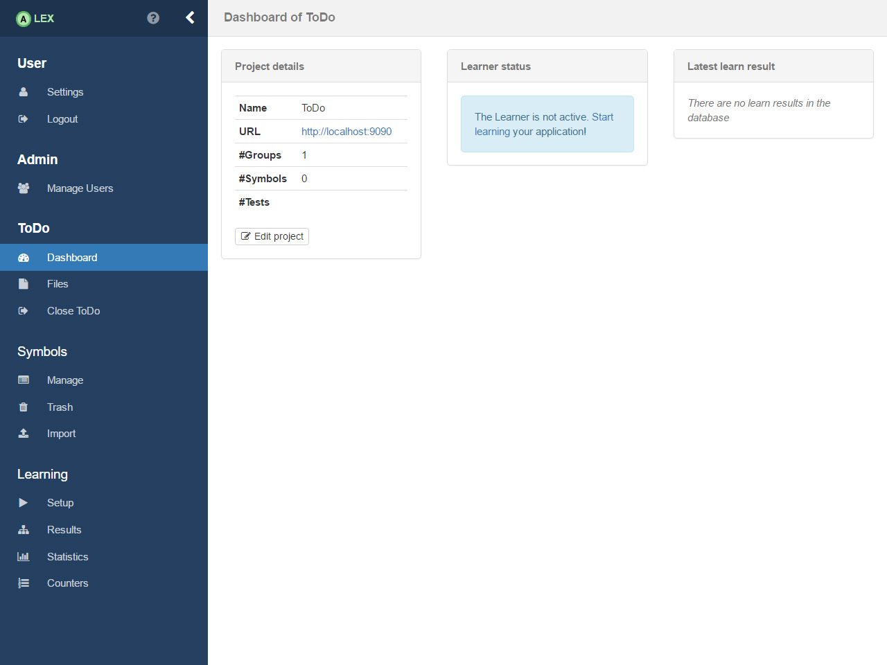

# Project Setup

To create a new project enter a name of your choice (here _ToDo_) and enter `http://localhost:9090`, i.e. the URL where
ToDo started, in the URL-field. Optionally, enter a description and press the __Create Project__ button. A message
should pop up and the project should be listed on the right side.

Click on the name of the newly created project in the list to open it. You are beeing redirected to the projects
dashboard where a brieg overview of the project and current learn processes are displayed. On the left, new navigation
items are shown to navigate through ALEX.

