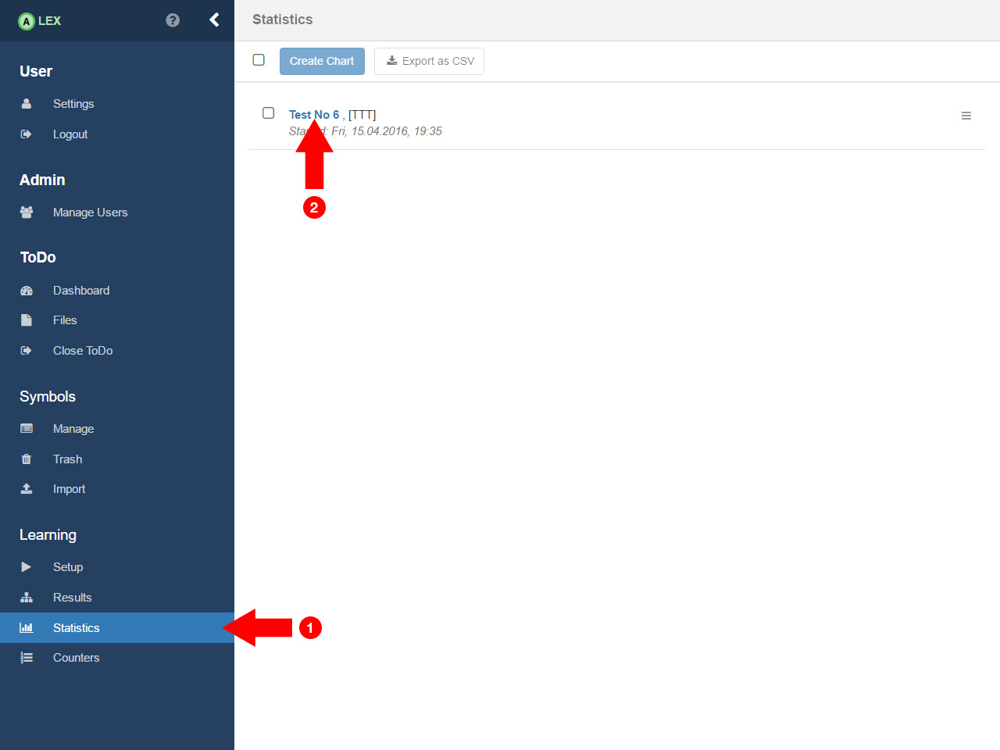

# View Results

In ALEX, you can generate statistics of a learn process if you are interested in it.

In this case, click on the __Statistics__ item from the sidebar. 
The view opens that lists all learned processes. 
Click on the result you want to view statistics from and some plots are generated.

