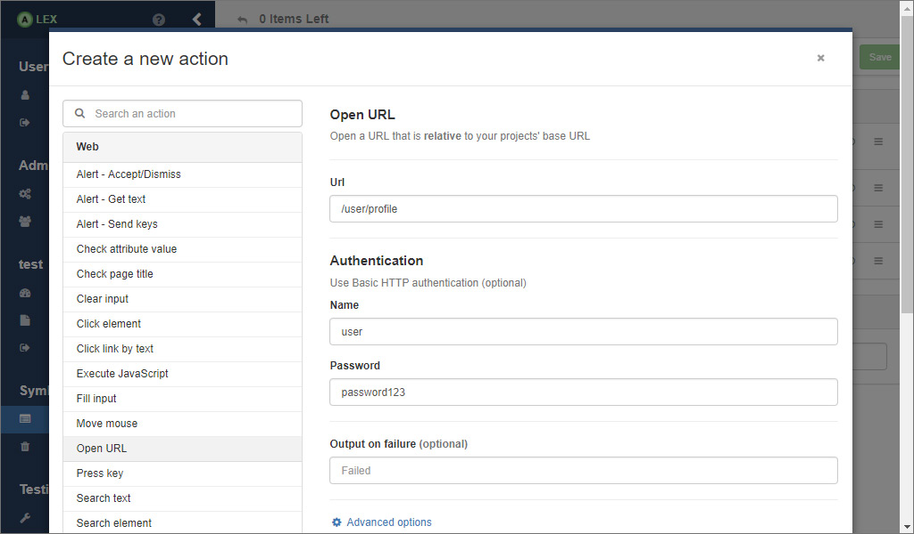
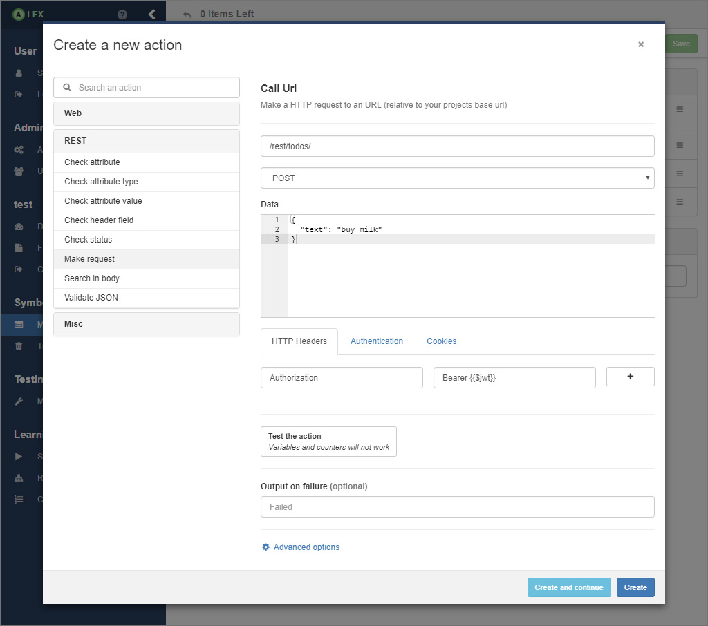
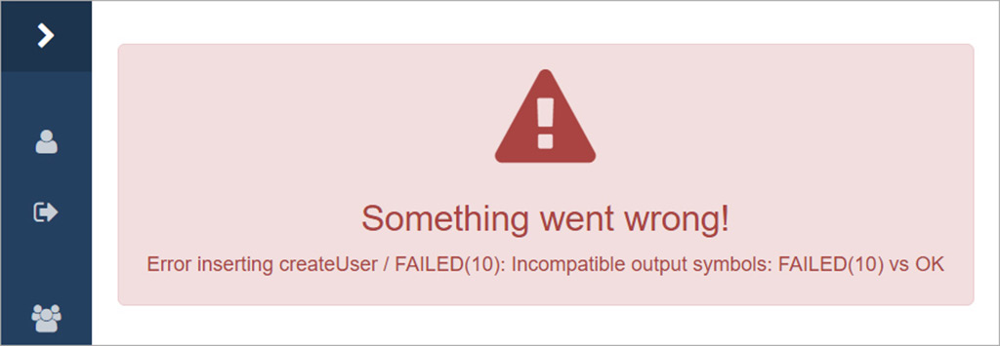

# Best Practices

In this section, some of the best practices for using ALEX are written down. These rely on our own experiences while modelling and learning several web applications.

## Symbol Modelling

When modelling symbols, the granularity of modelling your application matters and it is advised that you **think in use cases**. Here is the reason why:

For example, if you create an input symbol for each possible click on each link or button, you might have a very detailed and concrete model of your applications behavior, but it will not be visually observable. 
Additionally, learning will usually take much longer as the number of symbols grows.

In contrast to that, you should not treat a symbol as a whole integration test. 
For example you could create a symbol _TestAuthenticationSystem_ that creates a user, logs him in and then out. 
This has several disadvantages. 
You do not test at any other point of your application if a logout is possible without explicitly modelling it twice. 
Furthermore, the learned model will most likely not represent your _real system_ very accurately.  

Instead, we think it is good if you create something in between those extremes. 
As already mentioned, try modelling **use cases** of your application. 
As an example, have a look at Wordpress. 
Possible symbols could be:

- Login
- Logout
- Create a post
- Publish a post
- Mark a comment as spam
- ...

Each point can be modelled as a symbol and the learned model will tell you clearly what is possible and what is not while still be able to easily find possible errors in an application.

## Modelling Authentication Systems

### Basic HTTP Authentication

The *Call* action and the *Open URL* action both support the specification of credentials, consisting of a login and a password, in order to use basic HTTP auth.

### JSON Web Tokens

JWTs are usually used to authenticate against REST APIs by sending an encoded token in the *Authorization* header, like `Authorization: Bearer <TOKEN>`. 
In ALEX, you can specify HTTP headers in the *Call* action.
It usually makes sense to store the JWT in a variable and let ALEX insert it dynamically, like in the image above.

### Cookie-based Authentication

In the *Call* action you can specify both, cookies and additional HTTP header fields, if necessary.

## Resetting an Application

While learning, sequences of symbols are created and executed on your application. 
We assume that your application behaves deterministically, i.e. each sequence that is executed will always, at any time in the system yield the same output. 
As a consequence, for each sequence, the system has to be put in a state where all further executions are independent from the ones before.
For this reason it is required that you model a system reset with a separate symbol.

What a reset looks like is up to you and depends on your application, but here are some examples that might be relevant for your application:

If you have a **static web site** that only consists of a few linked html files and you want to make sure they are linked correctly, the reset symbol could consist of an action to go to the front page.

If you have a **user management system** and want to test user specific features only, your reset symbol could simply consist of the creation of a new user. 
For example if you want to test a users ability to create, update and delete a business entity, then, a reset could create a new user and log him in. 
If he now creates a entity, his action does not interfere with actions executed by previous users.

Sometimes it may be necessary to **clear the database** in order to remove all entities. 
Since we have no actions that connects to your database to execute queries you will have to work around that, e.g. by 

1. creating a temporary REST endpoint that is called that resets the database, or by 
2. adding a button to the frontend that is hidden in the admin panel that does the same.

As you can see, how you model a system reset is not always trivial and is highly dependant on how your application works and what exactly you want to test.

## Learning Process Configuration

Before you start a learning process, you can configure some parameters like the algorithm used or the equivalence oracle. 
ALEX runs all tests with reasonable preconfigured settings.
Here are some advices:

- The *TTT* algorithm usually performs best.
- The default settings for the Random Word equivalence oracle is ok for models that you do not expect to get bigger than 4 to 6 states. 
  There is no real rule of thumb here, but if you expect your models to be bigger that that, adjust the parameters correspondingly.
- The complete and W-method equivalence oracle can be used when you can run your tests over night or the weekend, or for a really small alphabet size. 
- Enabling the membership query cache is preferred.
- Provide multiple mirror URLs during the project creation so that equivalence oracles and some algorithms can perform better.

## Learning JavaScript Enabled Applications

- When modelling symbols for JavaScript heavy websites, e.g. single page applications, make use of the *wait for ...* actions when interacting with elements of the website. 
  This way, Selenium can handle dynamic changes of the DOM better.

## Further Remarks

- Sometimes, you might get a cryptic error message while learning (like in the image above) that says something like: *expected symbol ok ok failed(1) but got symbol ok failed(2) ok*.
  This means that the same query resulted in two different system outputs, which indicates that the system does not behave deterministically.
  More often, the real reason is one of the following:
  
  1. Faulty symbol modelling, triggered by a counter that has not been incremented or something like that.
  2. Selenium behaves off which mostly happens in single page applications.
     Refactor the modelling of the symbol that leads to the error, e.g. add more timeouts.
  3. The driver executable fails to connect to the web browser, which can happen at times.
     The only solution here is to continue learning from the last known hypothesis.