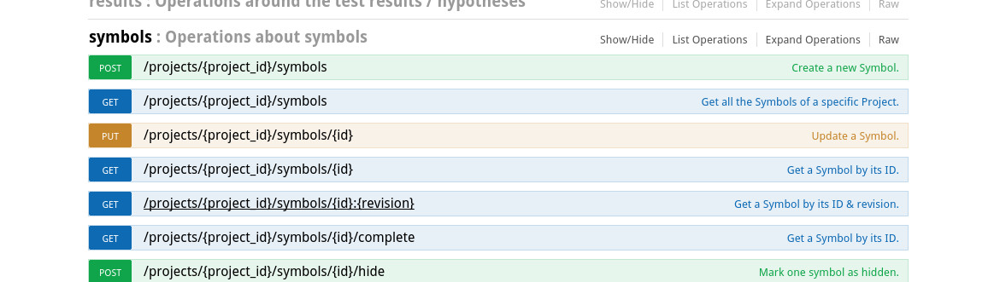

# REST Documentation

The server offers a [REST API](http://en.wikipedia.org/wiki/Representational_state_transfer) to manage the functionalities of ALEX.
The documentation of this API can be found at *"/restdocs/"* on your running server, e.g. http://localhost:8000/restdocs.

## Swagger

To create this documentation, a tool called [Swagger](http://swagger.io/) is used together with
[an JavaDoc doclet](https://github.com/Carma-Public/swagger-jaxrs-doclet) which creates the files for swagger based on
the code and some extra information in the JavaDoc.



To test REST resources which require an active user, please use the login method (which does not need an active user)
and copy the returned token into the *api_key* field on the top of the page.

Please notice: The swagger specification and the doclet both support inheritance of model classes, but the swagger-ui is 
incapable to render this information
(there are [several](https://github.com/swagger-api/swagger-ui/issues/300) 
[issues](https://github.com/swagger-api/swagger-ui/issues/1526) about that).

## Actions

Swagger does not show the actions, so here we go.
Every action has these attributes:

```json
{
    ...
    "negated": true|false,
    "ignoreFailure": true|false,
    "disabled": true|false,
    "errorOutput": "..."
}
```

### Web Actions

```json
{
    "type": "web_alertAcceptDismiss",
    "action": "ACCEPT|DISMISS"
}
```

```json
{
    "type": "web_alertGetText",
    "variableName": "variable"
}
```

```json
{
    "type": "web_alertSendKeys",
    "text": "some text"
}
```

```json
{
    "type": "web_checkForNode",
    "node": {
      "selector": "#node",
      "type": "CSS|XPATH"
    }
}
```

```json
{
    "type": "web_checkNodeAttributeValue",
    "node": {
      "selector": "#node",
      "type": "CSS|XPATH"
    },
    "attribute": "class",
    "value": "visible",
    "checkMethod": "IS|CONTAINS|MATCHES"
}
```

```json
{
    "type": "web_checkForText",
    "value": "Lorem Ipsum",
    "regexp": true|false
}
```

```json
{
    "type": "web_checkPageTitle",
    "title": "page title",
    "regexp": true|false
}
```

```json
{
    "type": "web_clear",
    "node": {
      "selector": "#node",
      "type": "CSS|XPATH"
    }
}
```

```json
{
    "type": "web_clickLinkByText",
    "value": "Click Me"
}
```

```json
{
    "type": "web_click",
    "node": {
      "selector": "#node",
      "type": "CSS|XPATH"
    },
    "doubleClick": true|false
}
```

```json
{
    "type" : "web_fill",
    "node": {
      "selector": "#node",
      "type": "CSS|XPATH"
    },
    "value" : "Lorem Ipsum"
}
```

```json
{
    "type": "web_goto",
    "url":  "http://example.com",
    "credentials": {
      "name": "username",
      "password": "password"
    }
}
```

```json
{
    "type": "web_pressKey",
    "node": {
      "selector": "#node",
      "type": "CSS|XPATH"
    },
    "key": "ESC|ENTER|..."
}
```

```json
{
    "type": "web_executeScript",
    "script": "window.alert('hi!')",
    "name": "variableName"
}
```

```json
{
    "type": "web_select",
    "node": {
      "selector": "#node",
      "type": "CSS|XPATH"
    },
    "selectBy": "VALUE|TEXT|INDEX",
    "value": "Lorem Ipsum"
}
```

```json
{
    "type": "web_submit",
    "node": {
      "selector": "#node",
      "type": "CSS|XPATH"
    }
}
```

```json
{
    "type": "web_switchTo",
    "target": "PARENT_FRAME|DEFAULT_CONTENT"
}
```

```json
{
    "type": "web_switchToFrame",
    "node": {
      "selector": "#node",
      "type": "CSS|XPATH"
    }
}
```

```json
{
    "type": "web_moveMouse",
    "node": {
      "selector": "#node",
      "type": "CSS|XPATH"
    },
    "offsetX": 10,
    "offsetY": 10
}
```

```json
{
    "type": "web_waitForNode",
    "node": {
      "selector": "#node",
      "type": "CSS|XPATH"
    },
    "maxWaitTime": 2000,
    "waitCriterion": "VISIBLE|INVISIBLE|ADDED|REMOVED"
}
```

```json
{
    "type": "web_waitForText",
    "node": {
      "selector": "#node",
      "type": "CSS|XPATH"
    },
    "maxWaitTime": 2000,
    "regexp": true|false,
    "value": "text to wait for"
}
```

```json
{
    "type": "web_waitForTitle",
    "value": "page title",
    "maxWaitTime": 2000,
    "waitCriterion": "IS|CONTAINS"
}
```

### Rest Actions

```json
{
  "type" : "rest_call",
  "method" : "GET|POST|PUT|DELETE",
  "url" : "http://example.com/api",
  "data" : "{}"
}
```

```json
{
  "type": "rest_checkAttributeExists",
  "attribute": "object.attribute"
}
```

```json
{
  "type": "rest_checkAttributeType",
  "attribute": "object.attribute",
  "jsonType": "STRING"
}
```

```json
{
  "type": "rest_checkAttributeValue",
  "attribute": "object.attribute",
  "value": "FooBar Lorem",
  "regexp": true
}
```

```json
{
  "type": "rest_checkForText",
  "value": "Lorem Ipsum",
  "regexp": true
}
```

```json
{
  "type": "rest_checkHeaderField",
  "key": "Key",
  "value": "Value",
  "regexp": true
}
```

```json
{
  "type": "rest_checkStatus",
  "status": 200
}
```

### Variable/ Counter Actions

```json
{
  "type": "assertCounter",
  "name": "counter",
  "value": 4,
  "operator": "LESS_THAN|LESS_OR_EQUAL|EQUAL|GREATER_OR_EQUAL|GREATER_THAN"
}
```

```json
{
  "type": "assertVariable",
  "name": "variable",
  "value": "value",
  "regexp": true|false
}
```

```json
{
  "type": "incrementCounter",
  "name": "counter",
  "incrementBy": 1
}
```

```json
{
  "type": "setCounter",
  "name": "counter",
  "valueType": "NUMBER|VARIABLE",
  "value": 42|"variableName"
}
```

```json
{
  "type": "setVariable",
  "name": "variable",
  "value": "foobar"
}
```

```json
{
  "type": "setVariableByCookie",
  "cookieType": "WEB|REST",
  "name": "variable",
  "value": "foobar"
}
```

```json
{
  "type": "setVariableByHTML",
  "name": "variable",
  "node": {
    "selector": "#node",
    "type": "CSS|XPATH"
  }
}
```

```json
{
  "type": "setVariableByJSON",
  "name": "variable",
  "value": "foobar"
}
```

```json
{
  "type": "setVariableByNodeAttribute",
  "name": "variable",
  "node": {
    "selector": "#node",
    "type": "CSS|XPATH"
  },
  "attribute": "href" 
}
```

```json
{
  "type": "setVariableByNodeCount",
  "name": "variable",
  "node": {
    "selector": "#node",
    "type": "CSS|XPATH"
  }
}
```

```json
{
  "type": "setVariableByRegexGroup",
  "name": "variable",
  "regex": "^foo(.*?)bar",
  "nthMatch": 1,
  "mthGroup": 1
}
```

### Misc. Actions

```json
{
    "type": "wait",
    "duration": 1000
}
```
