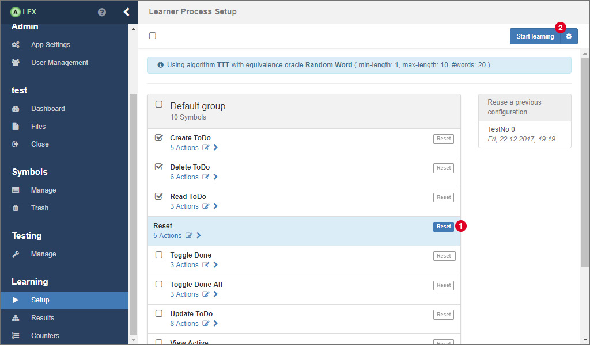

# Learning Setup

In order to start learning an application, a learn process has to be modeled. 
Such a process always consists of the following components:

* An input alphabet (set of symbols)
* A symbol to reset the application (see [this section](../../best-practices/README.md#resetting-an-application))
* A learning algorithm
* A parametrized equivalence oracle
* A maximum amount of steps to learn
* A specification of a web browser

In the setup view, the list of symbols is displayed from which you have to select the symbols that should be used for the input alphabet.
Furthermore, a special symbol that resets the application has to be selected.
Mark the corresponding symbol by clicking on the button 1.
Once selected, the reset symbol can not be included in the input alphabet.

## Configuration

The next step is the configuration of the learning process.
A click on the button with the gear icon at 2 opens the modal window that is displayed below.

Here, in the tab *"Learner"* (left), select a learning algorithm first.
Per default, the *TTT* algorithm is preselected because it usually performs better than the other available options.

Then, configure the equivalence approximation strategy:

<dl>
    <dt>Random Word</dt>
    <dd>
        The <em>Random Word</em> EQ oracle approximates an equivalence query by generating random words from the input alphabet and executes them on the system. 
        The oracles expects three parameters: <em>minLength (> 0)</em> defines the minimum length of a generated word, <em>maxLength (>= minLength)</em> the maximum length and <em>numberOfWords (> 0)</em> the amount of randomly generated words to test.
    </dd>
    <dt>Complete</dt>
    <dd>
        The <em>Complete</em> EQ oracle generates all possible words from an alphabet within some limits. 
        <em>minDepth (> 0)</em> describes the minimum length of word, <em>maxDepth (>= minDepth)</em> the maximum length.
    </dd>
    <dt>W-Method</dt>
        <dd>
            The <em>W-Method</em> EQ oracle generates words based on a transition coverage of the graph under the assumption of <em>maxDepth</em> additional states.
        </dd>
    <dt>Sample</dt>
    <dd>
        If this oracle is chosen, counterexamples are searched and specified manually by the user.
    </dd>
    <dt>Hypothesis</dt>
    <dd>
        Uses an ideal model of an application to search for differences and uses them as counterexamples.
        Note that the input alphabets should be the same.
    </dd>
</dl>

The input field for the maximum amount of steps to learn indicates how many intermediate hypotheses the learner has to generate before the learning process is stopped.
The value *-1* means that the learner stops if no more counterexample is found.
Another value, for example 3, would stop the learner after having generated three hypotheses, although this might not be the final one.
Of cause, if the final hypothesis is learned before those three steps, the learner stops beforehand.
This way, it is possible to e.g. learn the first three steps with a randomized equivalence oracle and then continue learning with another one.

In the *WebDriver* tab (right) you can configure which web browser is used for accessing the target web application during the learning process.
Each web driver has individual options which are displayed once you select a web browser from the select input.

    Xvfb is used for Linux enviroments where no phyiscal screen is present.
    Thus, this option can not be used if ALEX runs on a Windows machine.

Save the configuration with a click on the *Save* button.
Finally, click on the *Start learning* button in the button group 2 to start the learning process.
