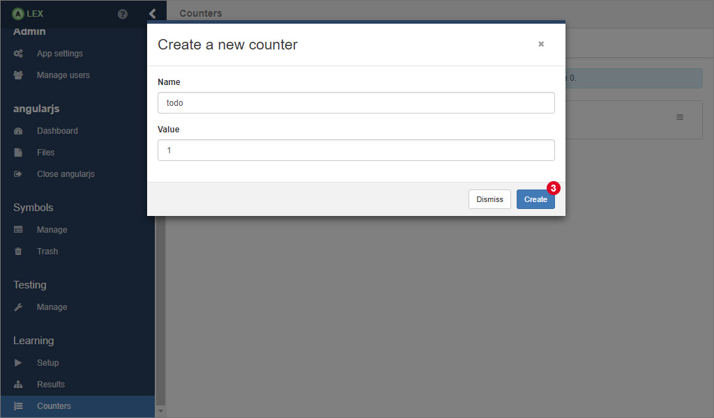
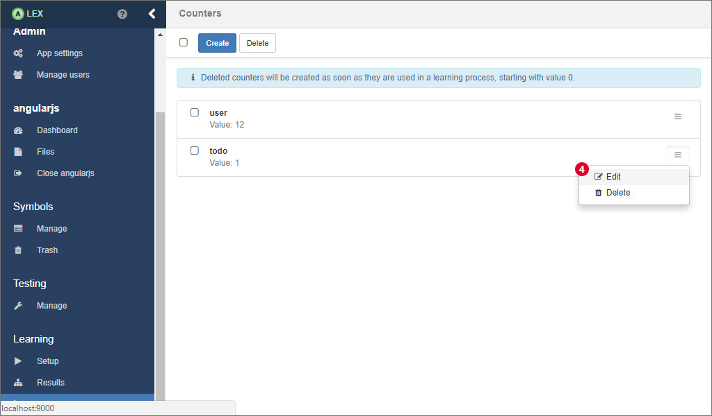
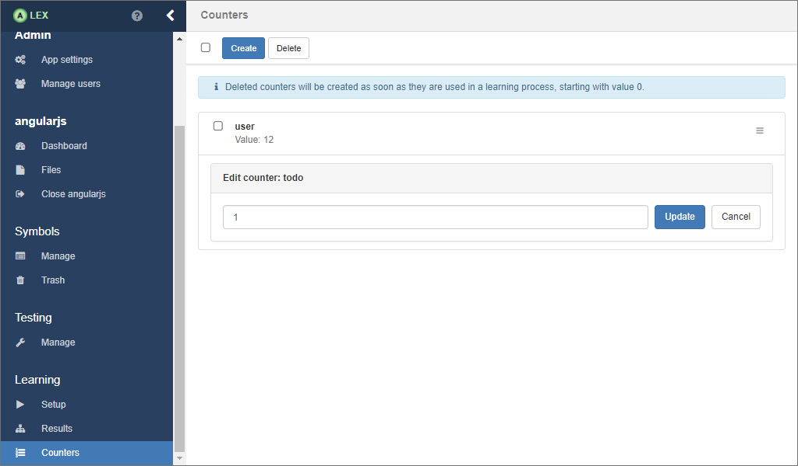

# Counters

As you may recall, counters are positive integer values that are created, modified and used during a learning process and persisted in the database over multiple learning processes.

On the counters page, which you can access by clicking on the item *Counters* 1 in the sidebar, the values of existing counters can be edited and new counters can be created.

For creating a new counter with a preset start value, click on 2 which opens a modal window.

Here, insert a unique name and the value in the input fields and click on *Create* 3.
If the counter has been created successfully, the modal dialog is closed and it appears in the list.

For editing the value of an existing counter, click on 4 in the dropdown menu, update the value in the form and finally, click on *Update*.