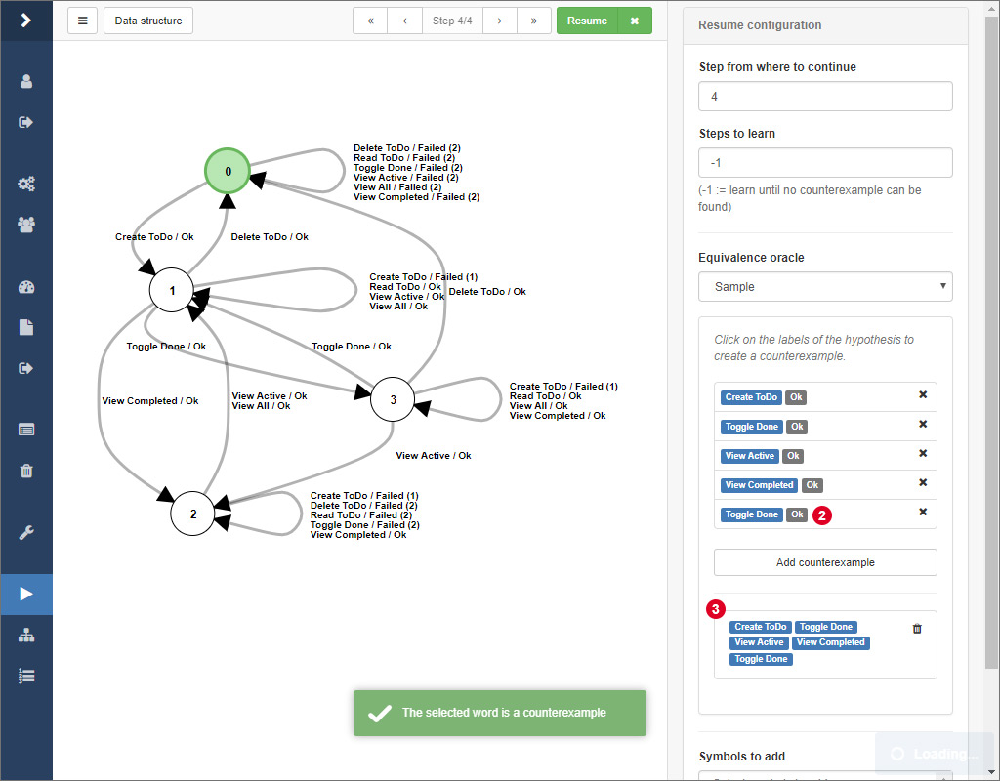

# Learning

After having started a learning process and while the learner is active, ALEX shows you a loading screen where you find different information about the current process.
In the top half, several statistics and the membership queries that are being executed at the moment are displayed.
Below, the current state of the model is displayed. 
You can navigate through all intermediate models 1 or view details about the current step, change the layout of the model and export the model in the menu 2.

Hypotheses are represented as Mealy machines and represent the learned behavior of the target application. 
Nodes are labeled from *0* to *n*, where nodes represent the internal states of the target application and state *0* (visualised by a green node) is the initial state. 
Edges denote transitions from one state to another where the edge labels show the symbols whose execution led to the transition into another state.
Edge labels have the following pattern:

- &lt;symbolName&gt; / Ok
- &lt;symbolName&gt; / Failed (&lt;number&gt;)
- &lt;symbolName&gt; / &lt;customOutput&gt;

where &lt;symbolName&gt; is the name of the symbol and the text after the "/" displays the output of the system.
In ALEX, the output of the system is interpreted as *"Ok"*, if all actions of a symbol have been executed successfully.
On the other hand *"Failed (n)"* means that the execution failed on the *n*-th action of the symbol.
As you may remember, in [this section](../symbol-modeling/actions.md) we introduced the possibility to define custom outputs.
Custom success or error outputs for a symbol have a higher priority over the default ones. 

After some time, when no more counterexamples can be found, the learner finishes and the final hypothesis is presented like above.
From here on, you can, if you find it necessary, configure how the learning process should be continued.
You can also select the equivalence oracle *Sample* and search for counterexamples by yourself, which is explained in the following.

## Finding Counterexamples Manually

Beside automated strategies for finding counterexamples, there is the option to search for counterexamples by hand directly on a model.

Therefore, select the equivalence oracle *Sample* from the select input in the sidebar.
Then, click together a word by clicking on the edge labels of the hypothesis.
After that, click on 1 to check if the word actually is a counterexample.

If this is the case, a notification will pop up and the actual system output of the word will be displayed at 3.
Finally, click on the *Resume* button to initiate the refinement of the model given your counterexample.

## Resuming a Previous Learning Process

The learning process usually takes a lot of time when learning models from web applications.
The more annoying it is if the learning process is interrupted due to various reasons and you have to start learning from the beginning.
Luckily, there is the possibility to resume an old process from an intermediate model.

In the results overview, expand the dropdown menu on the corresponding result and click on the item labeled by *Continue learning* 1.

You are being redirected to the view you should be familiar with from the learning process.
Here, simply select the step 2 you want to continue learning from and configure the equivalence oracle according to your needs.
Finally, click on 3 to resume the learning process.

    When resuming a learning process and using the random equivalence oracle, make sure you use a different seed that in the run before.
    Otherwhise, membership queries are posed that have been posed before, which is not effective.

You can even add additional input symbols that should be included in the next iteration of the learning process by selecting them in 4.

## Restrictions While Learning

While ALEX is learning there are some restrictions concerning the functionality:

1. You can not delete the current project as the instance is required by the learner. 
2. Due to the architecture of ALEX, there can always only be one learning process at a time per project.
