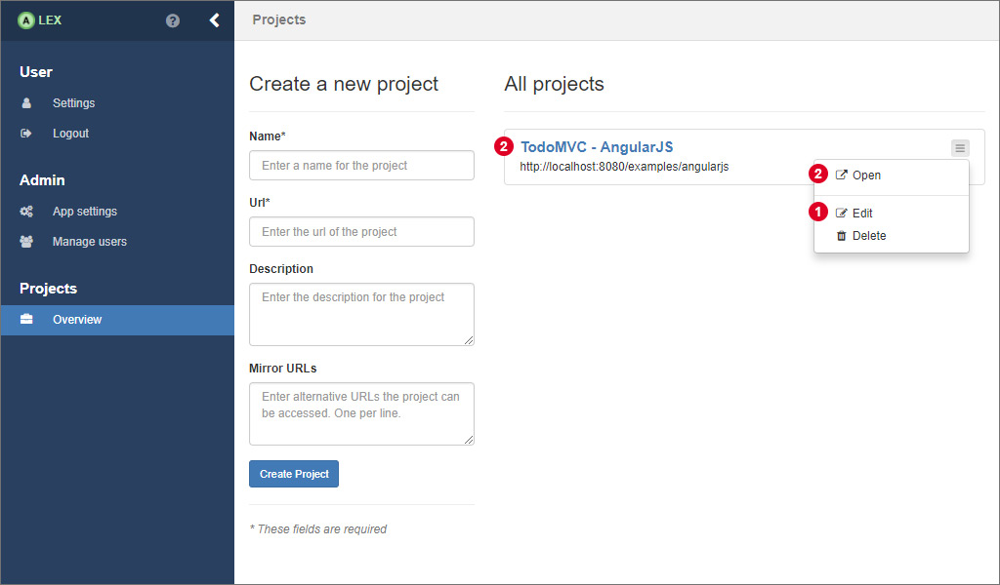
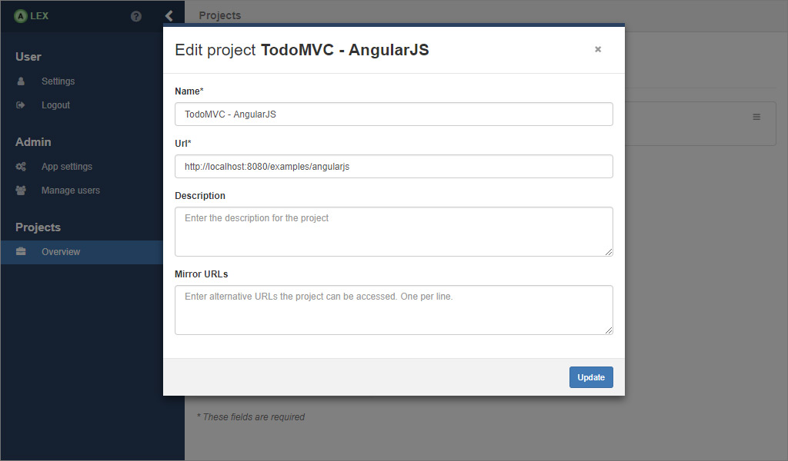
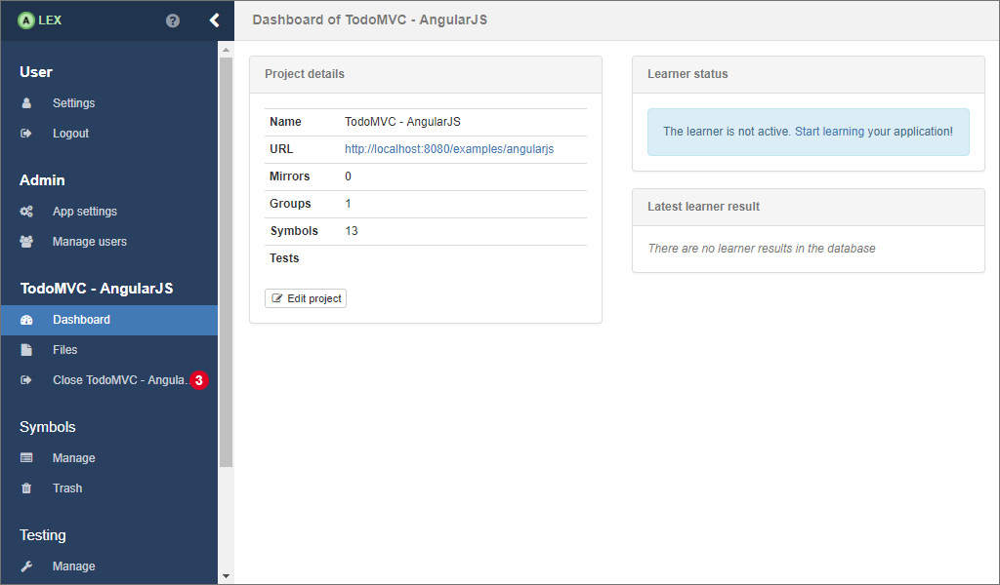

# Project Management

Projects are the entities that are used to manage multiple target applications in ALEX. 
You can, for example, create a project for your application in version *x* and another one for version *x+1* while having a different sets of input symbols.
A project is bound to the user that created it and can not be shared between other users.

After the login, you will see an overview of all created projects like depicted below.

## Creating, Editing and Deleting Projects

In order to create a new project, fill out the form on the left. 
A new project has the following properties:

| Field       | Description                                                                            | Required |
|-------------|----------------------------------------------------------------------------------------|----------|
| Name        | A unique name for your project                                                         | yes      |
| URL         | The root URL your application is accessible under                                      | yes      |
| Description | A description of your project                                                          | no       |
| Mirror URLs | Alternative URLs where the target is accessible under                                  | no       |

The URL of a new project has to start with *http://* or *https://* followed by at least one further character for the host. 
The URL can, but does not have to end with a trailing '/'. 
Technically, any host can be entered and therefore any web site can be learned. 
Due to the traffic that is caused by the learning process, it is recommended to only learn web applications you are the owner of, be it a local or a remote host.
Especially for performance reasons, a local installation of the target application is recommended.

In the text area with the label **Mirror URLs** multiple more URLs where the application or replications of it are accessible can be specified, one per line.
This is useful for parallelizing aspects of the learning process, thus, making it faster.
It is important that these replications do not share the same state.

If you want to edit or delete a project, click on 1 and the following modal window will pop up where the same form as for the creation is displayed.

Deleting and updating projects can be done under the premise that there is no active learning process with the project.
Before deleting a project, make sure you have exported your symbols, hypotheses and/or statistics because with the deletion of a project, all these entities are deleted from the database, too.

## Working with a Project

Most aspects of ALEX require that a project is *opened*, which means that is has been selected from the project list. 
It is then saved in the session storage of the web browser, so that, in case of a page refresh, the project does not have to be opened again. 
You can select a project you want to work with it by clicking on 2 which will redirect you to the dashboard of the project (see picture below).

The dashboard displays some information about the project itself, an indicator for the state of a running learning process and a quick link to the latest learning result.

In order to switch to another project you have to close the current one first. 
The button for this action can be found in the menu under the navigation point with the name of the opened project 3. 
It redirects back to the project overview. 
Since the current project is persisted per tab, working on multiple projects simultaneously is possible by loading ALEX in another browser tab.
