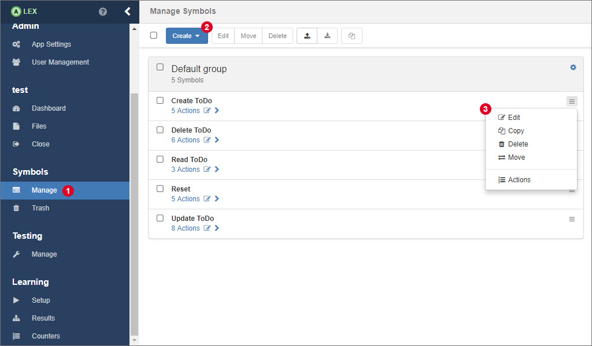
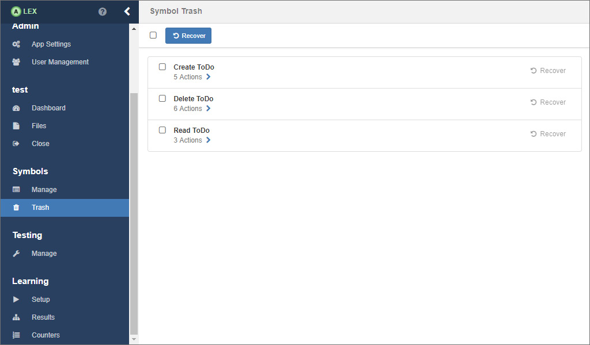
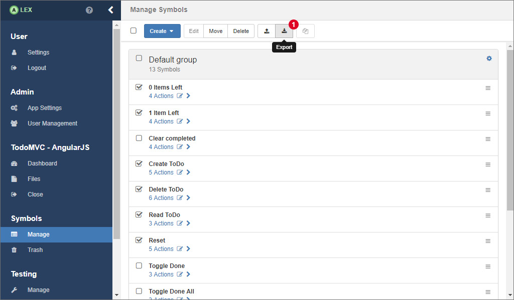
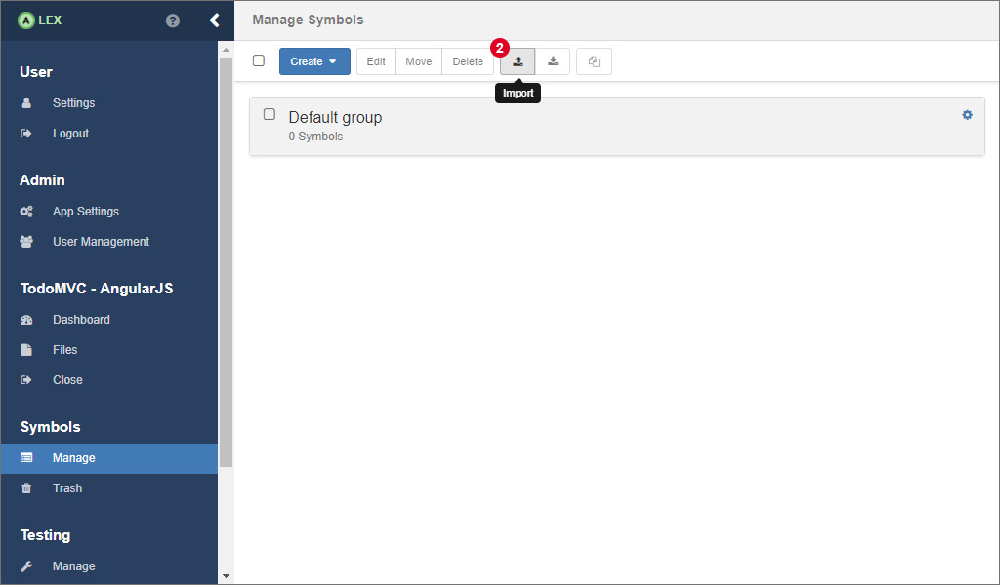
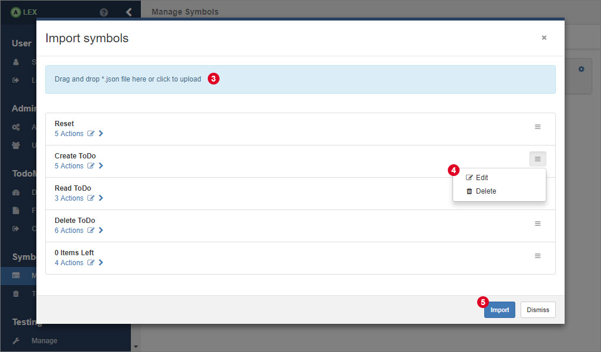

# Symbol Management

The modelling of input symbols is a key aspect of using ALEX.
They define interactions with the system under learning and thus are the building blocks of every learning process and test case.

Once you have logged in and opened a project, click on 1 to open the view for the symbol management.

## Symbol Groups

Symbol groups are logical container for symbols.
Per default, there is a default group that is created during the creation of the project.
The default group can not be deleted, and all symbols, if not specified otherwise, are put into it.
You can create a new group by clicking on 2 and select the corresponding item from the dropdown menu.
You are then asked for a name for the group, which has to be unique.
Once a group has been created, you can edit and delete it, by clicking on the *gear* icon that is found on the right.

## Symbols

When creating a new symbol (see 2), you have to specify two properties:

| Name          | Description                                                                                  |
|---------------|----------------------------------------------------------------------------------------------|
| name          | A unique name of the symbol                                                                  |
| symbol group  | The group in which the symbol is put. Per default, the default group of the project is used. |

Once the symbol has been created successfully, it appears in the specified group.
For each symbol, there is a list of operations that are accessible by clicking on the menu 3 of which most are self explanatory.
In the menu on top of the page, these operations are available for a batch of symbols.

Each symbol contains of a sequence of actions, that are managed in a separate view.
Click on the link below the symbol name or the item *Actions* in menu 3 to open the action management for the symbol, which is covered in [this section](actions.md).

### Restoring Deleted Symbols

Once you delete a symbol, it is not really removed from the database.
Instead, they are put into the symbol trash bin, which works similar to its equivalent from various operating systems.
The only difference is that symbols cannot be deleted permanently, because they still might be referenced by e.g. learner results or test cases you have modeled.

You can see all deleted symbols in the trash bin overview which can be accessed via the item *Trash* in the sidebar.
The only operation you can do here is to recover deleted symbols.
A recovered symbol is then moved into the default group.

### Export & Import

If you want to save a set of symbols for another project or use existing ones, ALEX offers an export and import feature.
Note that existing symbol groups are not exported in order to be compatible with other projects.

In order to export symbols, select the corresponding symbols in the overview and click on the export button 1.
You are then asked for name of the JSON file which will be downloaded.

In the same view, you can import existing symbols from a JSON file by clicking on 2 which opens a modal window.

Here, drag and drop the JSON file into the field 3 and the symbols will be displayed below.
The import will not work unless the names of the symbols are unique within the project.
So, edit the symbol names 4 or delete the ones you do not need.
Finally, confirm your selection by clicking on 5.
If everything goes fine, the modal window will close automatically and the symbols appear in the default group.
