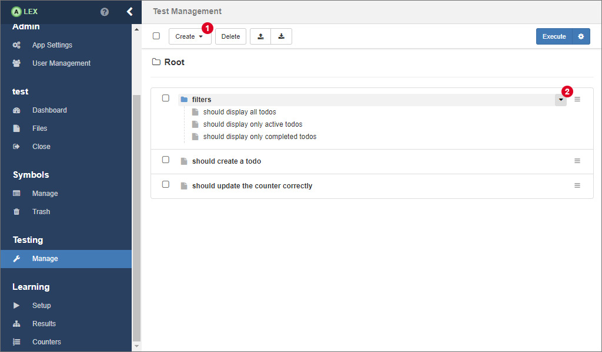
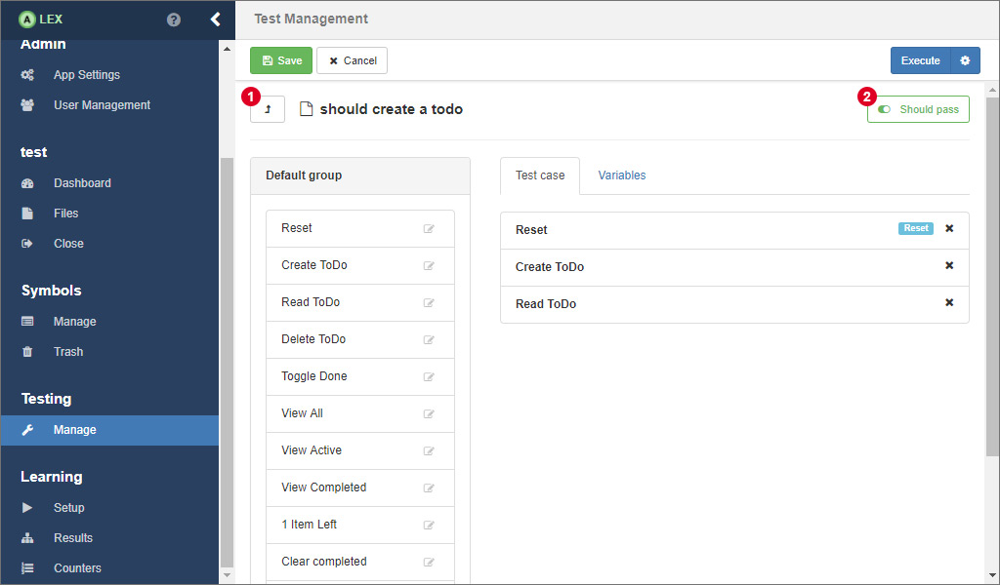
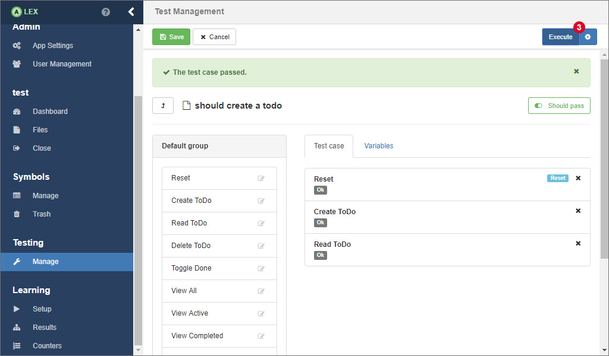
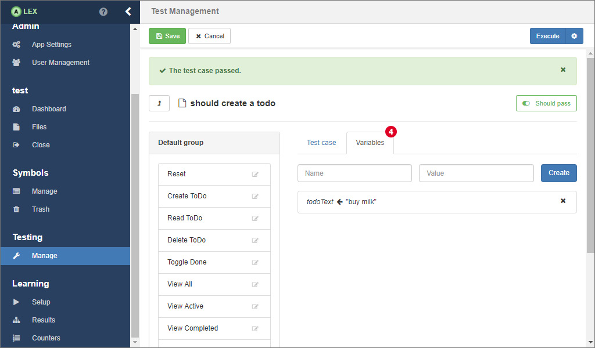

# Testing

ALEX has integration testing abilities on board. 
So, instead of learning, you can model and execute single test cases.
The corresponding functionality is available under the item **Manage** in the group **Testing** in the sidebar.

We differentiate between test cases and test suites.
A test case is a use case of the application and is modelled via a sequence of symbols.
A test suite bundles multiple test cases.
You can navigate through all test cases and test suites like in a typical directory structure.
Test cases are indicated by a file icon, test suites by a folder icon.

The option to create a test case or a test suite is available in the dropdown menu 1.
Via 2, you can navigate directly in the test suite.
Clicking on a test case redirects you to a view where the test case can be modelled, which is covered in the following.

## Test Cases

Here, you can create a sequence of symbols by clicking on the symbols that are displayed in their groups on the left.
Once you have created a test case, you can rearrange the symbols via drag and drop.
Clicking on 1 navigates you to the parent test suite.
With 2 you can specify if the test case is supposed to pass or if it is supposed to fail.
The end result of the test case execution can be taken from the following table:

| Test passes? | Should pass? | Result |
|--------------|--------------|--------|
| yes          | yes          | pass   |
| yes          | no           | fail   |
| no           | yes          | fail   |
| no           | no           | pass   |

A click on the small button with the gear icon in the button group 3 opens a modal window where you can configure the web driver you want to execute the test in.
Make sure you save any changes you have made before executing a test case.
Then, execute the test case by clicking on the *Execute* button.

When the test case has been executed, a small notification appears telling if the execution succeeded or failed.
Furthermore, the output of every symbol is also displayed.

You can notice another tab on the page labeled *Variables* 4.
There, you can preconfigure variables that are used by the symbols in the test case, so that you do not have to create a reset symbol that sets them for each test case individually.

## Test Execution

Back in the overview, select the test cases and test suites that should be executed.
The button group 1 behaves like in the test case view.

When the execution finished, labels beside each test case and test suite indicate its result. 
A yellow label indicates that some, but not all test cases inside the test suite did not pass. 

Below the list, The result over all tests is displayed in a table 2.
The results of the test execution are not saved in the database in the current version of ALEX, but you can export the results as a *[JUnit XML Report][junit]*.

[junit]: https://www.ibm.com/support/knowledgecenter/en/SSQ2R2_9.5.0/com.ibm.rsar.analysis.codereview.cobol.doc/topics/cac_useresults_junit.html