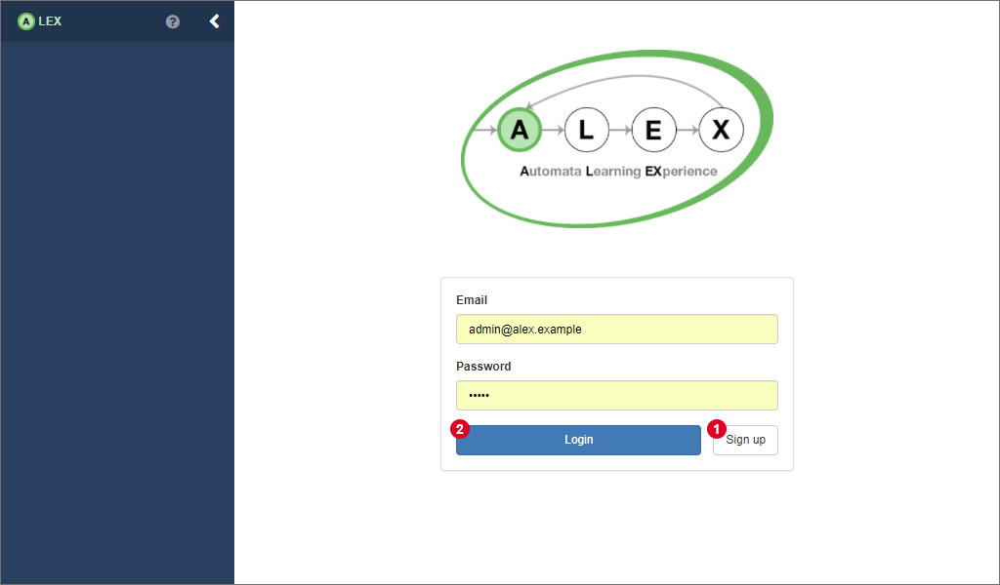
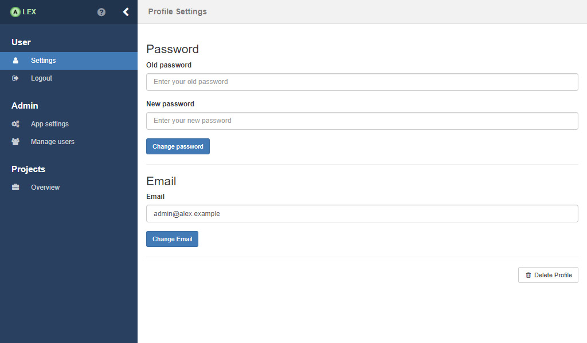
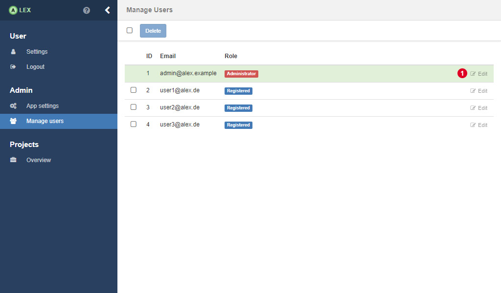
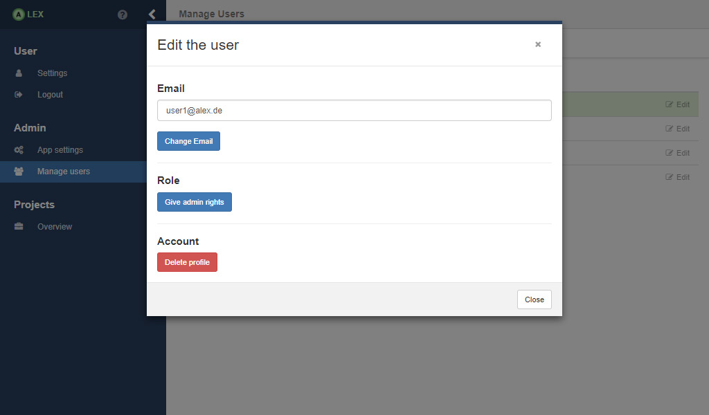

# User Management

There are two roles in ALEX which are listed below.

| Role       | Description                                                                         |
|------------|-------------------------------------------------------------------------------------|
| REGISTERED | Default user role.                                                                  | 
| ADMIN      | All rights of a user, plus user management and can edit application level settings. |

The first time ALEX is started, a default admin account is created which you can use instantly to login into the application.
The credentials are:

    Email: &nbsp;&nbsp;&nbsp;&nbsp;&nbsp;&nbsp; <em>admin@alex.example</em> 
    Password: <em>admin</em>

## Logging Into ALEX

The picture above shows the start page of ALEX. You can either create a new account 1 or sign in 2 with an existing account.
In both cases, all you need to enter is an email address and a password.

## Editing the User Profile

Once you are logged in, you can edit your user profile by clicking on the **"Settings"** item in the sidebar in the group labeled **"User"**.
Here, you can change your email address, your password or delete your account permanently.

## User Management

Admins also have the possibility to manage all existing users that are registered.
Therefore, click on the item **"Manage users"**.

A click on 1 reveals a modal window (see the picture below) where the corresponding actions on a user can be performed.
Note that, as an admin, you can only delete your own account or change your role to *REGISTERED* if there is another user with admin rights in the system.

