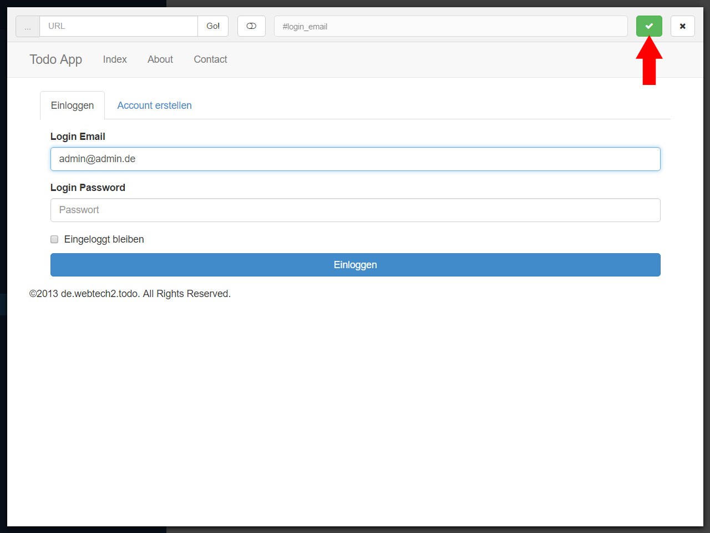
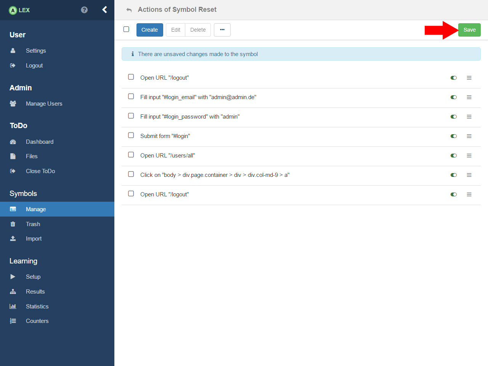
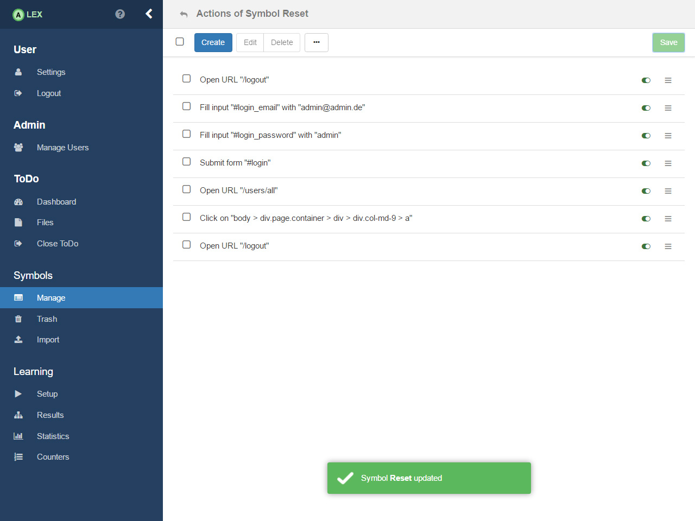

# Action setup

The first symbol we want to model is the reset symbol.
In this case, we first have to think about what the initial state of ToDo is.
Here, it is the case when no user except the admin is registered in the system. 
Via actions that are assigned to the symbol, we have to reach that state.

Therefor, click on the link under the correspondent action to open the view for managing actions of a symbols. 
At first, no actions are created. 
To create the first action, click on the __Create__ in the top bar which results in a new modal window which displays the action editor.

The first thing we want to do is logout the user that is potentially logged in. 
Because we want to model an action on the real browser, we __(1)__ click on the __Web__ group on the left and in the collapsing menu, __(2)__ click on the item __Open URL__. 
On the right side, a form is displayed where __(3)__ we enter the URL _/logout_. 
Note that the entered URL is relative to the root URL of the project. 
Finally __(4)__ we create the action by clicking on the button __Create and Continue__, which creates the action, but does not close the modal window, contrary to the __Create__ button.

After the logout, we should be on the index page of ToDo which displays the login form.
We now want to login as the administrator. 
To fill out the form, __(1)__ select the action __Fill input__ from the left menu. 
You are prompted to enter the CSS selector of the input element and the value that should be entered in the input. 
To find out the selector, you can use the _Element Picker_ to extract the selector automatically from ToDo. 
Click on the corresponding button and the Element Picker pops up and loads the root URL of ToDo.

You can navigate freely within ToDo via the Element Picker. 
First __(1)__, enter _admin@admin.de_ in the email field. 
Then __(2)__ toggle the button in order to enable the selection mode.

Hover over the input field __(1)__ and it should be highlighted with a thick, red border while at the same time, its selector is displayed on the top __(2)__. 
Click on it to confirm the selection and disable the selection mode. 

Click on the green button which closes the Element Picker. 
As you can see, the selector and the value you have entered are adopted automatically.
Press the __Create__ button to create the action.

You can now continue to create further actions which are displayed here. What it does it the following:

1. Logout the current user (redirects to the index page)
2. Enter the credentials of the admin (2,3) and login (4)
3. Go to the user management page (_/users/all_)
4. On this page there is a button to delete all users with the selector _body > div.page.container > div > div.col-md-9 > a_ which is clicked on
5. The admin is logged out

After that, we save the symbol by clicking on the __Save__ button on the top. 
Note: Don't worry if you accidentally created an action. 
You can safely remove and reorder via drag-and-drop.

As a practice, you can now continue to model all remaining symbols on your own.

