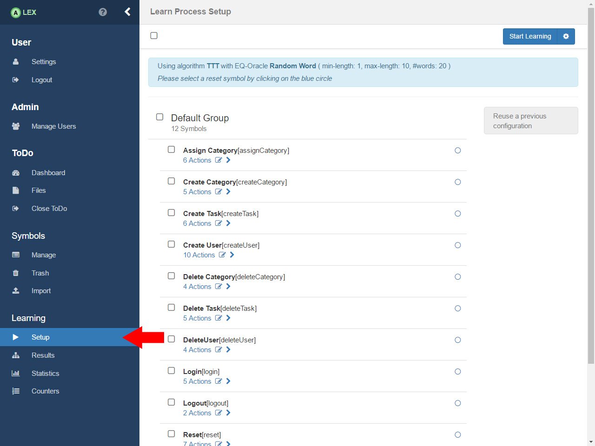
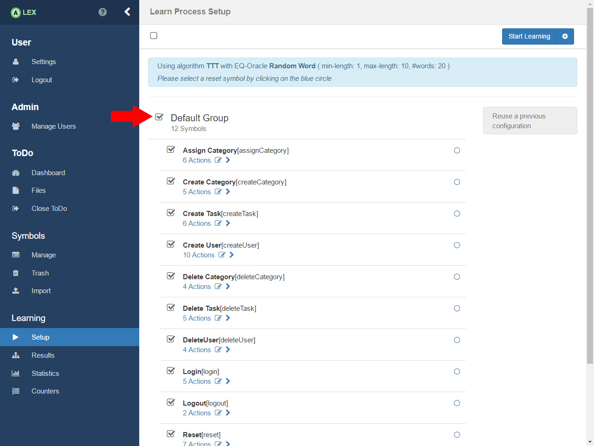
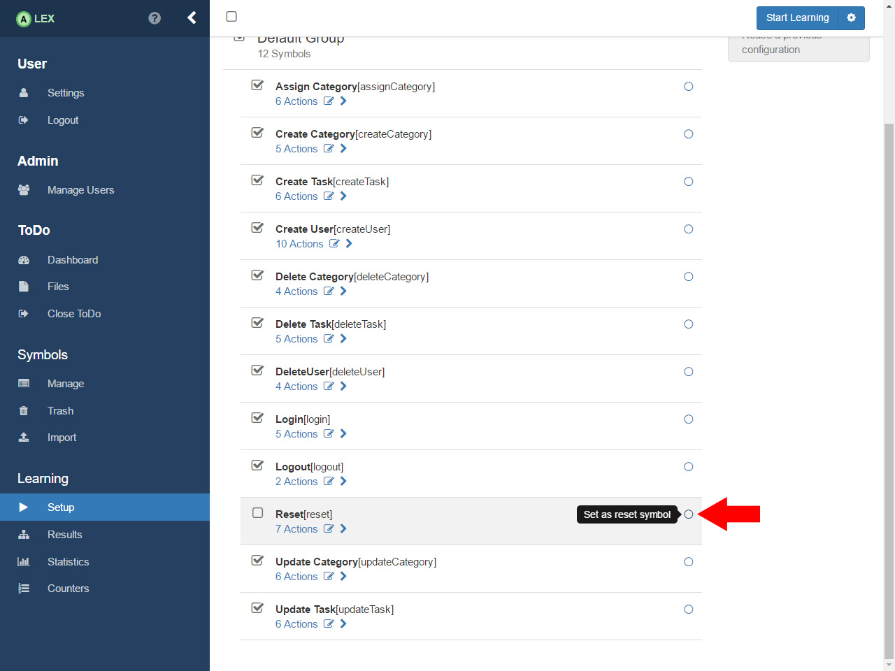
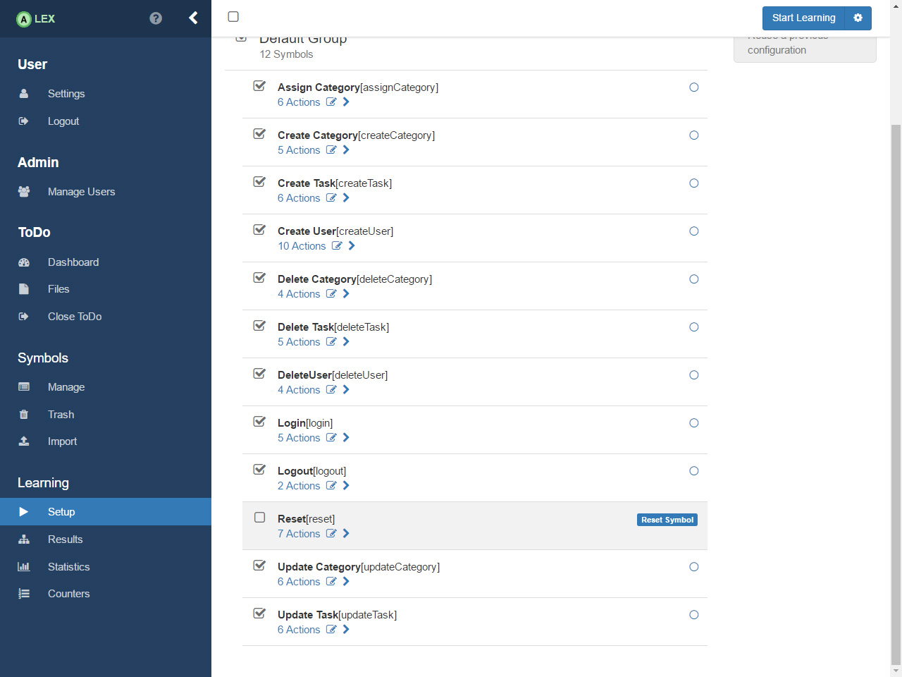
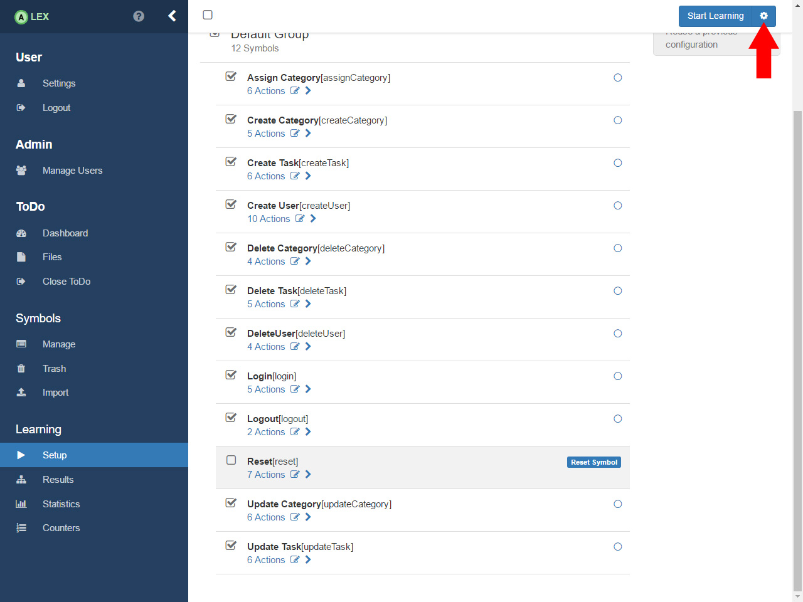
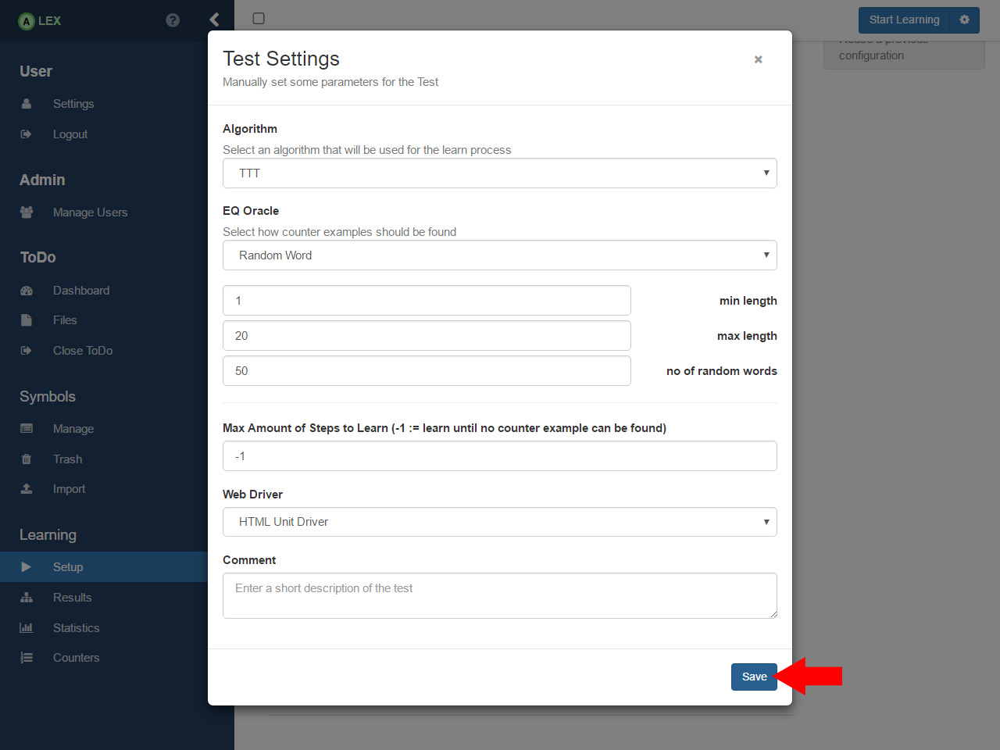
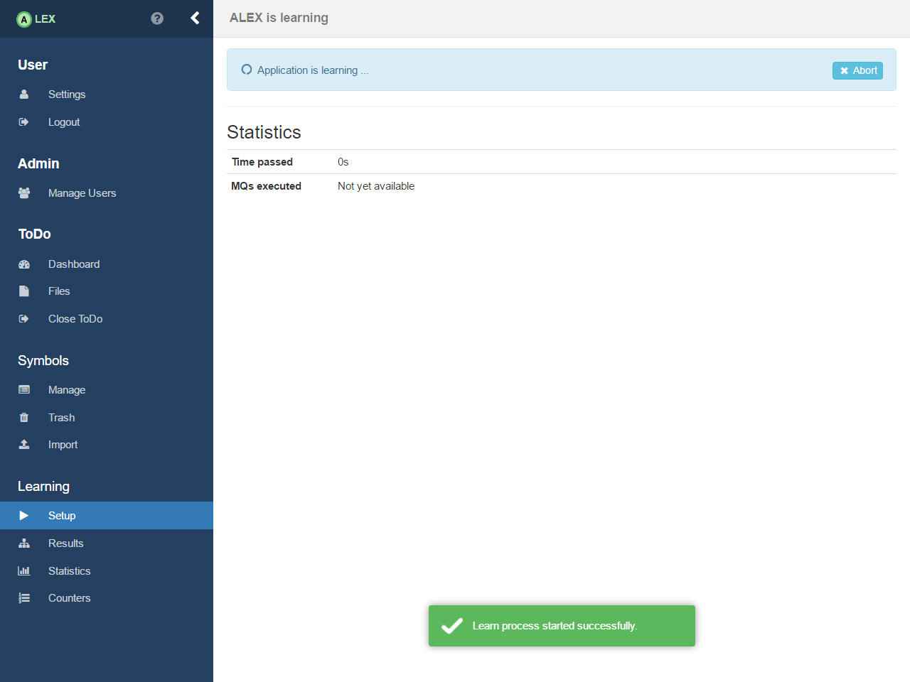

# Learn ToDo

After the symbols have been modeled, you can start learning ToDo. 
Navigate to the setup view by clicking on the item __Setup__ in the sidebar. 

The view looks similar to the one for managing symbols. 
Now, select the symbols that should be learned, but exclude the reset symbol. 

Then, you have to mark the reset symbol as reset symbol explicitly by clicking on the blue circle beside the symbol item.

Before we learn ToDo, we want to configure some parameters for the learning process. 
By clicking on the gear icon on the top right, we open a new modal window that reveals options to configure the process.

Here, we only adjust the equivalence oracle as seen in the image. 
Save the changes by clicking on the __Save__ button.

Now, click on the button __Start Learning__ in order to start the learning process with the selected set of symbols and the configuration. 
You are then redirected to a loading page where the current status is displayed. 
After some time, the result will be displayed as a mealy machine of ToDo.

