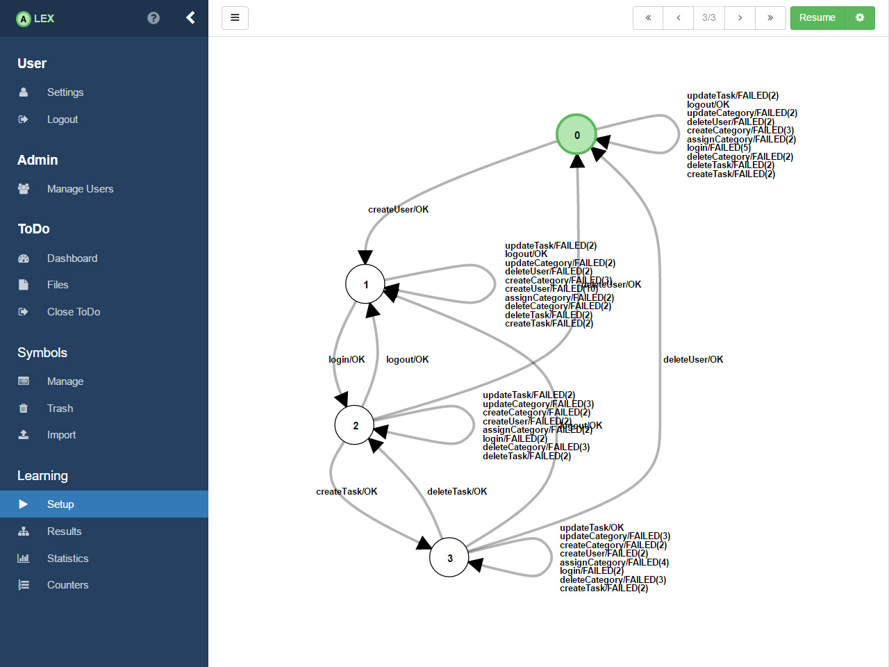
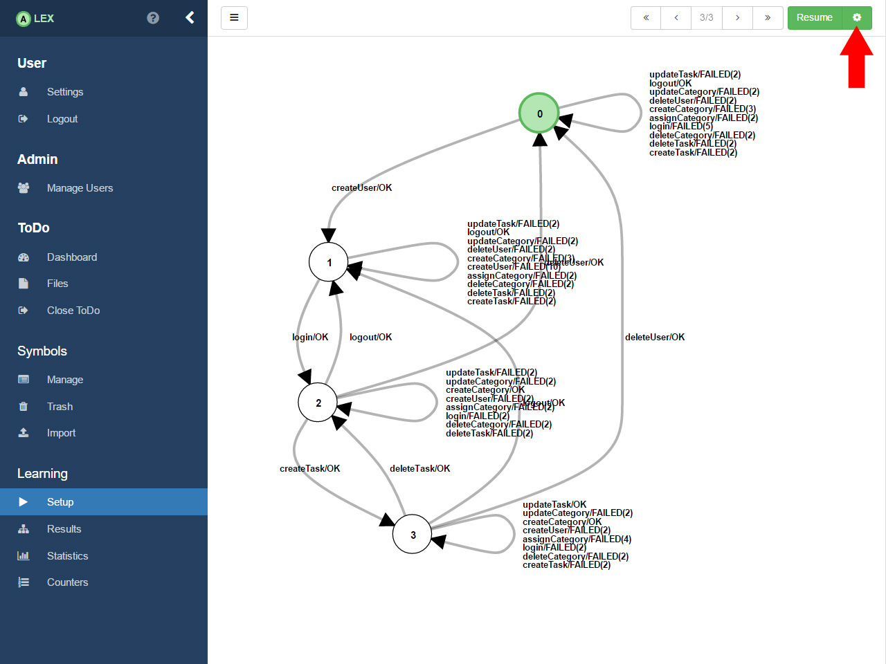
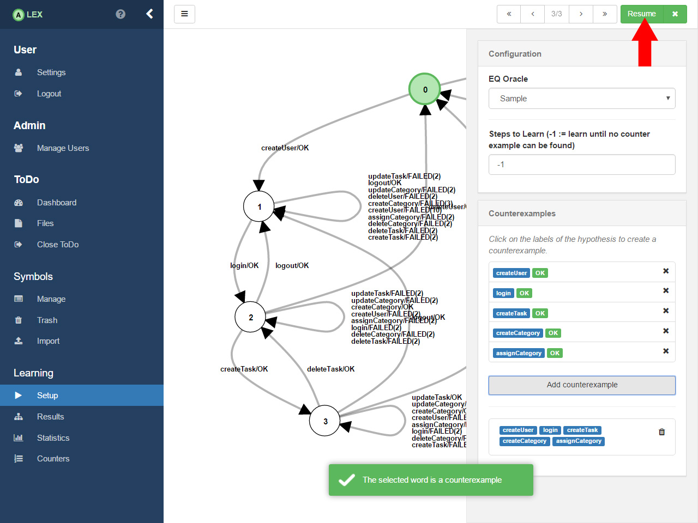

## Refine ToDo

In the previous section, we learned ToDo and generated a hypothesis of the application, but can we be sure that it really reflects the behaviour of ToDo? 
Because of the nature of black-box systems, we can not. 
So, we now look manually at the automaton and search for paths in the model where we assume they differ from the actual behaviour.

On a closer look, one can see that the path _createUser_, _login_, _createTask_, _createCategory_, _assignCategory_ seems to have a different output than ToDo.
Because after having created a task and a category, we are able to assign the category to the task. 
The expected output is *OK OK OK OK* instead we got *of OK OK OK FAILED(4)*
So we have to check it.

Therefor, click on the gear icon in the top right corner. 
A sidebar appears.

Next, select the __Sample__ eq oracle, which means we want to search for counterexamples manually. 

Then, click the labels of the hypothesis in the order we discussed above. 
By clicking on the button __Add counterexample__, ALEX checks if the sequence differs from the application. 

In case the sequence is a counterexample, a success message will pop up and it is added to the configuration.
To refine the hypothesis, click on the __Resume__ button which will redirect you to the loading page again.

The learner refines the hypothesis with the given counterexample.
 

 
After some time, it will output a refined hypothesis which has now one more state than before. 
The sequence now matches the actual behaviour. 
This process can now be continued as long as you think it is necessary.
