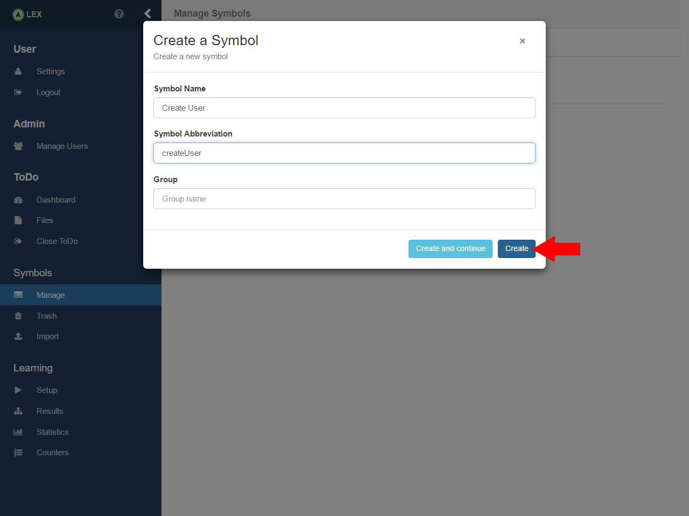
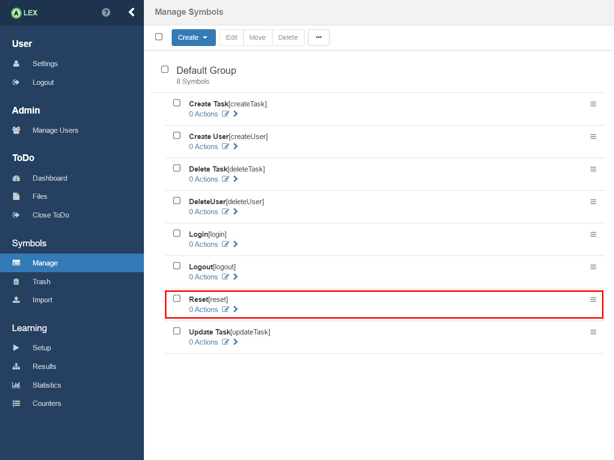

# Symbol setup

In order to create symbols, click on the item __Manage__ under the group _Symbols_ in the sidebar. 
At first, only the default group and no symbols are displayed.

## Create symbols

Now, we create the symbols that should model features of the application under learning. 
Before we do so, let us list the features of ToDo that we want to test. 
In ToDo, we can:

* Create a new user
* Login a user in the system
* Logout the current user
* Delete the current user
* Create a task
* Update a task
* Delete a task
* Create a category
* Update a category
* Delete a category
* Assign a category to a task

As a consequence, we will create the symbols _Create User_, _Login_, _Logout_, _Delete User_, _Create Task_, _Update
Task_, _Delete Task_, _Create Category_, _Update Category_, _Delete Category_ and _Assign category_.

In addition to that, we will also create a symbol __Reset__ with which we model the logic for the reset of the application. 
This is required since for every query that is posed, the application should be in its initial state.

In order to create a symbol, click on the menu button _Create_ in the bar on the top and choose the entry with the text _Symbol_. 
A modal window pops up, asking for a name, an abbreviation and a group.

    In the current version of ALEX, the symbol abbreviation field does not exist anylonger.

As the name, we use the ones from above and for the abbreviation, we use the lower camel case variant of the name.
For example, We create a symbol _Create User_ with the abbreviation _createUser_. 
The field for the group is left empty. 
After the click on the __Create__ button, the symbol should be listed under the default group.

All other symbols including the reset symbol are created analogously.

