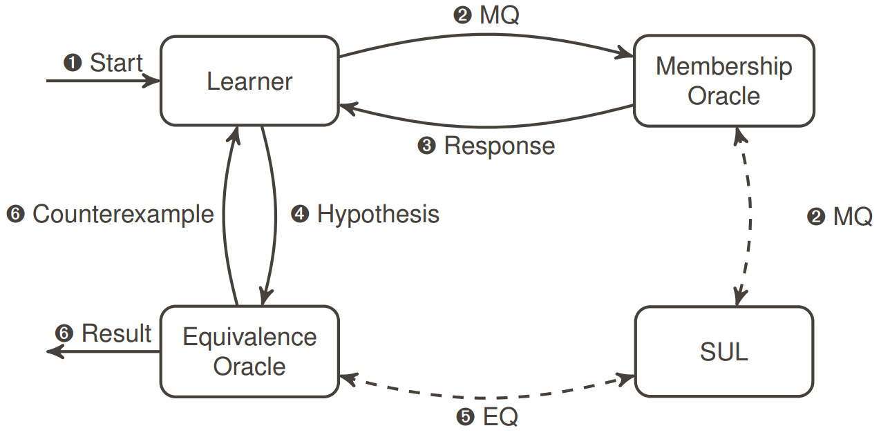
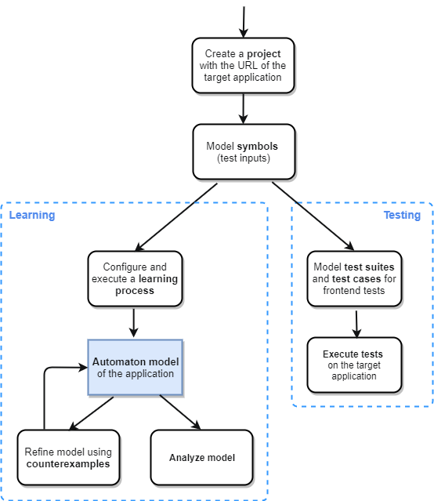

# User manual

Here and in the following sections, we present a detailed explanation of the concepts and ways to use ALEX.
If you find bugs of any kind relating this application or inaccuracies in this manual, [let us][mails] know.

[mails]: mailto:alexander.bainczyk@tu-dortmund.de,alexander.schieweck@tu-dortmund.de

## Description and features

ALEX offers a simplicity-oriented way to model and execute learning experiments for web applications and web services using active automata learning. 
With version 1.5.0 ALEX has been extended to support conventional testing, too.
Based on features of [LearnLib][learnlib] and inspired by the [LearnLib Studio][learnlibStudio], ALEX lays a focus on the ease to use of the tool while offering an extensive feature set, including:

* Inferring Mealy machines of web applications and web services using active automata learning techniques
* Graphical symbol and learning process modelling
* Automatic generation and visualization of
    * Models
    * Algorithmic data structures (observation table and discrimination tree)
    * Statistics of learning experiments
* Simultaneous learning of web applications and web services
* Various learning algorithms and equivalence approximation strategies
* GUI testing capabilities
* And much more...

## Required skills

As a user of ALEX and tester of web applications, you should

* be familiar with HTML and CSS
* be familiar with REST interfaces and exchange formats like JSON
* have logical thinking abilities
* have a basic understanding of active automata learning
* have a basic understanding of web application testing

It helps if you are familiar with programming in general and have already used Selenium.

## Terminology

This document contains some terms related to automata learning which are listed in the following:

<dl>
    <dt>System under learning (SUL)</dt>
    <dd>The system we want to infer an automaton model from.
        Often also called system under testing (SUT).</dd>
    <dt>Symbol</dt>
    <dd>We differentiate between input and output symbols.
        Input symbols are modeled by the user and define possible inputs to a system.
        Output symbols specify how the system reacts to inputs.</dd>
    <dt>Word</dt>
    <dd>A sequence of symbols, e.g. *Authenticate, Create Entity, Read Entity, Delete Entity, Logout*.</dd>
    <dt>Learner</dt>
    <dd>A learner infers an automaton model of an application by posing words to the SUL and analyzing its outputs.</dd>
    <dt>Membership Query (MQ)</dt>
    <dd>The words the learner poses to the system are called membership queries.</dd>
    <dt>Equivalence Query (EQ)</dt>
    <dd>An equivalence query is posed by an equivalence oracle. 
        It checks whether the learned automaton represents the behavior of the tested application correctly.</dd>
    <dt>Hypothesis</dt>
    <dd>A hypothesis is the behavioral automaton model that is learned.
        The model is called hypothesis due to the black box nature of the SUL. 
        Theoretically, there can always exist a behavior that is not captured by the model.</dd>
    <dt>Counterexample</dt>
    <dd>A counterexample is a word, where the output of the system and the learned model differ.
        Counterexamples are used to trigger the refinement of the model.
        We call a model the <em>final hypothesis</em>, if no counterexamples can be found.</dd>
</dl>

The following graphic illustrates the general learning process and thus the relation between the terms listed above.

## Business entities in ALEX

<dl>
    <dt>User</dt>
    <dd>A user is identified by its email address and can have one of two roles: <em>ADMIN</em> or <em>REGISTERED</em>.</dd>
    <dt>Project</dt>
    <dd>A project is the main entity that the following entities belong to. 
        It is bound to a unique name and a URL that starts with *"http\[s\]://"* that points to the application to test.</dd>
    <dt>Symbol group</dt>
    <dd>Each project has a list of symbol groups. 
        Symbol groups are logical containers for symbols and allow grouping symbols, e.g. by their purpose or by their feature.
         They are defined by a unique name. 
         For every project, there is a default group with the name <em>"Default Group"</em> which can not be deleted.</dd>
    <dt>Symbol</dt>
    <dd>Symbols are test inputs that are used for learning and testing the target application. 
        Each symbol consists of a sequence of actions that define the actual logic of the symbol once it is executed.</dd>
    <dt>Action</dt>
    <dd>Actions are atomic operations on the application. 
        In ALEX, there are three types: 
        <strong>Web</strong> actions are inspired by Selenium and directly interact with the web interface of an application.
        <strong>REST</strong> actions define interactions with a REST APIs.
        Finally, <strong>general</strong> actions allow interoperability between actions and symbols.</dd>
    <dt>Learner configuration</dt>
    <dd>A learning process is a combination of several parameters: 
        It consists of an input alphabet (a set of symbols), a reset symbol (a symbol that is used to reset an application), a learning algorithm, an equivalence approximation strategy and some other parameters.</dd>
    <dt>Learner result</dt>
    <dd>The result of a learning process includes the automaton model of the application and some statistics.
        Inferring the model usually requires multiple iterations. 
        For each iteration step, the intermediate model and the statistics are saved as well.</dd>
    <dt>Test case</dt>
    <dd>A test case can be understood as a single integration test. 
        It consists of sequence of symbols that are executed on the system. 
        The execution of a test case either <em>fails</em> or </em>passes</em>.</dd>
    <dt>Test suite</dt>
    <dd>Multiple test cases can be bundles into a test suite, which can also be nested.
        If a test suite is executed, all of its containing test cases and test suites are executed recursively. 
        The execution succeeds if all test cases pass, otherwhise it fails.</dd>
</dl>

## Workflow

Roughly speaking, the functionality of ALEX can be separated in two aspects: *testing* and *learning*.
The following diagram illustrates the basic workflow.

    

As you can see, the difference between testing and learning is that while tests either pass or fail to execute, a behavioral model is generated while learning.
In this user manual, we will go deeper into the single steps listed in the diagram.

## Frontend

Starting from the entry URL of ALEX, the graphical client can be accessed under http://localhost:&lt;port&rt;. 
From there on, the following URLs lead to different aspects of the application.

| URL                                         | Description                                               |
|---------------------------------------------|-----------------------------------------------------------|
| /                                           | The home screen to login and create new users             |
| /about                                      | An information page about the application                 |
| /admin/settings                             | Application specific settings                             |
| /admin/users                                | User management                                           |
| /counters                                   | Lists and manages the counters of a project               |
| /error                                      | Shows fatal error messages                                |
| /files                                      | Lists and manages uploaded files to a project             |
| /learner/setup                              | Setup and start a learning experiment                     |
| /learner/learn                              | Shows intermediate learner results                        |
| /learner/results                            | Lists all finished final learning results of a project    |
| /learner/results/&lt;testNos&gt;            | Show the hypotheses of the processes with &lt;testNos&gt; |
| /learner/results/statistics/&lt;testNos&gt; | Show statistics for learner results with &lt;testNos&gt;  |
| /projects                                   | Shows a list of all projects of a user                    |
| /projects/&lt;projectId&gt;                 | Dashboard of the project with the ID &lt;projectId&gt;    |
| /profile                                    | Edit the profile of the user that is logged in            |
| /redirect?to=                               | Redirect to a specify URL in ALEX specified by 'to'       |
| /settings                                   | Specify web drivers                                       |
| /symbols                                    | Create, update & delete symbol groups and symbols         |
| /symbols/&lt;symbolId&gt;                   | Manage actions and parameters of a specific symbol        |
| /symbols/archive                            | Restore archived symbols                                  |
| /tests                                      | Management of test suites and test cases                  |
| /tests/&lt;id&gt;                           | Edit the test suite or test case with a given ID          |
| /integrations/webhooks                      | Management of webhooks                                    |

Except for the *"about"* *"error"* and the *"/"* page, all URLs require that a user is logged in and a project has been created and is opened.
URLs that are prefixed with */admin* can only be accessed by users that inhibit the *ADMIN* role.

[learnlib]: https://learnlib.de/
[learnlibStudio]: http://ls5-www.cs.tu-dortmund.de/projects/learnlib/download.php
