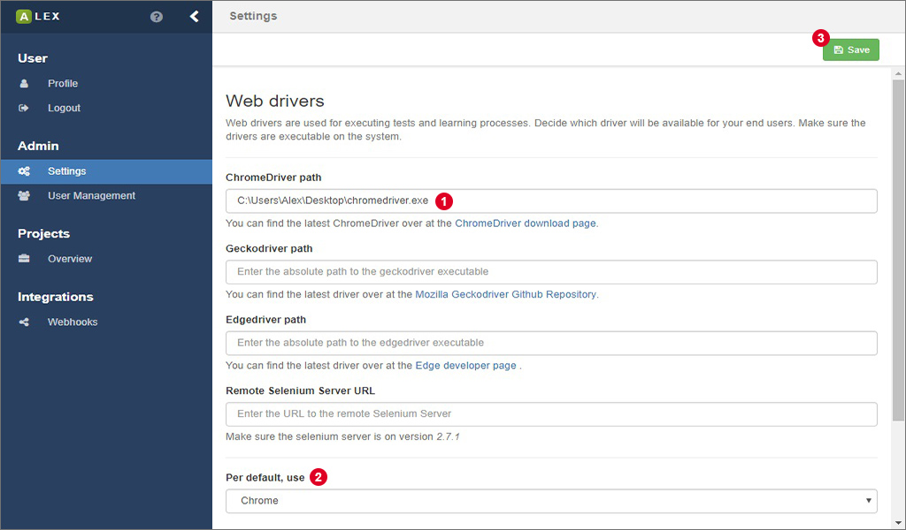
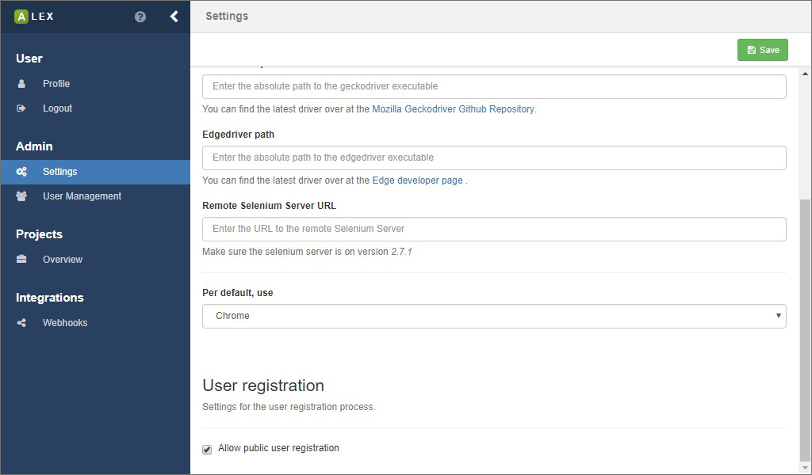

# Application settings

There are some global, application specific settings that only users with admin rights have access to.

## WebDrivers

For testing and learning web applications, we use [Selenium][selenium] to interact with web browsers. 
Per default, only the headless WebDriver [HTMLUnit][htmlunit] and [Safari][safari] are supported since they do not require a user to download executables that enable Selenium to communicate with them.
Note that Safari is only supported if ALEX is running on a MacOS system. 
Otherwise, the option is still displayed, but will not work for testing or learning.

For other web browsers, namely [Chrome][chrome], [Firefox][firefox] and [Edge][edge], driver executables have to be downloaded.
We provide links to the download pages, but you have to make sure that the version of the executable supports the version of the web browser you have installed.
After you have downloaded an executable, enter the absolute path to the file in the corresponding input field, as depicted in 1.
In Linux systems, there might be an error that saying that the driver executable is not executable.
Then, change the permissions of the file e.g. like `chmod +x chromedriver`.

You can also define a browser which is used for testing and learning per default.
Therefore, a dropdown menu on the bottom of the page 2 lets you select a web browser.
Do not forget to save the changes you have made 3.

Further, using the Edge browser on Linux and MacOS is not supported, and also Safari is not supported on Linux and Windows systems.
The option is still visible, but using a web browser on an operating system that does not support it will result in errors.

## User registration

If you have ALEX installed in your network, you may not want the registration process to be available for anyone.
You can enable and disable public user registration by checking or unchecking the provided input on the bottom of the page.
Be aware that you, as an admin, can also create new users manually in the user management.

[selenium]: http://www.seleniumhq.org/
[htmlunit]: http://htmlunit.sourceforge.net/
[safari]: https://www.apple.com/de/safari/
[chrome]: https://www.google.com/chrome
[firefox]: https://www.mozilla.org/firefox
[edge]: https://www.microsoft.com/windows/microsoft-edge
