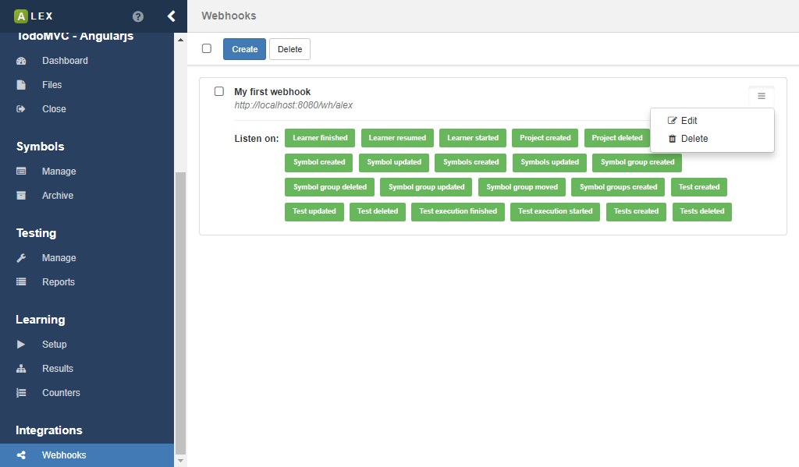
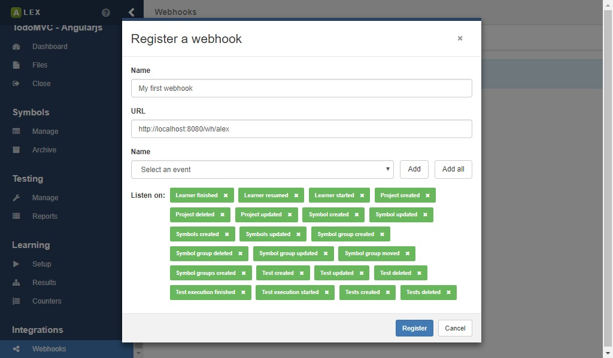

# Integrations

ALEX offers some ways for integration in third party applications.

## Webhooks

[Webhooks][webhooks] are a way to let third party applications know about events that happen in your system.
These application have to register a webhook by specifying a URL.
When an event occurs, e.g. a learning process finished, ALEX sends a HTTP request to the registered URL.
If a body is send along the HTTP request, it is formatted as JSON object.

*Currently, if the target server cannot be reached within 3 seconds, the request is cancelled.
 We also do not provide any retry mechanism at the moment.*

You can manage webhooks under the **Webhooks** item in the sidebar.
On the page a list of registered webhooks is displayed.

To create a new webhook, specify the following properties in the modal dialog.

| Property | Description                                            | Required |
|----------|--------------------------------------------------------|----------|
| Name     | The name of the webhook, e.g. the name of the service. | no       |
| URL      | The URL where events are send to.                      | yes      |
| Events   | The list of subscribed events.                         | yes      |

[webhooks]: https://en.wikipedia.org/wiki/Webhook
