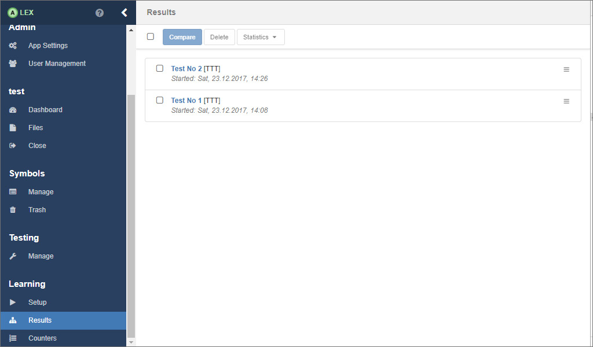
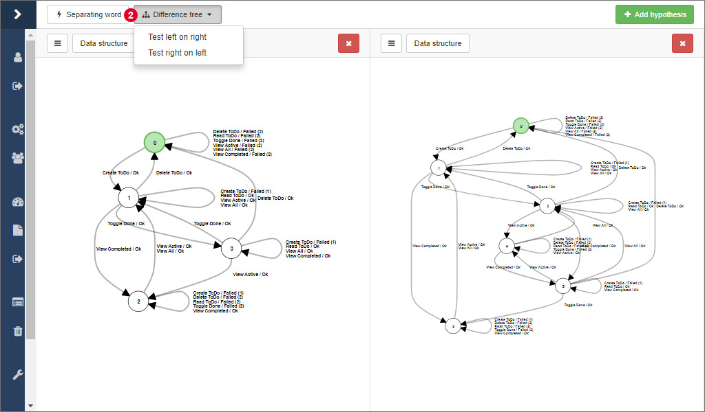
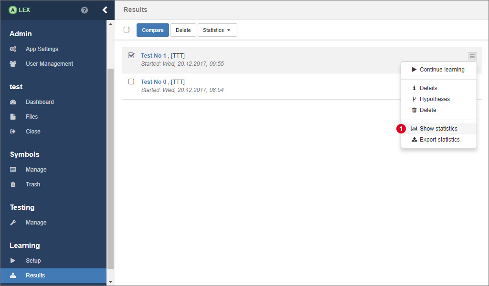

# Learning experiment analysis

Each learning process experiment and its results, including the models, statistics etc. are saved in the database. 
This section deals with possibilities to use the learned models for a further analysis.

## Comparing hypotheses

All results from the learning processes are saved in the database and are listed in the view under *Results* in the group *Learning*.
Click on the test number of a result to display the model that has been learned during the corresponding learning process.

The view here is the same as the one that is displayed during the learning process.
The difference is that other models from the same project, from other projects or from a previously exported JSON file can be added and displayed side by side.
Click on 1 to open a modal window with the corresponding options.

In ALEX, there are two options to compare two hypotheses, which are available at 2.
The **separating word** is the shortest word where the output of two model differ.
If no separating word can be found, both models are identical.
On the other side, such a word can indicate two things:

1. Different or differently configured equivalence oracles have been used in both test runs and one did not find as many counterexamples as the other.
2. The system under learning has changed, be it because a regression between the two test runs.
   In this case, the separating word gives you an entry point for debugging the application or it represents the change correctly.
   
Then, you can calculate the **difference** between two models.
In contrast to the separating word, *all* words are calculated where both models differ.
The result is displayed as a tree, where the paths with same suffixes have been merged for a better overview, like depicted in the picture below, where the difference is displayed in a third panel.

There are two options for calculating the difference between two models in the dropdown menu 2.
There are two options because of the way the difference is calculated.
As a basis, the transition coverage of one model is used and every word is tested on the other model.
As a consequence there might be different results depending on which way is used.

## Statistics

In ALEX, some statistics about the learning processes are gathered automatically, that are:

- The number of membership queries,
- the number of equivalence queries,
- the number of symbols that have been called and
- the execution time.

Each value is saved per learning step and separated by membership and equivalence oracle.

In order to display statistics, go to the results overview, and click on the item 1 on the corresponding result.

Now, you will see some bar charts for the cumulated values over all learning steps.
To see the statistics for each individual learning step, click on 2

A line chart then displays the values that are listed above for each step.

There is also the possibility to compare the statistics of multiple learning processes.
In this case, select all relevant results in the overview and click on 3.
The only difference here is that the displayed values are not separated by oracle.
