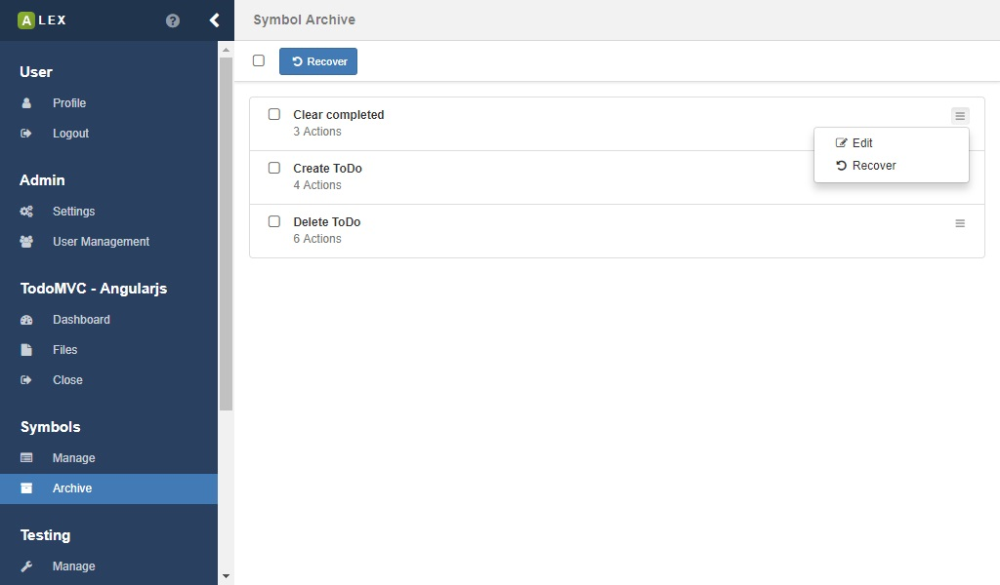
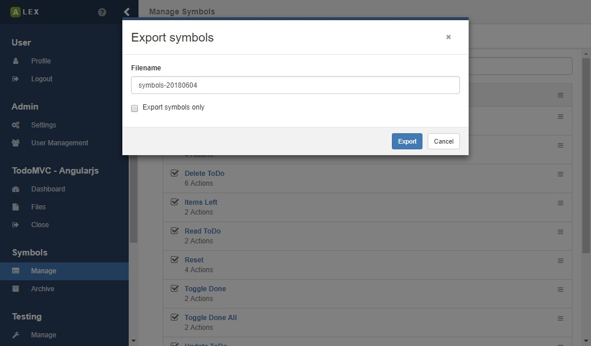
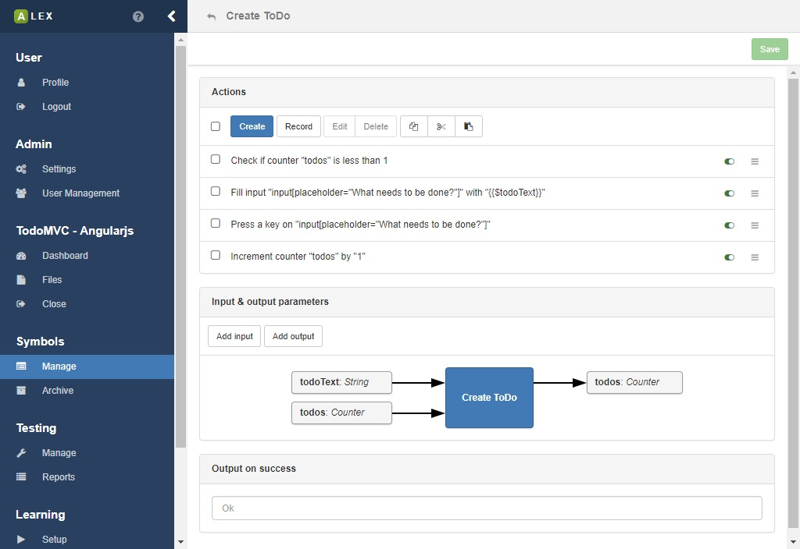

# Symbol management

The modelling of input symbols is a key aspect of using ALEX.
They define interactions with the system under learning and thus are the building blocks of every learning process and test case.

Once you have logged in and opened a project, click on 1 to open the view for the symbol management.

## Symbol groups

Symbol groups are logical container for symbols.
Per default, there is a default group that is created during the creation of the project.
The default group can not be deleted, and all symbols, if not specified otherwise, are put into it.
You can create a new group by clicking on 2 and select the corresponding item from the dropdown menu.
You are then asked for a name for the group, which has to be unique.
Once a group has been created, you can edit and delete it, by clicking on the *gear* icon that is found on the right.

## Symbols

When creating a new symbol (see 2), you have to specify two properties:

| Name          | Description                                                                             |
|---------------|-----------------------------------------------------------------------------------------|
| Name          | A unique name of the symbol                                                             |
| Symbol group  | The group the symbol belongs to. Per default, the default group of the project is used. |

Once the symbol has been created successfully, it appears in the specified group.
For each symbol, there is a list of operations that are accessible by clicking on the menu 3 of which most are self explanatory.
In the menu on top of the page, these operations are available for a batch of symbols.

Each symbol contains of a sequence of actions, that are managed in a separate view.
Click on the link below the symbol name or the item *Actions* in menu 3 to open the action management for the symbol, which is covered in [this section](actions.md).

### Searching symbols

Directly below the action bar, a search input is displayed which you can use to quickly find symbols.
A click on a result redirects you to the symbol page.

### Restoring archived symbols

Once you archived a symbol, it is not really removed from the database, instead, they are put into the symbol archived.
Symbols cannot be deleted permanently, because they still might be referenced by e.g. learner results or test cases you have created.

You can see all archived symbols in the archive overview which can be accessed via the item *Archive* in the sidebar.
Here you can do here is to recover symbols or edit their name.
A recovered symbol is then moved into the default group.

### Export & import

If you want to save a set of symbols for another project or use existing ones, ALEX offers an export and import feature.
Note that existing symbol groups are not exported in order to be compatible with other projects.

In order to export symbols, select the corresponding symbols in the overview and click on the export button 1.
You are then asked for name of the JSON file which will be downloaded.
Additionally, you can decide if only the selected symbols are exported, or if the symbol groups that they are in are exported as well.

In the same view, you can import existing symbols from a JSON file by clicking on 2 which opens a modal window.
Here, drag and drop the JSON file you exported in the previous step.
The import will not work unless the names of the symbols are unique within the project.
If everything goes fine, the modal window will close automatically and the symbols appear in the selected group.

### Symbol parameters

Symbols have input and output parameters for variables and counters (see next section for more information).

Variables and counters are read from and written into and a global store during a membership query, see the image above.
Before a variable or counter can be used in a symbol, it has to be defined in as input parameter for the symbol.
Local modifications of variables and counters do not affect the global context unless they are written back as output.

If you use a variable or a counter that has not been defined, the execution of the symbols fails and the output is: *Undefined variable: Name*, or *Undefined counter: Name* respectively.
