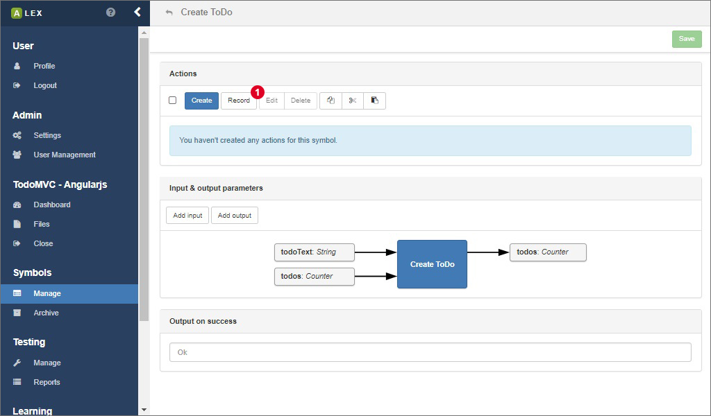
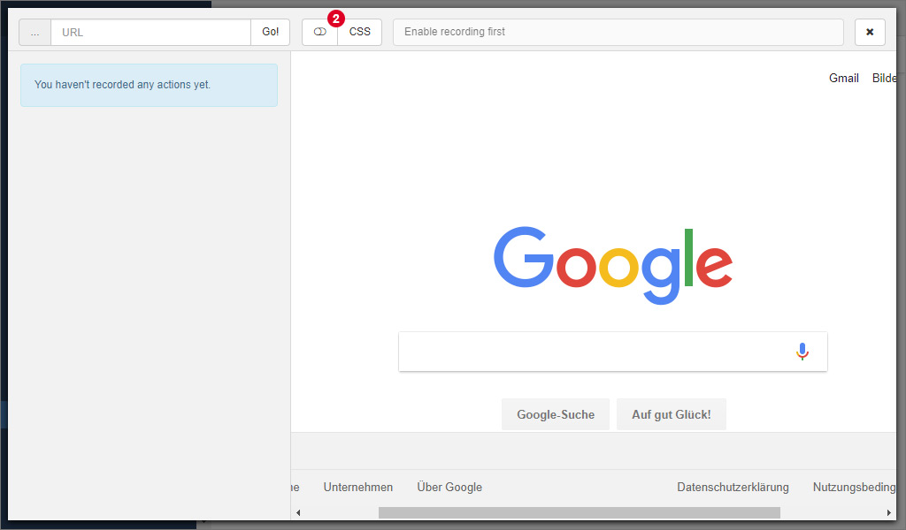
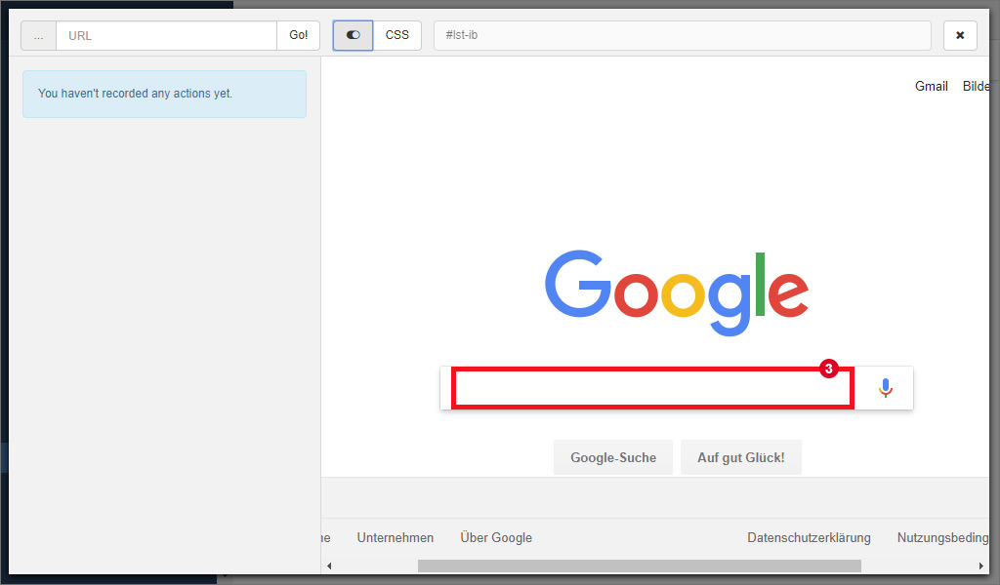
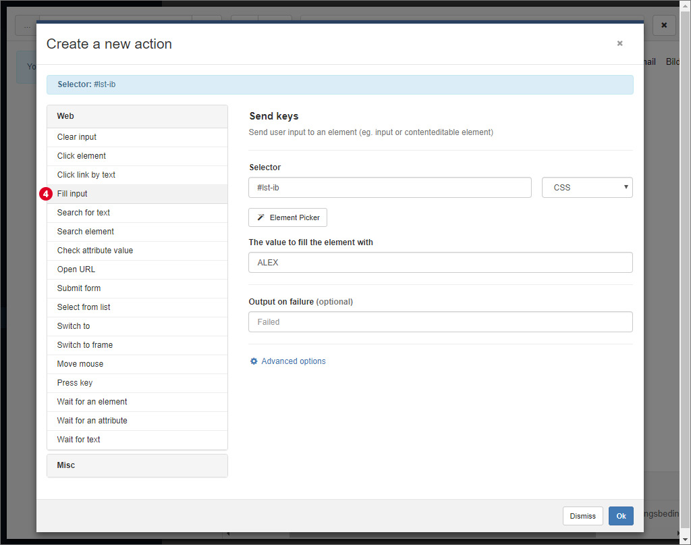
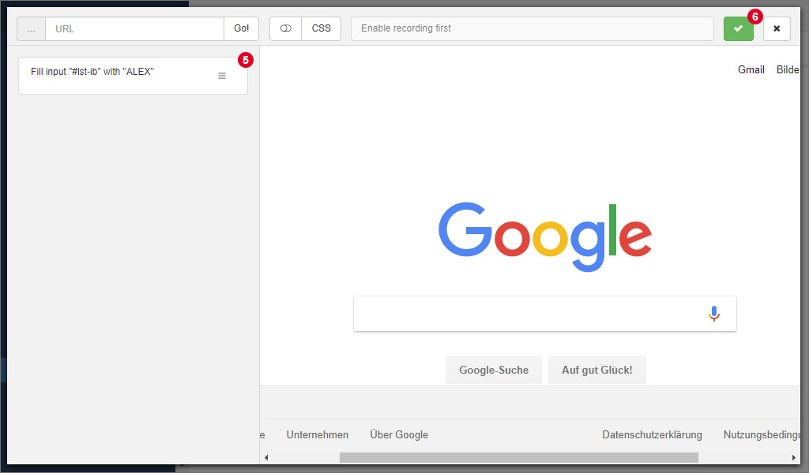

# Recording actions

ALEX also supports recording actions directly on the target website without leaving the element picker.
Therefore, click on the button *Record* 1 in the symbol overview.

An overlay pops up that looks like the element picker, except that on the left, there is space for a list of recorded actions.
In order to start recording, click on the button 2 that enables and disables the recording.
Note that since the recorder uses the same technology as the element picker, web browsers have to be started with disabled security rules, too.

Once you clicked the recording button, move the cursor over an element you want to interact with.
The element is then marked with a big red border 3 and its selector is displayed in the field in the header of the recorder.

If you are satisfied with the target element, a click on it opens the familiar modal dialog to create an action.
The difference is that on the left, only a selection of all available actions that is suitable for the element you clicked on is displayed.

From the list, choose an action 4.
You can notice that the input field for the selector is automatically inserted.
Once you are done, click on the *Ok* button of the modal dialog.

The action is now listed on the left 5.
You can update, delete and rearrange the actions per drag and drop.
Finally, click on the green button with the checkmark icon 6 to close the recorder and to transfer the sequence of actions to the symbol.
