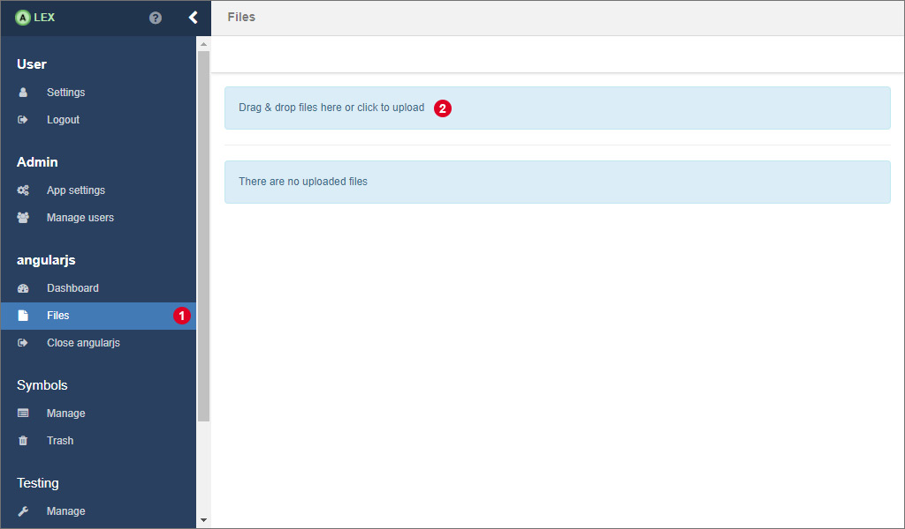
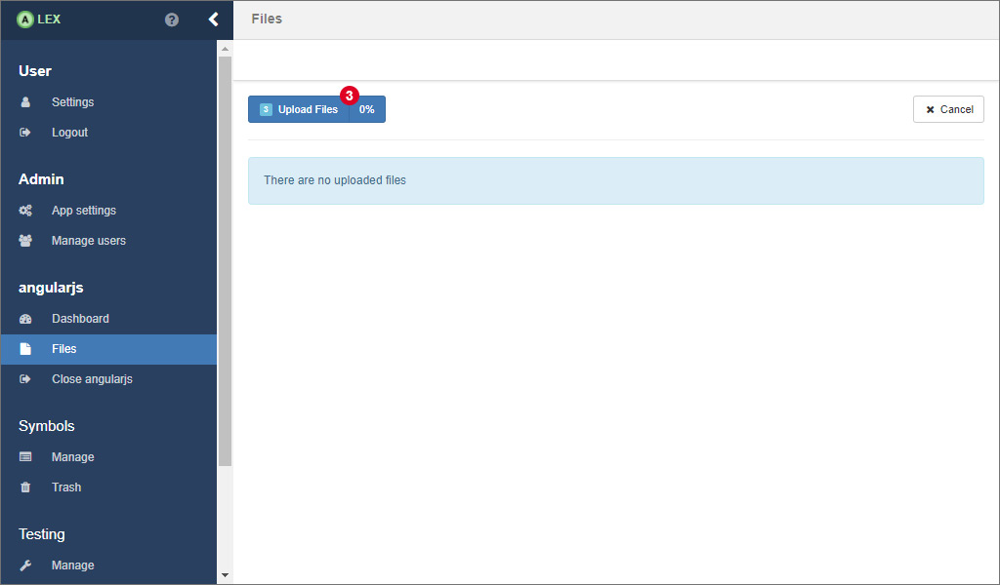
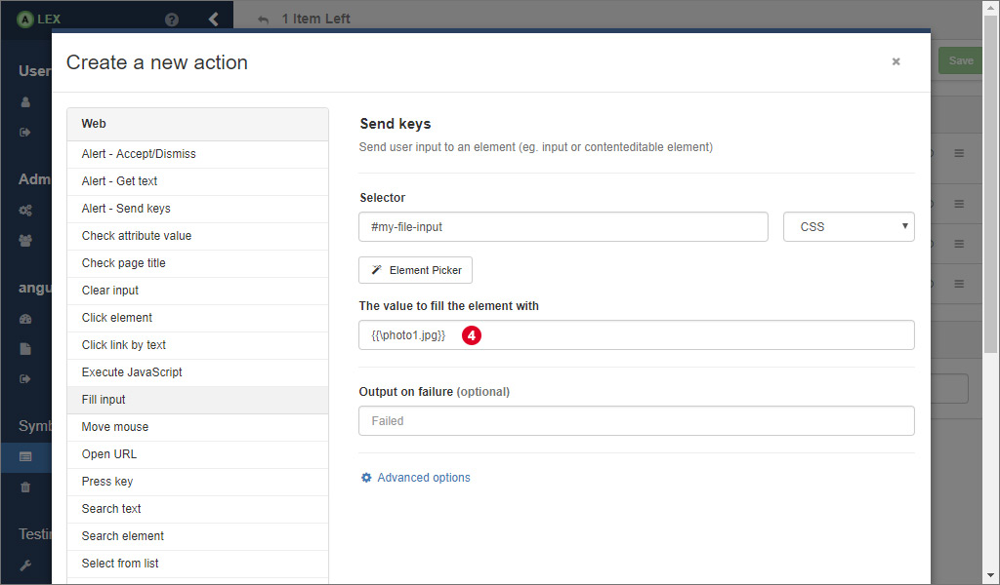

# Uploading files

A special functionality we want to present here is the upload of files to the target application via an action, since there is no dedicated action for that.
For this to work, two requirements have to be met:

1. All files have to be uploaded into ALEX first.
2. The file upload only works with native `<input type="file">` elements.
3. The execution of JavaScript has the be enabled by the targeted web driver.

For uploading files into ALEX, navigate to the *files* page by clicking on the corresponding item in the sidebar 1.
Then click on 2 to open a native file choosing dialog or drag and drop files directly in that element.

Then, click on the upload button 3 to start the upload.
The progress indicator indicates how much of a file has already been uploaded.

Once the upload is completed, the files are displayed in a list.

In order to upload a specific file to the target application, create a *fill input* action and insert the selector of the corresponding input field.
As the value, enter **\{\{\\filename.ext\}\}** where *filename.ext* should be the exact name of the file you uploaded to ALEX.

## Downloading files

Once you have uploaded a file, you can also download it again.
Therefor, click on the corresponding menu item in the dropdown menu of a file.
