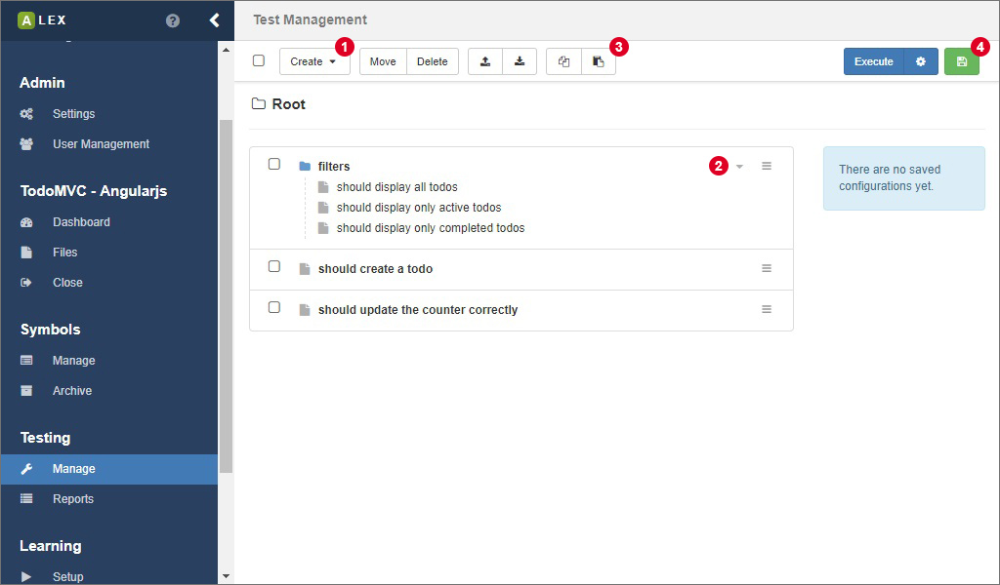
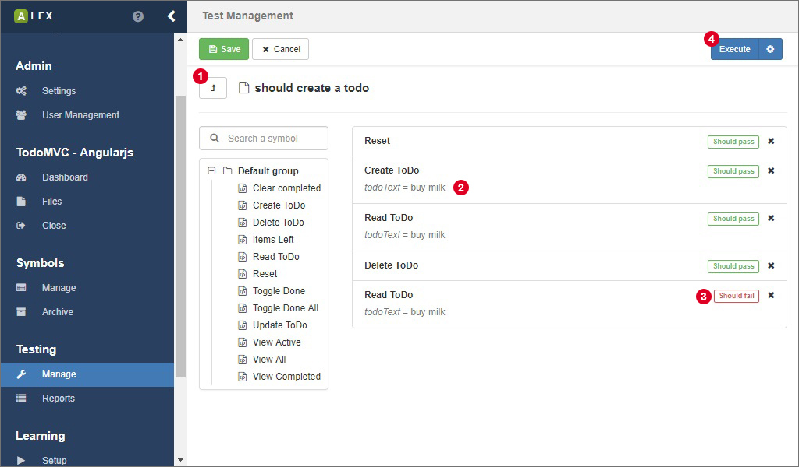
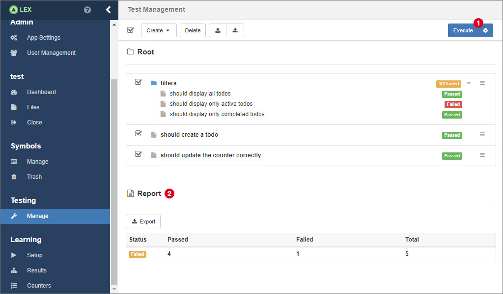

# Testing

ALEX has integration testing abilities on board. 
So, instead of learning, you can model and execute single test cases.
The corresponding functionality is available under the item **Manage** in the group **Testing** in the sidebar.

We differentiate between test cases and test suites.
A test case is a use case of the application and is modelled via a sequence of symbols.
A test suite bundles multiple test cases.
You can navigate through all test cases and test suites like in a typical directory structure.
Test cases are indicated by a file icon, test suites by a folder icon.

The option to create a test case or a test suite is available in the dropdown menu 1.
The name of a test case has to be unique within the parent test suite.
This means that it is possible to have multiple test cases with the same name as long as they are in different groups.

Via 2, you can navigate directly in the test suite.
Clicking on a test case redirects you to a view where the test case can be modelled, which is covered in the next section.
3 allows you to copy and paste test cases and test suites.

For executing tests setup more quickly, select the tests you want to execute and save the current configuration with 4.

## Test cases

Once you are in the view for a single test case, you can navigate to the parent test suite by clicking on 1.

In order to model the test, click together a sequence of symbols from the symbol tree on the left.
You can always reorder the symbols in the test by drag-and-drop.

If a symbol has input parameters defined, they are displayed here, too (see 2).
At first, they are assigned a null value which indirectly means that the values are read from the global data context that is created during the execution of the test.
If you specify a value yourself, that value overwrites the value from the global context.

A test always has to pass.
It fails if one of its steps fails and the steps after the failed step are not executed.
You can however specify with  that a step should fail.
In the example above, we specify that the last step *Read ToDo* should fail because after having deleted a todo, it should not be visible anylonger.
As a result, the test passes.

You can execute the test by clicking on  and configure the execution with the button with the gear icon on the right.
Before the execution, save any changes first so the the current version of your test is executed.
Note that if you execute the test here, no report is created.

## Executing tests

Back in the overview, select the test cases and test suites that should be executed.
The button group 1 behaves like in the test case view.

When the execution finished, labels beside each test case and test suite indicate its result. 
A yellow label indicates that some, but not all test cases inside the test suite did not pass. 

Below the list, The result over all tests is displayed in a table 2.
The results of the test execution are not saved in the database in the current version of ALEX, but you can export the results as a *[JUnit XML Report][junit]*.

[junit]: https://www.ibm.com/support/knowledgecenter/en/SSQ2R2_9.5.0/com.ibm.rsar.analysis.codereview.cobol.doc/topics/cac_useresults_junit.html
