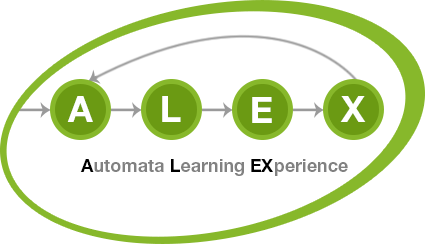

<figure>
    
</figure>

# ALEX

Automata Learning EXperience (ALEX) allows you run automated tests on Web applications and HTTP-based APIs using active automata learning.

Users model [Selenium][selenium]- or HTTP-based test inputs for their target application, which are used to automatically infer an automaton model (a [Mealy machine][mealy]) by learning algorithms.
The resulting automaton represents the user-level behavior of the web application which can be verified by LTL formulas.

[mealy]: https://en.wikipedia.org/wiki/Mealy_machine
[selenium]: https://www.seleniumhq.org/
