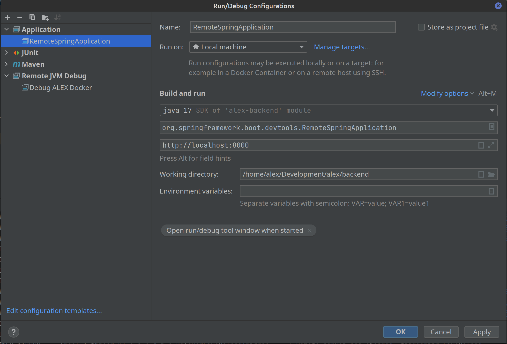

# Development (Docker)

## Requirements

To run ALEX, install the following software on your machine:

**Linux**
* Docker (v20.10.\*) and
* Docker Compose (v1.28.*)

**Windows / Mac**
* Docker for Windows

## Installation

**Windows, Linux, Mac (Intel)**

1. Clone the repository.
2. Run `docker-compose -f docker-compose.develop.yml pull`.
3. Run `docker-compose -f docker-compose.develop.yml up`.
4. Open `http://127.0.0.1:4200` in a web browser to access the frontend.

**Mac (ARM)**

1. Clone the repository.
2. Run `docker-compose -f docker-compose.develop.yml -f docker-compose.overrides.m1.yml pull`.
3. Run `docker-compose -f docker-compose.develop.yml -f docker-compose.overrides.m1.yml up`.
4. Open `http://127.0.0.1:4200` in a web browser to access the frontend.

## Credentials

After the first start, you can log in as an admin using the account below:

Email: *admin@alex.example*  
Password: *admin*

## Services

| Port | Service                       |
|------|-------------------------------|
| 4200 | Frontend (with live reload)   |
| 8000 | API                           |
| 5005 | API Debug Port                |
| 4444 | Selenium Hub                  |
| 7901 | Chrome VNC (open in browser)  |
| 7901 | Firefox VNC (open in browser) |

For both, the Chrome and the Firefox VNC server, you can use the password `secret`.

## Backend debugging

You can debug the backend of ALEX from within Docker.
In this case, we use IntelliJ to connect to the remote debugger.
Therefore, create a new run configuration.
Go to `Run`, `Edit Configurations...`, add a new configuration of type `Remote JVM Debug` and configure it according the following image:

Then, start ALEX via the `docker-compose.develop.yml`, wait until the application is started and run the created configuration.

## Backend live reload

Thanks to Spring devtools, we can leverage the live reload capability to restart the application automatically as soon as the code changes.
Therefore, create a new run configuration.
Go to `Run`, `Edit Configurations...`, add a new configuration of type `Application` and configure it according the following image:

Then, start ALEX via the `docker-compose.develop.yml`, wait until the application is started and run the created configuration.
Now you can make changes in the Java files, rebuild the module (e.g. via `STRG+Shift+F9`) and the application is rebuild inside the container.
