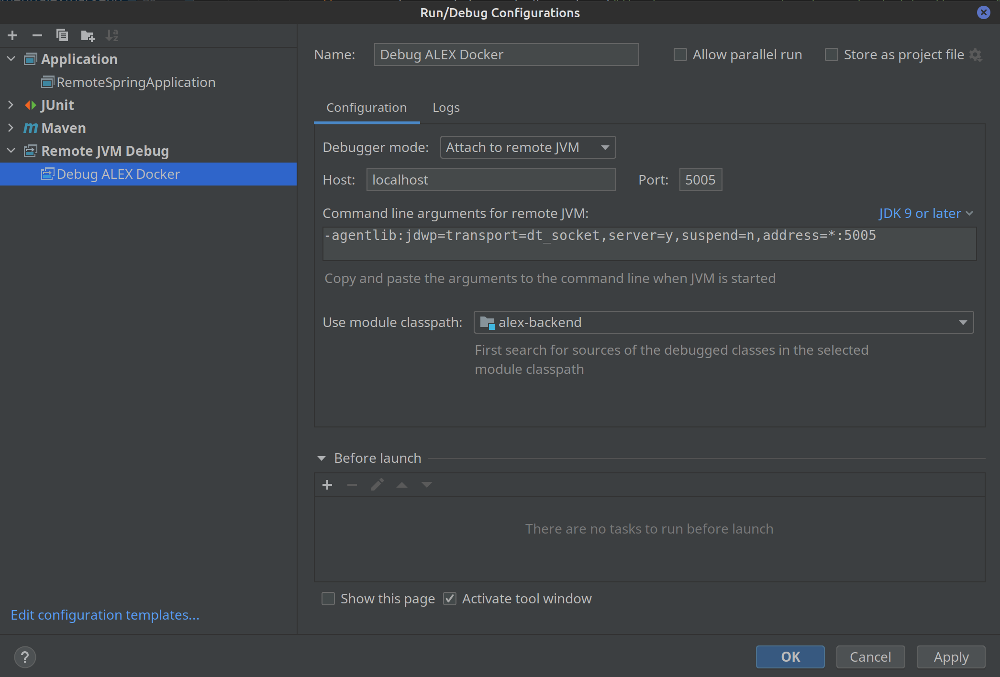
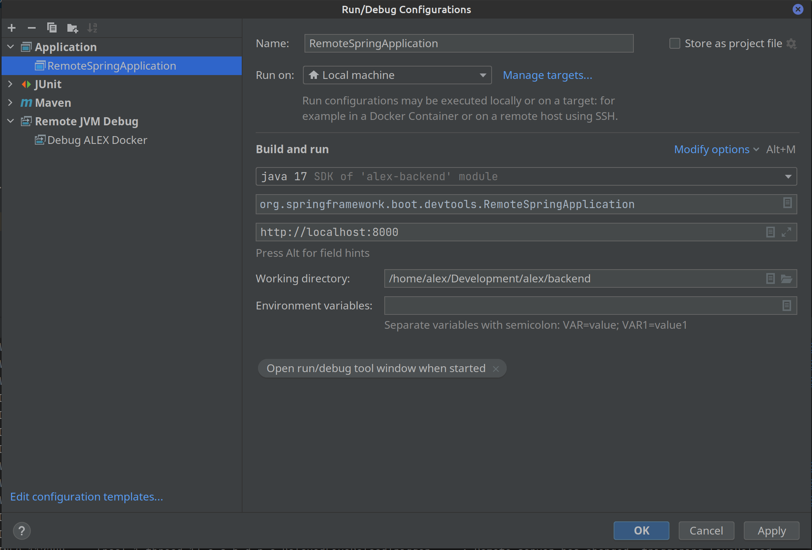

# Development

On this page, we present some information for developers and maintainers of ALEX.

- Git
- Docker
- Docker Compose

## Frontend

Make sure you have the following software installed on your development machine:

- Node.js v16 and NPM v8

The frontend is developed with [Angular][angular], relies on the Angular CLI and is written in Typescript.
Styling in ALEX is done with [Bootstrap v4][bootstrap] and SASS stylesheets.
All frontend files can be found in *frontend/src/main/javascript*.

## Backend

Make sure you have the following software installed on your development machine:

- Java JDK 17
- Maven 3.8.*

### Maven goals

Make sure you `mvn install`ed ALEX once before executing any of the following commands.

| Command                                 | Description                                                          |
|-----------------------------------------|----------------------------------------------------------------------|
| `mvn test`                              | Execute all backend unit tests.                                      |
| `mvn verify`                            | Execute all backend unit and integration tests.                      |
| `mvn checkstyle:check -Pcode-analysis`  | Check if the code style is according to the specifications.          |
| `mvn spotbugs:check -Pcode-analysis`    | Execute static code analysis with Spotbugs.                          |
| `mvn spring-boot:run`                   | Start the REST API of ALEX.                                          |

### Docker debugging

You can debug the backend of ALEX from within Docker.
In this case, we use IntelliJ to connect to the remote debugger.
Therefore, create a new run configuration.
Go to `Run`, `Edit Configurations...`, add a new configuration of type `Remote JVM Debug` and configure it according the following image:

Then, start ALEX via the `docker-compose.develop.yml`, wait until the application is started and run the created configuration.

### Live reload

Thanks to Spring devtools, we can leverage the live reload capability to restart the application automatically as soon as the code changes.
Therefore, create a new run configuration.
Go to `Run`, `Edit Configurations...`, add a new configuration of type `Application` and configure it according the following image:

Then, start ALEX via the `docker-compose.develop.yml`, wait until the application is started and run the created configuration.
Now you can make changes in the Java files, rebuild the module (e.g. via `STRG+Shift+F9`) and the application is rebuild inside the container.

## CLI

Make sure you have the following software installed on your development machine:

- Node.js v16 and NPM v8When installed locally, and the target app is also locally, the base URL of a project should start with: "http://docker.host.internal" (for Linux) and "http://192.168.65.2" (for MacOS and Windows).

## Performing a release

In the `developer` branch, perform the following steps:

1. Update the version, in the following files:
    * `backend/pom.xml`
    * `frontend/package.json`
    * `frontend/src/environments/environment.*.ts`
    * `cli/package.json`
    * `docs/package.json`
2. Commit and push the changes to the `developer` branch.
    - Ensure that the [CI pipeline][ci] passes.
3. Merge the `developer` branch in the `master` branch.
    - Ensure that the [CI pipeline][ci] passes.
4. In the `master` branch, create a new tag with the new version and perform a GitHub release.
    - Append the current `docker-compose.production.yml` file.
      For this purpose, rename the file according to the current release version, e.g. ``docker-compose.alex-3.0.0.yml``
5. In the `developer` branch, increment the version in all files from step 1 to the next minor version and append the *-SNAPSHOT* suffix.
  
  
[angular]: https://angular.io/
[bootstrap]: https://getbootstrap.com/docs/4.3/
[docker]: https://www.docker.com
[ci]: https://github.com/LearnLib/alex/actions
