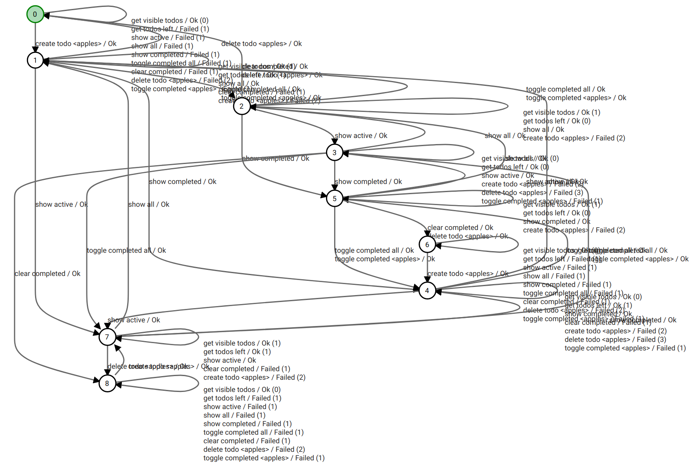

# TodoMVC

In this section, we present the steps in order to learn the *ReactJS* implementation of the [TodoMVC](http://todomvc.com/) project.

## Requirements

* ALEX v3.0.0
* [TodoMVC](http://todomvc.com/) v1.3

## Instructions

Follow the instructions on the [homepage](http://todomvc.com/) of TodoMVC in order to start the application.
In the following, we assume that TodoMVC runs on port 8080 and is accessible at *http://localhost:8080*.

### 1) Import the project

1. Download the exported project [here](/files/todomvc-react.project.json).
2. In the project overview, click on the import icon in the action bar and select the project in the file *todomvc-react.project.json*
3. Open the project by clicking on the corresponding item in the list.

### 2) Learn TodoMVC

#### With a new setup

1. Click on *Learning* > *Setups* in the sidebar.
2. Click on *New Setup*
3. For the reset symbol, select the symbol *reset*.
4. For the input alphabet, select all symbols except *reset* from the panel *Symbols* on the left.
5. The symbols *create todo*, *delete todo* and *toggle completed* have parameter *text*.
   Insert any value for each them, e.g. "bananas".
6. In the configuration panel on the right, select the TTT algorithm.
   Use a "Random Word" Equivalence Oracle with the parameters (Min length = 60, Max length = 60, Random words = 60, Batch size = 1).
7. In the *WebDriver* tab, select the desired browser.
8. Click on *Run* to run the experiment.

#### With the existing setup

For demonstration purposes, the project already contains a predefined learner setup ready to use.
The setup uses the same parameters as in the previous section and executes tests in Chrome.

1. Click on *Learning* > *Setups* in the sidebar.
   The predefined setup is called *"setup with one todo item"*
2. Click on *Run*. 

## Results 

Depending on the hardware specifications of the system that the process is running on, the execution time may vary.
For this example, the process has been executed on a Laptop with an Intel Core i7 8th Gen, 32GB RAM and an SSD.
The execution took 9min45s and the following model has been learned:

Download the DOT file [here](/files/todomvc-react.model.json).

