# Learning

## Creating a learner setup

In order to start learning an application, a learner setup has to be configured. 
Such a setup always consists of the following components:

* An input alphabet (set of symbols)
* A symbol to reset the application
* A learning algorithm
* A parametrized equivalence oracle
* A list of target URLs
* A web browser

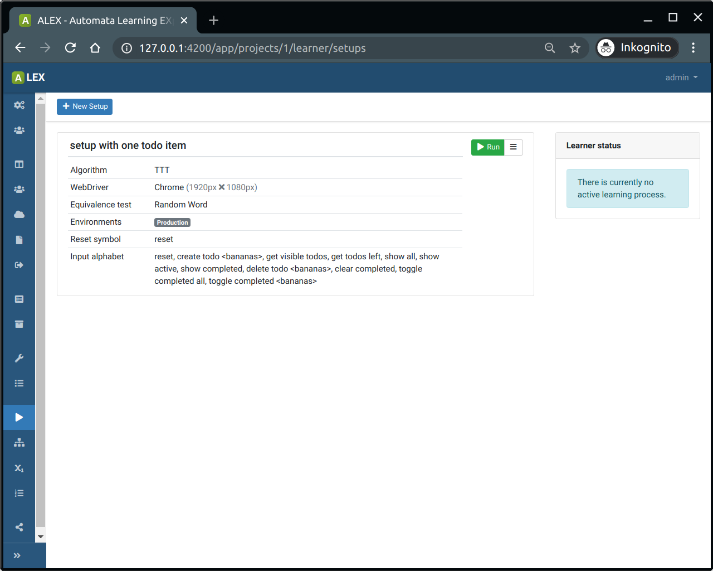

In the setup view (**Learning > Setup**), the list of created learner setups is displayed.
To create a new setup, click on the *New Setup*-button.

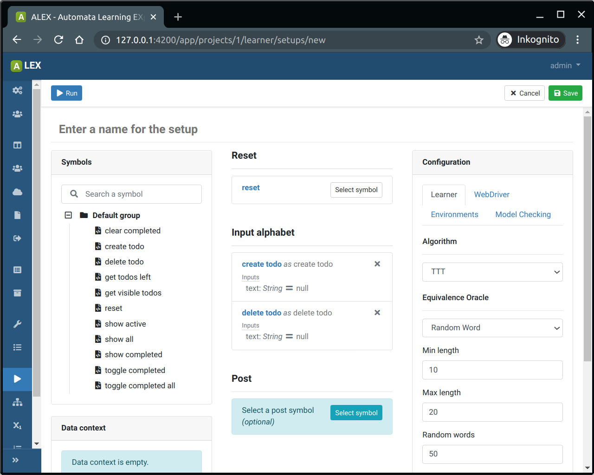

1. Select a symbol that works as a system reset in the **Reset**-section
2. Select all symbols that should be included in the input alphabet from the tree view in the left column
3. Optionally, select a symbol in the **Post**-section.
   This symbol will be executed after each membership query.

You can start the learning process with the default configuration by clicking on **Start learning**.
You can, however also adjust certain settings such as the equivalence test strategy or the target web browser.
The corresponding settings can be configured via the tabset on the right.

Here, in the tab **Learner**, select a learning algorithm first.
Per default, the *TTT* algorithm is preselected because it usually performs better than the other available options.

Then, configure the equivalence approximation strategy:

<definition term="Random word">
    The <em>Random Word</em> EQ oracle approximates an equivalence query by generating random words from the input alphabet and executes them on the system. 
    The oracles expects three parameters: <em>minLength (> 0)</em> defines the minimum length of a generated word, <em>maxLength (>= minLength)</em> the maximum length and <em>numberOfWords (> 0)</em> the amount of randomly generated words to test.
</definition>

<definition term="Complete">
    The <em>Complete</em> EQ oracle generates all possible words from an alphabet within some limits. 
    <em>minDepth (> 0)</em> describes the minimum length of word, <em>maxDepth (>= minDepth)</em> the maximum length.
</definition>

<definition term="W-Method">
    The <em>W-Method</em> EQ oracle generates words based on a transition coverage of the graph under the assumption of <em>maxDepth</em> additional states.
</definition>

<definition term="Sample">
    If this oracle is chosen, counterexamples are searched and specified manually by the user.
</definition>

<definition term="Hypothesis">
    Uses an ideal model of an application to search for differences and uses them as counterexamples.
    Note that the input alphabets should be the same.
</definition>

<definition term="Test Suite">
    Uses all tests in a test suite for the counterexample search.
    Tests that do not use the same symbols from the model's input alphabet are skipped.
    This oracle is especially useful when having generated a test suite from a previously learned model.
</definition>

In the **WebDriver** tab you can configure which web browser is used for accessing the target web application during the learning process.
Each web driver has individual options which are displayed once you select a web browser from the select input.

Under the **Environments** tab, all URLs that are registered to the project are listed.
Select the ones where membership queries should be posed to.
If more than one URL is selected, membership query batches will be parallelized automatically.

Save the configuration with a click on the **Save**-button so that it appears in the list of learner setups or execute the setup immediately.

## Learning

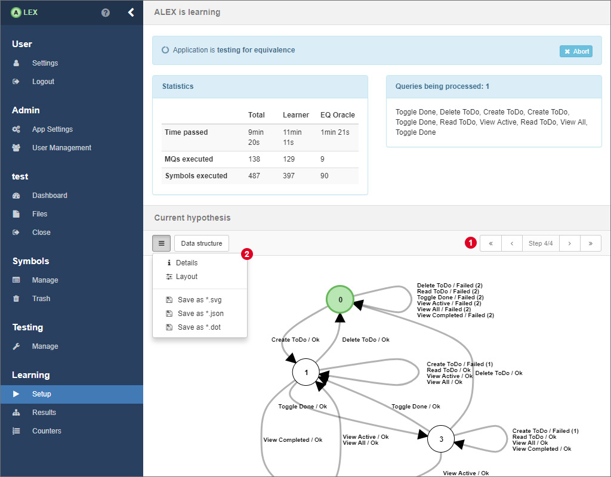

After having started a learning process and while the learner is active, ALEX shows you a loading screen where you find different information about the current process.
In the top half, several statistics and the membership queries that are being executed at the moment are displayed.
Below, the current state of the model is displayed. 
You can navigate through all intermediate models 1 or view details about the current step, change the layout of the model and export the model in the menu 2.

Hypotheses are represented as Mealy machines and represent the learned behavior of the target application. 
Nodes are labeled from *0* to *n*, where nodes represent the internal states of the target application and state *0* (visualised by a green node) is the initial state. 
Edges denote transitions from one state to another where the edge labels show the symbols whose execution led to the transition into another state.
Edge labels have the following pattern:

- &lt;symbolName&gt; / Ok
- &lt;symbolName&gt; / Failed (&lt;number&gt;)
- &lt;symbolName&gt; / &lt;customOutput&gt;

where &lt;symbolName&gt; is the name of the symbol and the text after the "/" displays the output of the system.
In ALEX, the output of the system is interpreted as *"Ok"*, if all actions of a symbol have been executed successfully.
On the other hand *"Failed (n)"* means that the execution failed on the *n*-th action of the symbol.
As you may remember, in a previous section we introduced the possibility to define custom outputs.
Custom success or error outputs for a symbol have a higher priority over the default ones. 

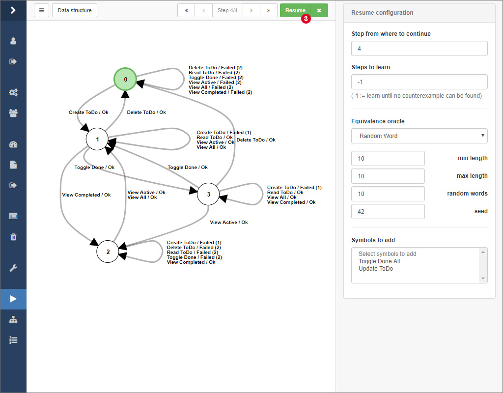

After some time, when no more counterexamples can be found, the learner finishes and the final hypothesis is presented like above.
From here on, you can, if you find it necessary, configure how the learning process should be continued.
You can also select the equivalence oracle *Sample* and search for counterexamples by yourself, which is explained in the following.

### Stopping a learning process

At each point of time during a learning process, you can abort it by clicking on the **Abort**-button beside the loading indicator.
After clicking on the button, the current membership query (batch) is still executed, but after that, the process terminates gracefully.
Models that have been inferred up to the point of termination are still available in the learning result.

### Finding counterexamples manually

Beside automated strategies for finding counterexamples, there is the option to search for counterexamples by hand directly on a model.

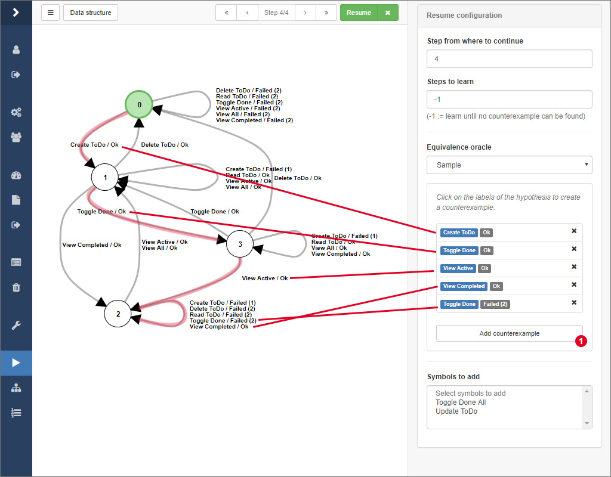

Therefore, select the equivalence oracle *Sample* from the select input in the sidebar.
Then, click together a word by clicking on the edge labels of the hypothesis.
After that, click on 1 to check if the word actually is a counterexample.

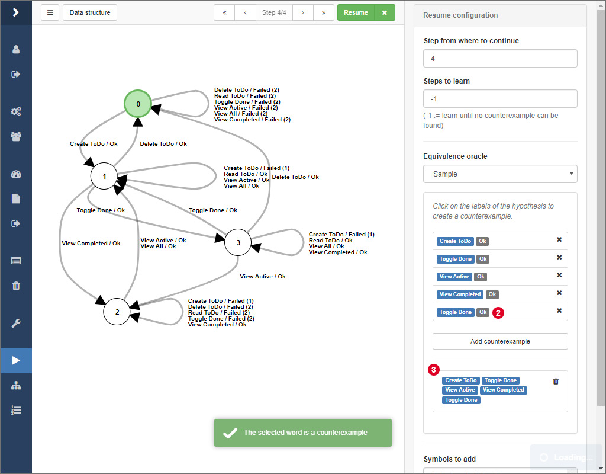

If this is the case, a notification will pop up and the actual system output of the word will be displayed at 3.
Finally, click on the *Resume* button to initiate the refinement of the model given your counterexample.

### Resuming a previous learning process

The learning process usually takes a lot of time when learning models from web applications.
The more annoying it is if the learning process is interrupted due to various reasons and you have to start learning from the beginning.
Luckily, there is the possibility to resume an old process from an intermediate model.

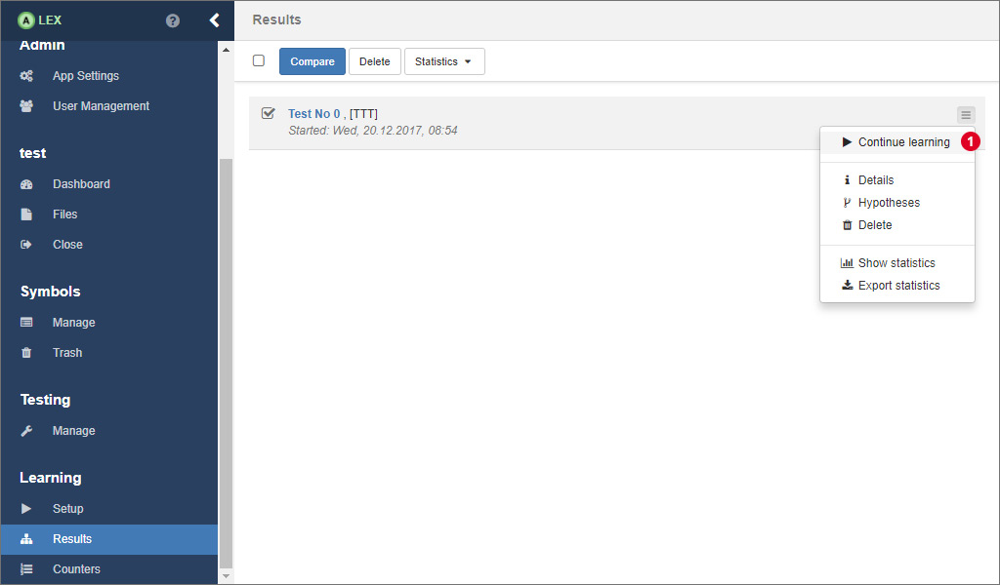

In the results overview, expand the dropdown menu on the corresponding result and click on the item labeled by *Continue learning* 1.

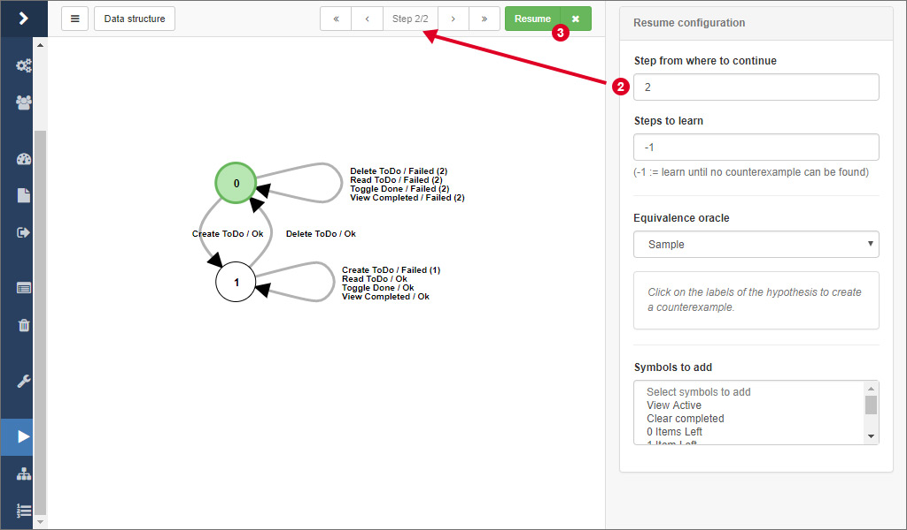

You are being redirected to the view you should be familiar with from the learning process.
Here, simply select the step 2 you want to continue learning from and configure the equivalence oracle according to your needs.
Finally, click on 3 to resume the learning process.

    When resuming a learning process and using the random equivalence oracle, make sure you use a different seed that in the run before.
    Otherwhise, membership queries are posed that have been posed before, which is not effective.

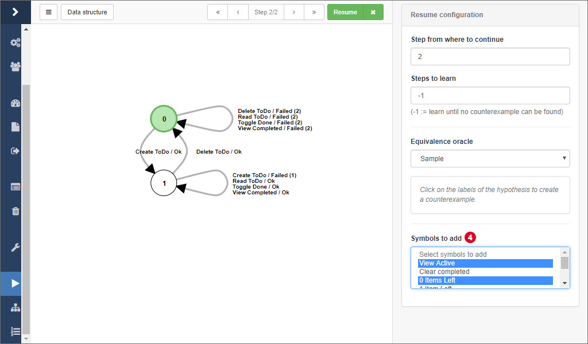

#### Adding new input symbols

You can add additional input symbols that should be included in the next iteration of a learning process.
This allows an incremental model construction.
In order to do so

1. Resume a learning process
2. In the right sidebar, open the tab **Symbols**
3. Select the symbols that you want to add.
   Symbols that are already included in the model are ignored
4. Click the **Resume**-button.
   For each new symbol, a new step is generated and finally, an equivalence test is performed.

## Test generation

ALEX allows you to generate test suites from a learned model automatically according to certain strategies, since each path of the model corresponds to a test case.
For that purpose:

1. Open any learned model
2. Switch to the testing view by selecting the **Tests** item form the select menu on the top right

We differentiate between automated and manual test generation strategies.
One option is select sequences to generate a test case from manually:

3. Click the labels on the model in the corresponding order.
   The sequence appears in the **Generate test case** widget.
4. Give the test case a name and click on the **Generate**-button.
   As a result, the test case will be created in the root test suite.

There is also the possibility to generate a test suite from the model automatically using certain strategies.

3. In the **Generate test suite** widget, select a corresponding strategy. 
   Note that the *Discrimination tree* strategy only provides state coverage, but results in a much smaller test suite than the other methods.
   The *W-Method* and the *Wp-Method* both provide state and transition coverage, but result in bigger test suites and the generation process might take longer.
4. Click on the **Generate**-button to generate the test suite

## Cloning learning experiments

Sometimes it may be useful to copy existing learning experiments, e.g. for the purpose of testing other equivalence strategies from a previously learned step.
Therefore

1. Navigate to **Learning > Results** in the sidebar
2. Open the menu for the corresponding learning experiment
3. Click on **Clone**

## Result analysis

Each learning process experiment and its results, including the models, statistics etc. are saved in the database. 
This section deals with possibilities to use the learned models for a further analysis.

### Model comparison

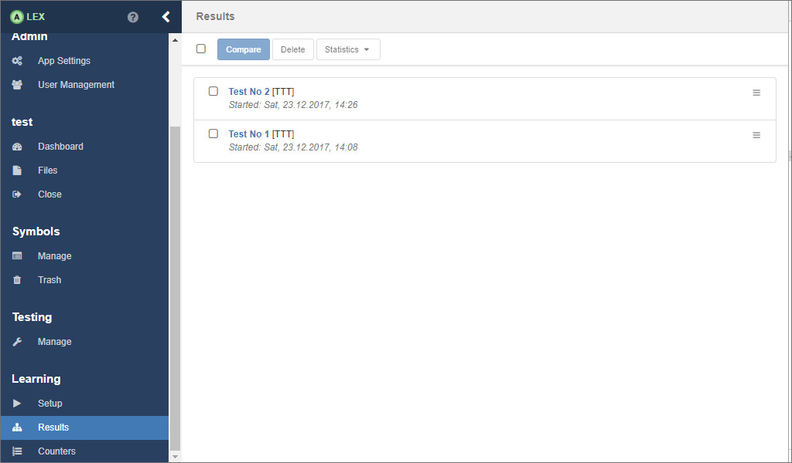

All results from the learning processes are saved in the database and are listed in the view under *Results* in the group *Learning*.
Click on the test number of a result to display the model that has been learned during the corresponding learning process.

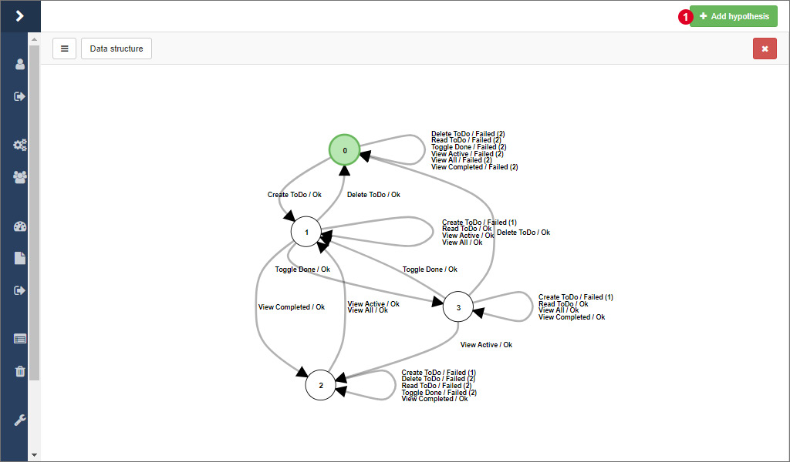

The view here is the same as the one that is displayed during the learning process.
The difference is that other models from the same project, from other projects or from a previously exported JSON file can be added and displayed side by side.
Click on 1 to open a modal window with the corresponding options.

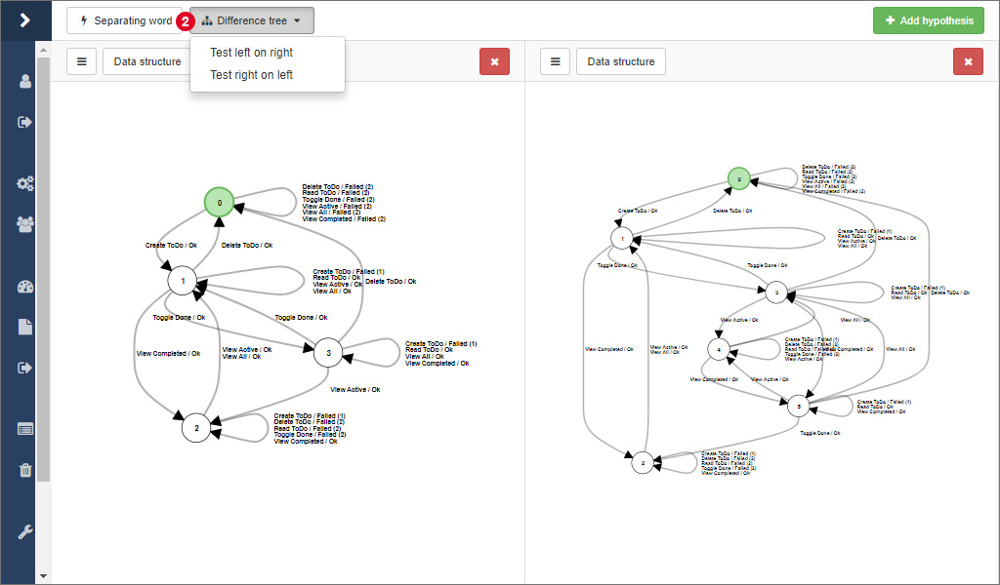

In ALEX, there are two options to compare two hypotheses, which are available at 2.
The **separating word** is the shortest word where the output of two model differ.
If no separating word can be found, both models are identical.
On the other side, such a word can indicate two things:

1. Different or differently configured equivalence oracles have been used in both test runs and one did not find as many counterexamples as the other.
2. The system under learning has changed, be it because a regression between the two test runs.
   In this case, the separating word gives you an entry point for debugging the application or it represents the change correctly.
   
Then, you can calculate the **difference** between two models.
In contrast to the separating word, *all* words are calculated where both models differ.
The result is displayed as a tree, where the paths with same suffixes have been merged for a better overview, like depicted in the picture below, where the difference is displayed in a third panel.

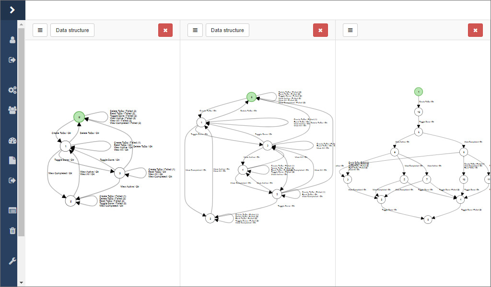

There are two options for calculating the difference between two models in the dropdown menu 2.
There are two options because of the way the difference is calculated.
As a basis, the transition coverage of one model is used and every word is tested on the other model.
As a consequence there might be different results depending on which way is used.

### Statistics

In ALEX, some statistics about the learning processes are gathered automatically, that are:

- The number of membership queries,
- the number of equivalence queries,
- the number of symbols that have been called and
- the execution time.

Each value is saved per learning step and separated by membership and equivalence oracle.

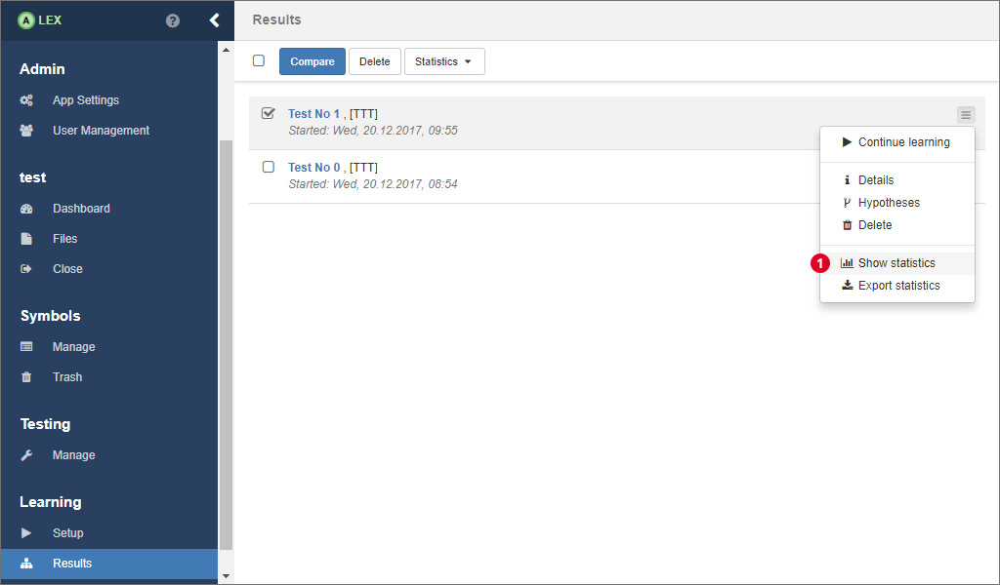

In order to display statistics, go to the results overview, and click on the item 1 on the corresponding result.

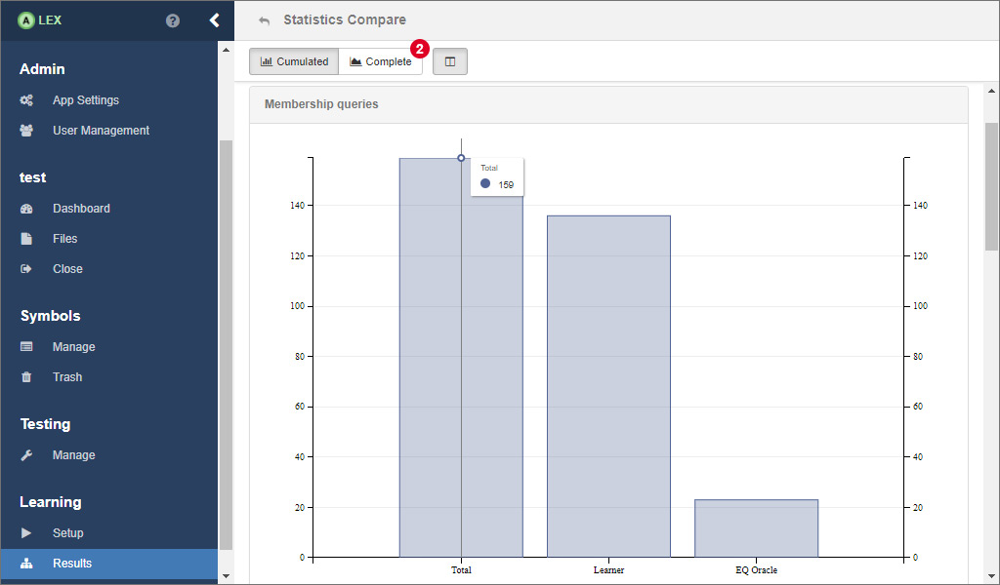

Now, you will see some bar charts for the cumulated values over all learning steps.
To see the statistics for each individual learning step, click on 2

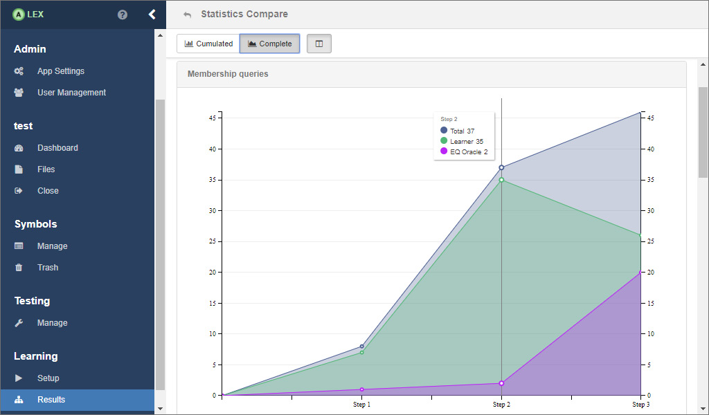

A line chart then displays the values that are listed above for each step.

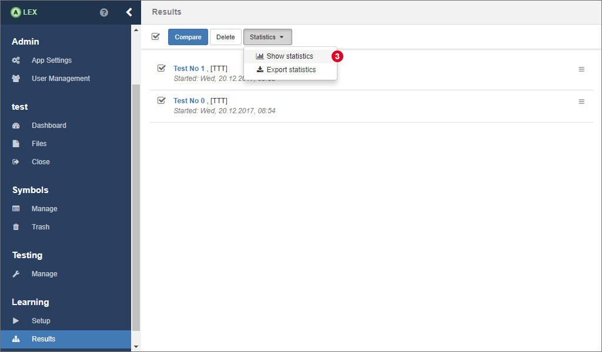

There is also the possibility to compare the statistics of multiple learning processes.
In this case, select all relevant results in the overview and click on 3.
The only difference here is that the displayed values are not separated by oracle.

## Counters

As you may recall, counters are integer values that are created, modified and used during a learning process and persisted in the database over multiple learning processes.

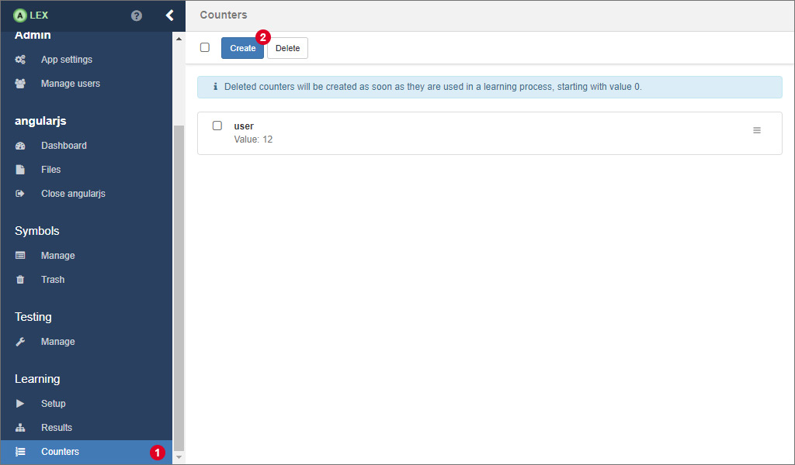

On the counters page, which you can access by clicking on the item *Counters* 1 in the sidebar, the values of existing counters can be edited and new counters can be created.

For creating a new counter with a preset start value, click on 2 which opens a modal window.

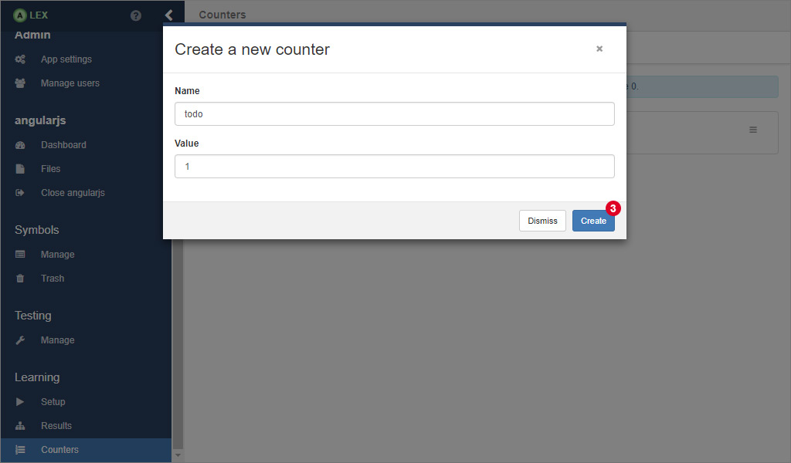

Here, insert a unique name and the value in the input fields and click on *Create* 3.
If the counter has been created successfully, the modal dialog is closed and it appears in the list.

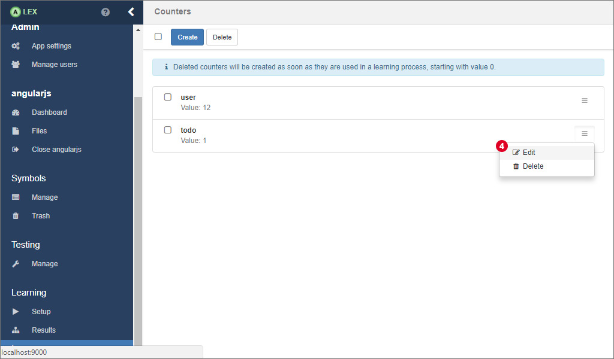

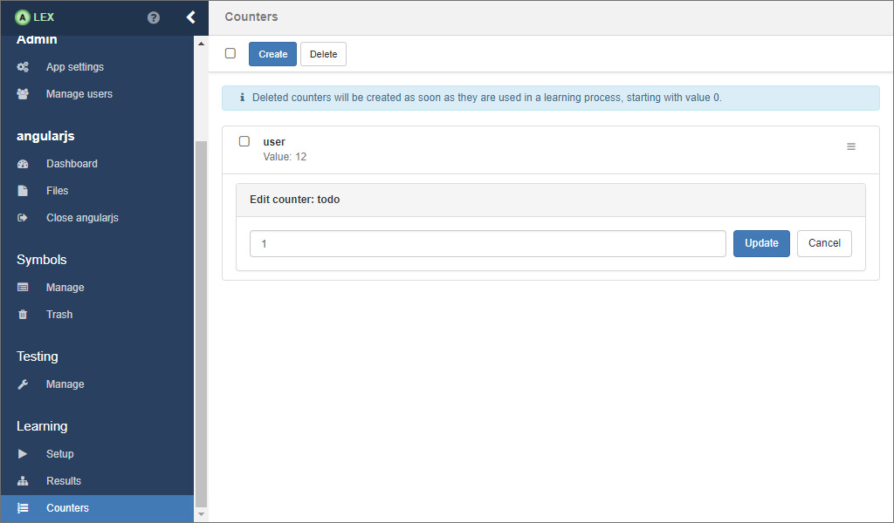

For editing the value of an existing counter, click on 4 in the dropdown menu, update the value in the form and finally, click on *Update*.
