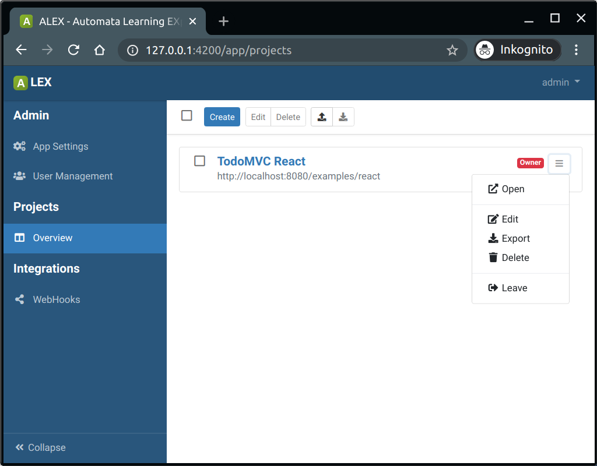
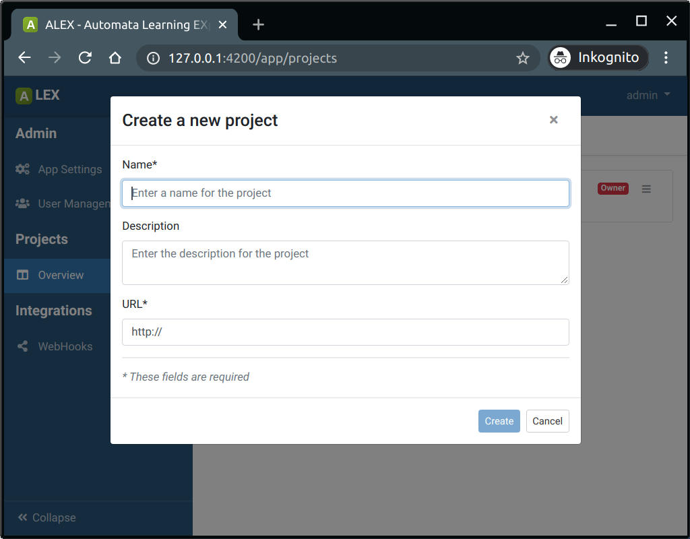
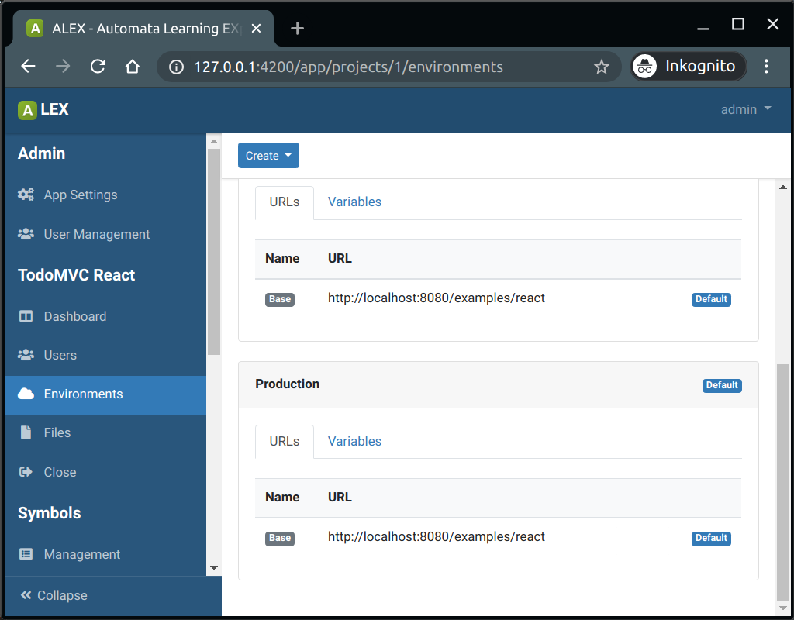

# Project management

Projects are the entities that are used to manage target applications in ALEX. 
That means that typically, for each web application a new project is created.
A project contains all resources to test and learn an application, such as symbols, tests, LTL formulas and learning setups.

## Creating a project

In order to create a new project, click on the *Create*-button.

 
A new project has the following properties:

| Field       | Description                                                                            | Required |
|-------------|----------------------------------------------------------------------------------------|----------|
| Name        | A unique name for the  project.                                                        | yes      |
| URL         | The URL of the system                                                                  | yes      |
| Description | A description of the  project.                                                         | no       |

The URL of a new project has to start with *http://* or *https://* followed by at least one further character for the host. 
The URL can, but does not have to end with a trailing '/'.

::: tip
Note: When installed locally, and the target app is also locally, the base URL of a project should start with: "http://docker.host.internal" (for Linux) and "http://192.168.65.2" (for MacOS and Windows).
:::

Deleting and updating projects can be done under the premise that there is no active learning process with the project.
Before deleting a project, make sure you have exported the project, your symbols, hypotheses or statistics because the deletion is irreversible.

## Project environments

Project environments give you the option to execute tests and learning processes against multiple system environments.
Each environment can have a set of named **URLs** and **environment variables**.
URLs are used as a base URL in certain actions, such as in the *Open URL* and *Request* action.
Variables can used in any action with the following notation, similar to how variables and counters are used: 

::: v-pre
`{{:VAR_NAME}}`
:::

## Collaboration with other users

Users can add other users to their projects in order to collaboratively with them.
We differentiate between a project **owner** and a project **member**.

A project **owner** is the user who created a project or has been made a project owner by another owner.
Project owners have exclusive rights to manage users of a project, as well as to making project related changes.
The latter includes the creation of project environments, URLs and environment variables.

### Add users to a project

1. In the sidebar, click on *"Users""* in the project group
2. Click on the *"Add User"*-button in the action bar
3. In the modal, search for a user by its username
4. Select the user and click on *Add Users* 

The added user will then see the project in his overview.

### Leave a project

1. Go to the project overview page
2. Click on *Leave* in the dropdown menu beside the project

*Note:* As an owner, you cannot leave project if a) it has members and b) you are the only owner left.
Announce another project member as owner and then you can leave the project.
