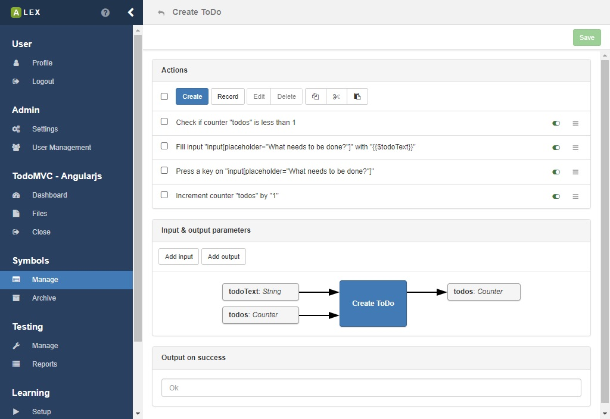

# Symbol management

The modelling of input symbols is a key aspect of using ALEX.
They define interactions with the system under learning and thus are the building blocks of every learning process and test case.

Once you have logged in and opened a project, click on 1 to open the view for the symbol management.

## Symbol groups

Symbol groups are logical container for symbols.
Per default, there is a default group that is created during the creation of the project.
The default group can not be deleted, and all symbols, if not specified otherwise, are put into it.
You can create a new group by clicking on 2 and select the corresponding item from the dropdown menu.
You are then asked for a name for the group, which has to be unique.
Once a group has been created, you can edit and delete it, by clicking on the *gear* icon that is found on the right.

## Symbols

When creating a new symbol (see 2), you have to specify two properties:

| Name            | Description                                                                             |
|-----------------|-----------------------------------------------------------------------------------------|
| Name            | A unique name of the symbol                                                             |
| Description     | A textual description of the symbol (optional)                                          |
| Expected result | A textual description of the expected result (optional)                                 |
| Symbol group    | The group the symbol belongs to. Per default, the default group of the project is used. |

Once the symbol has been created successfully, it appears in the specified group.
For each symbol, there is a list of operations that are accessible by clicking on the menu 3 of which most are self explanatory.
In the menu on top of the page, these operations are available for a batch of symbols.

Each symbol contains of a sequence of actions, that are managed in a separate view.
Click on the link below the symbol name or the item *Actions* in menu 3 to open the action management for the symbol.

### Searching symbols

Directly below the action bar, a search input is displayed which you can use to quickly find symbols.
A click on a result redirects you to the symbol page.

### Restoring archived symbols

Once you archived a symbol, it is not really removed from the database, instead, they are put into the symbol archive.

You can see all archived symbols in the overview which can be accessed via the item *Archive* in the sidebar.
Here, you can recover symbols, edit their names and permanently delete them.
Note that it is only possible to delete a symbol permanently if the symbol is not still in use, for example in test reports or learning results.
Further, recovered symbol is then moved into the default group.

### Permanently delete symbols

Symbols can be deleted permanently from the archive if there are no references to the symbol anymore, be it for example in models, tests or other symbols.

1. In the sidebar, click on **Symbols > Archive**
2. Select the symbols you want to have deleted permanently
3. In the action bar, click on the **Delete**-button
4. If there is a reference to one of the selected symbols, a notification will appear.
   Otherwise the symbols are removed.

### Export & import

If you want to save a set of symbols for another project or use existing ones, ALEX offers an export and import feature.
Note that existing symbol groups are not exported in order to be compatible with other projects.

In order to export symbols, select the corresponding symbols in the overview and click on the export button 1.
You are then asked for name of the JSON file which will be downloaded.
Additionally, you can decide if only the selected symbols are exported, or if the symbol groups that they are in are exported as well.

In the same view, you can import existing symbols from a JSON file by clicking on 2 which opens a modal window.
Here, drag and drop the JSON file you exported in the previous step.
The import will not work unless the names of the symbols are unique within the project.
If everything goes fine, the modal window will close automatically and the symbols appear in the selected group.

### Symbol parameters

Symbols have input and output parameters for variables and counters (see next section for more information).

Variables and counters are read from and written into and a global store during a membership query, see the image above.
Before a variable or counter can be used in a symbol, it has to be defined in as input parameter for the symbol.
Local modifications of variables and counters do not affect the global context unless they are written back as output.

<figure>
    
</figure>

If you use a variable or a counter that has not been defined, the execution of the symbols fails and the output is: *Undefined variable: Name*, or *Undefined counter: Name* respectively.

## Actions

The function of a symbol is defined by its actions and their execution order. 
An action can be understood as an atomic interaction with a system, like clicking on a button, submitting a form, making an HTTP request to a REST API and so on.

In the actions view of a symbol, the sequence of actions, which can be rearranged via drag and drop, is displayed.
Everything you do here is not saved automatically.
Instead, a notification on the top 3 notifies you that something has changed.
A click on the *Save* button saves the action and you are safe to navigate to another page.

A click on the create button opens a modal window, where, on the left, the list of all possible actions is listed.
On the right, the form for a selected action is displayed. 
With 4 you can search for an action by its name instead of searching it in the list.

Each action can be marked with three different flags which are

| Flag          | Description                                                                                                        |
|---------------|--------------------------------------------------------------------------------------------------------------------|
| negated       | Negates the outcome of an action.                                                                                  |
| ignoreFailure | If this flag is set to "true" proceeding actions are executed although the action failed.                          |
| disabled      | If this flag is set to "true" its execution is skipped during the call of its symbol. 2 |

Normally, the output of a system is either *"Ok"* or *"Failed"* depending on success of the execution of the symbol.
If this is not expressive enough, you can also specify a custom failure output of each action that is propagated to the symbol.
Insert the custom output in 6 (image above).
In this field, dynamic values can be inserted as well (see section about variables and counters below).

In the overview, you see another input field for the custom success output of the symbol.
The value that is inserted here will be the output in case all actions can be executed successfully.
Note that there can be dynamic outputs as well via variables and counters (see below).

A useful feature is that you can also use copy, cut and paste operations on actions, if e.g. symbols behave similar.
The option for this can be found in the dropdown menu on the right of each action or for a batch operation on selection actions in the action bar on top 7.

In the next sections, we go a little deeper into the single categories of actions.

### Web actions

Web actions are used to interact with a browser interface like a normal user would and are based on the Selenium framework. 
Most web actions require that a *locator* to the element to interact with is specified. 
There are three possible options how to define such a locator:

| Type  | Description                                        | Example                                      |
|-------|---------------------------------------------------------------------------------------------------|
| CSS   | A valid CSS3 locator                               | `#new-todo`                                  |
| XPath | An XPath expression to an element in the DOM tree  | `//*[@id='new-todo']`                        |
| JS    | A JavaScript snippet that returns an element, e.g. | `return document.querySelector('#new-todo')` |

### REST actions

REST actions are used to communicate with HTTP-based APIs and offer the possibility to perform HTTP requests and assert the contents of HTTP responses. 
Most REST actions assume that the response body is formatted in JSON.

Working with HTTP requests and responses follows a certain pattern. 
When modeling symbols, start with a *Make Request* action and use other actions to work with the response.
The context of the *Make Request* action, namely the HTTP response, is passed to the following actions until the next *Make Request* action is made.

### General actions

Actions of this group allow the interaction between different symbols and actions, for example by storing and passing *String* and *Integer* values to other actions.
This is achieved by using *Variables* and *Counters* respectively, which are explained later on this page.

### Label actions

There are to kinds of actions of this type:

The **Create Label** action is used to define certain points inside the action sequence of a symbol that can be jumped to during the execution.

The **Jump to Label** action can be used to conditionally jump to an existing label *L* inside the action sequence.
It expects a JavaScript snipped that returns a boolean value.
If the script returns `true` then execution continues with the action that comes after *L*.
Otherwise the action sequence is continued normally.

Both actions will never return a failed output.

## Variables and counters

Many web applications handle dynamic data. 
In order to model and learn such behaviors and to pass data between symbols, actions and learn processes, *variables* and *counters*.

<definition term="Variable">
    A variable is a string value that is kept in the scope of a membership query.
</definition>

<definition term=Counter>
    A counter is a positive or negative integer value that are persisted in the database per project.
    Usually, they are used to create multiple objects of the same kind, e.g. user1, user2, ... and so on. 
</definition>

In order to make use of those in actions, there is a template language that has to be used in action fields:

::: v-pre
| Notation           | Description                                                                       |
|--------------------|-----------------------------------------------------------------------------------|
| {{#counterName}}   | The value of the counter with the name *counterName* is inserted                  |
| {{$variableName}}  | The value of the variable with the name *variableName* is inserted                |
| {{:variableName}}  | The value of the environment variable with the name *variableName* is inserted    |
:::

The following example demonstrates the usage of variables, but counters can be used similarly.

Assume that we have an application that manages todo items and the element with the selector `#new-todo` is the input field that allows a user to create a new item.
We now want to insert the content of the item dynamically via a variable.
First, create an action that sets the value of the variable.
As you can see in the picture above, there are some choices for how to do this.

Then, we create another action that inserts the value of the variable into the element `#new-todo`.
In the input field for the value, we use the notation from the table above to indicate that we want to insert the value of the variable *todoName*.

As soon as the action is executed, the value of *todoName* is inserted automatically. 
In the todo list, a todo with the text *"buy milk"* would appear in the application.

## Using files

### Upload

A special functionality we want to present here is the upload of files to the target application via an action, since there is no dedicated action for that.
For this to work, two requirements have to be met:

1. All files have to be uploaded into ALEX first.
2. The file upload only works with native `<input type="file">` elements.
3. The execution of JavaScript has the be enabled by the targeted web driver.

For uploading files into ALEX, navigate to the *files* page by clicking on the corresponding item in the sidebar 1.
Then click on 2 to open a native file choosing dialog or drag and drop files directly in that element.

Then, click on the upload button 3 to start the upload.
The progress indicator indicates how much of a file has already been uploaded.

Once the upload is completed, the files are displayed in a list.
Then, use the **Upload File** action and specify a file to upload and an `input[type="file""]` element.
Note that currently, it is not possible to upload multiple files at once.

### Download

Once you have uploaded a file, you can also download it again.
Therefore, click on the corresponding menu item in the dropdown menu of a file.
