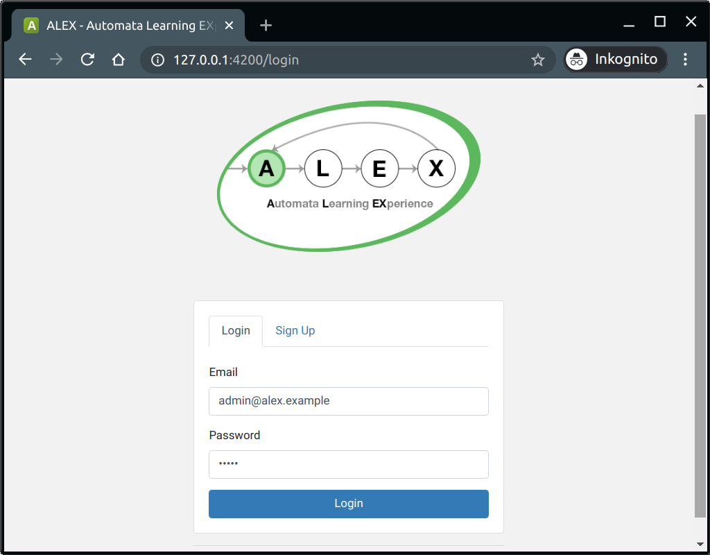
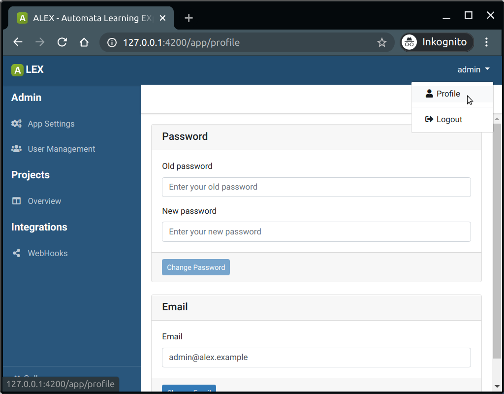
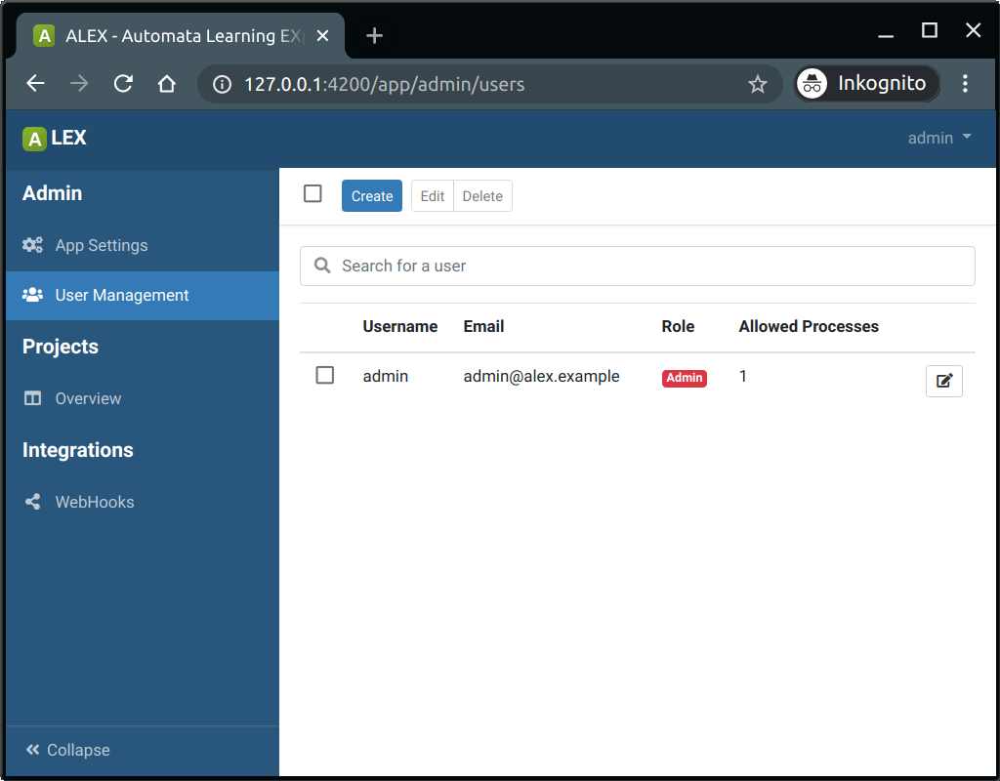

# User management

There are two roles in ALEX which are listed below.

| Role       | Description                                                                   |
|------------|-------------------------------------------------------------------------------|
| Registered | Default user role.                                                            | 
| Admin      | All rights of a user, plus user management and can edit application settings. |

The first time ALEX is started, a default admin account is created which can be used to login instantly:

Email: *admin@alex.example</em>*  
Password: *admin*

## Logging into ALEX

The picture above shows the start page of ALEX. 
You can either create a new account or sign in with an existing account.

## Updating the user profile

Once you are logged in, you can edit your user profile by clicking on the **"Profile"** item in dropdown menu on the top right.
Here, you can change your email address, your password or delete your account permanently.

## Admin user management

Admins also have the possibility to manage all existing users that are registered.
Therefore, click on the item **"User Management"** in the group **"Admin"**.

The click on the *Edit*-button opens a modal dialog where you can update information for each user.

### Allowed processes

This value indicates how many browser instances are available to this user.
These instances are used for learning and testing processes.
If, e.g. the value is set to 1, the corresponding user can only execute one learning process or one testing process.
