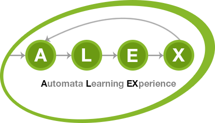

<figure>
    
</figure>

# ALEX

Automata Learning EXperience (ALEX) is an extension of [LearnLib][learnlib] that allows you run automated tests on web applications and JSON-based REST APIs using active automata learning.

Users model [Selenium][selenium]- or HTTP-based test inputs for their target application, which are used to automatically infer an automaton model (a [Mealy machine][mealy]), which represents the behavior of the web application.

[learnlib]: https://github.com/LearnLib/learnlib
[mealy]: https://en.wikipedia.org/wiki/Mealy_machine
[selenium]: https://www.seleniumhq.org/
