# ToDo

    The following guide has been created with an older version of ALEX.
    The provided symbols cannot be imported directly and the interface of ALEX has changed quite a bit.
    However, this examples still serves the purpose of demonstrating the general workflow with ALEX and you can still download the demo application.

The application is called *ToDo* and is pretty much destined to do what it sounds like. 
With ToDo, you can manage simple tasks, give them a termination date, a priority and create categories to group them. 
Beside a frontend, it also offers a REST API which offers the same functionality.

This tutorial will guide you in a step by step manner through learning the frontend part of ToDo with ALEX, beginning from the setup of ToDo and ending with a learned model of it. 
We do not offer any kind of user manual or documentation for ToDo since we want this guide to be an explorative process for you.

All required files to start and learn ToDo can be downloaded here: [ToDo.zip](https://ls5vs001.cs.tu-dortmund.de/alex/website/1.5.0/todo.zip).

## Installation

### Setup ToDo

In order to setup ToDo, download the archive and extract it to an arbitrary location. 
Make sure you have Java JRE or JDK v8 or higher installed. 
Open a terminal, navigate to where the extracted files are located and execute `java -jar ./jetty-runner.jar --port 9090 ./Todo-App.war`. 
Then, open `http://localhost:9090` in a web browser of your choice. 
You should see the login form of ToDo which looks like this:

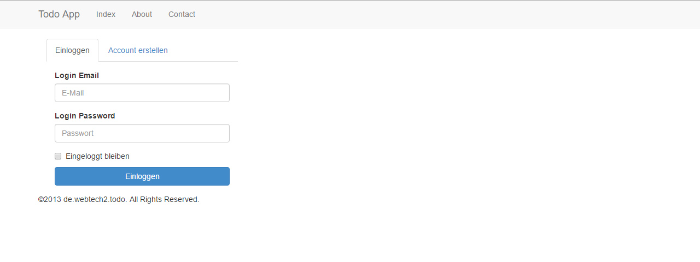

### Setup ALEX

The first thing we do is logging into ALEX.

<slides>
  <slide>
    <template slot="image">
      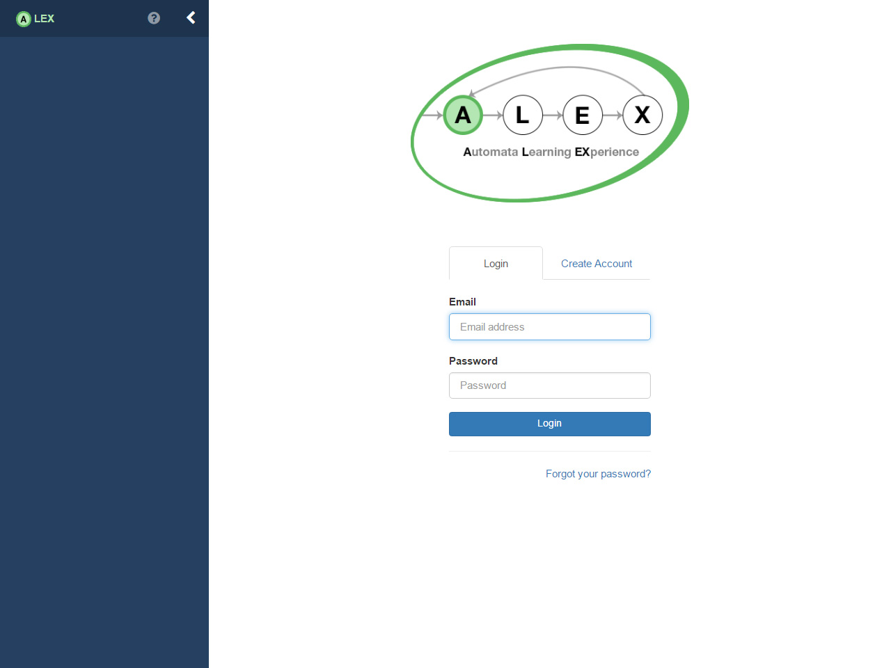
    </template>
    <template slot="text">
      Open the startpage of ALEX.
    </template>
  </slide>
  <slide>
    <template slot="image">
      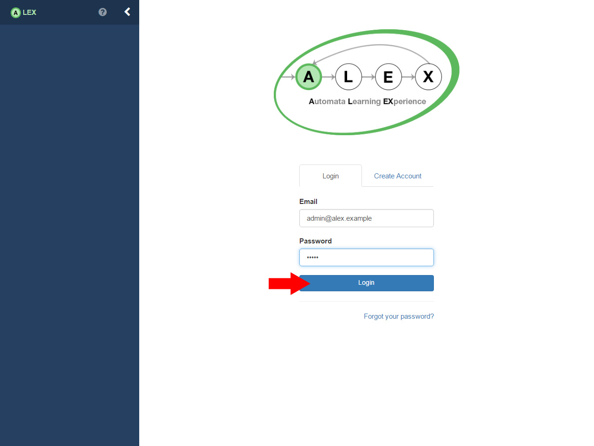
    </template>
    <template slot="text">
      Enter the credentials and press the <em>Login</em> button.
    </template>
  </slide>
  <slide>
    <template slot="image">
      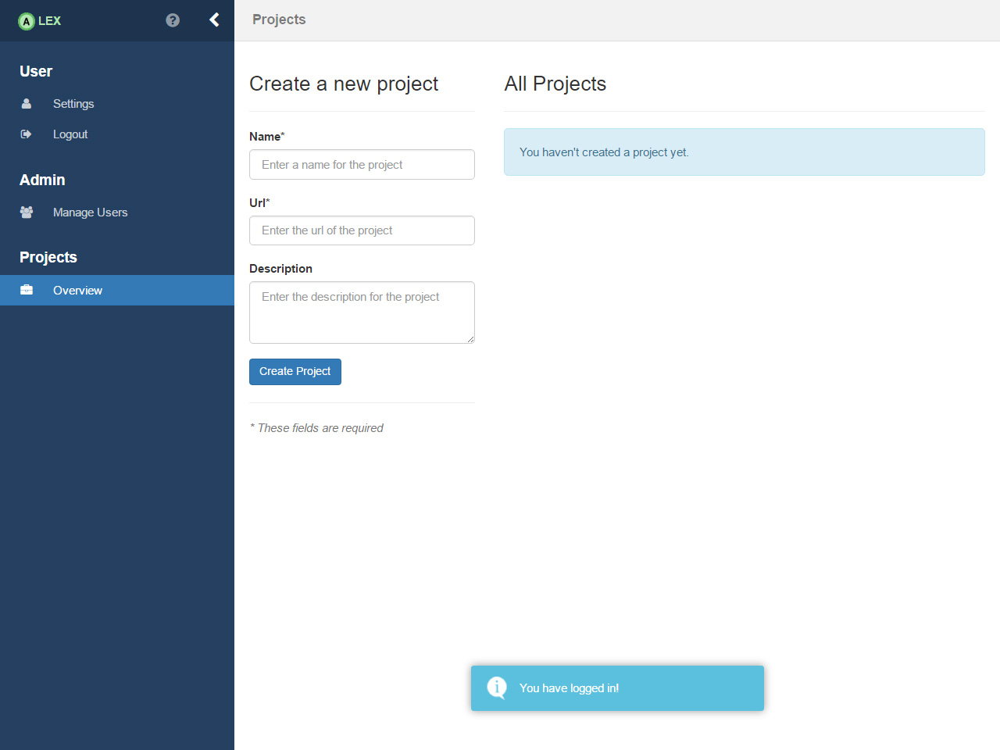
    </template>
    <template slot="text">
      After the login, the project view is displayed.
    </template>
  </slide>
</slides>

## Create a project

After that, we create a project in ALEX for the application.

<slides>
  <slide>
    <template slot="image">
      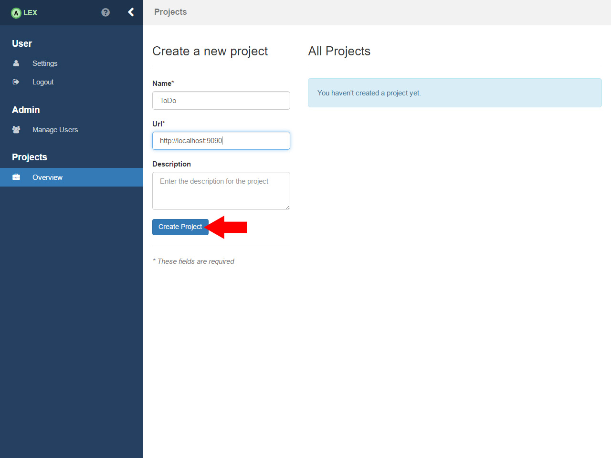
    </template>
    <template slot="text">
      To create a new project enter a name of your choice and the URL where the ToDo is reachable (http://localhost:9090).
      Optionally, enter a description and press the <em>Create Project</em> button. 
    </template>
  </slide>
  <slide>
    <template slot="image">
      
    </template>
    <template slot="text">
      A message pops up and the project should is listed on the right side.
      A list of all projects is listed on the right.
    </template>
  </slide>
  <slide>
    <template slot="image">
      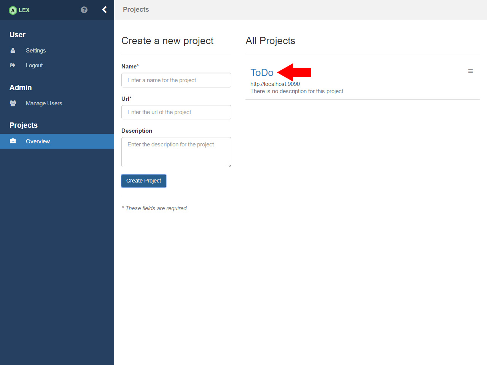
    </template>
    <template slot="text">
      Click on the name of the newly created project in the list to open it. 
      You are being redirected to the projects dashboard.
    </template>
  </slide>
  <slide>
      <template slot="image">
        
      </template>
      <template slot="text">
        There, a brief overview of the project and current learn processes are displayed. 
        On the left, new navigation items are shown to navigate through ALEX.
      </template>
    </slide>
</slides>

## Create symbols

Before the application can be tested or learned, we have to model symbols (test inputs).

<slides>
  <slide>
    <template slot="image">
      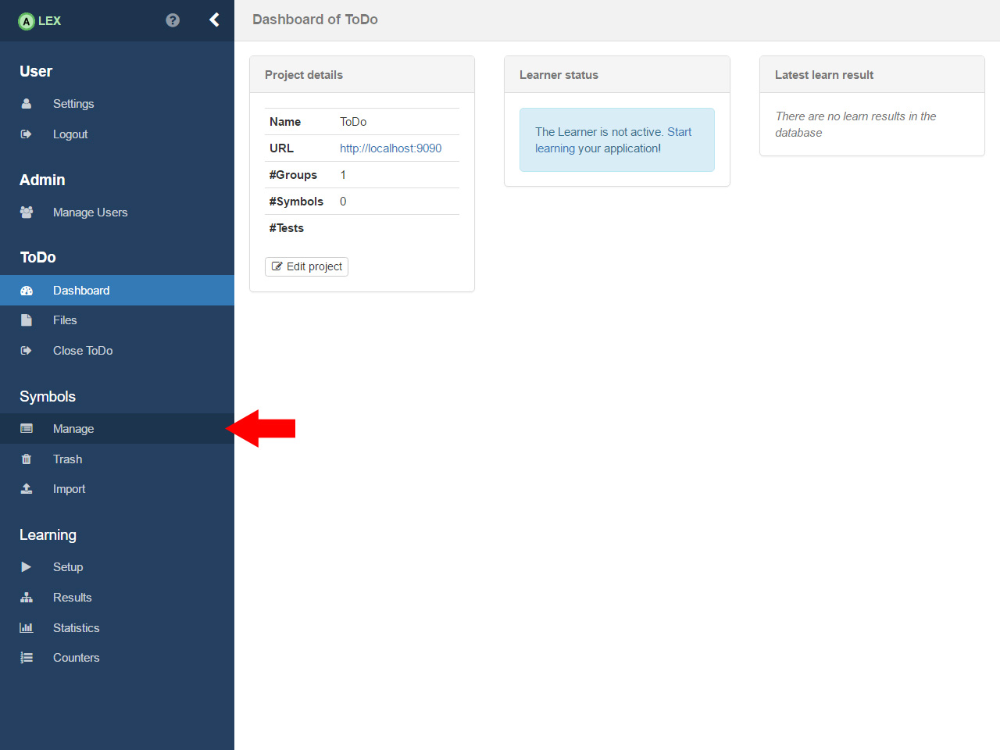
    </template>
    <template slot="text">
      In order to create symbols, click on the item <em>Manage</em> under the group <em>Symbols</em> in the sidebar. 
    </template>
  </slide>
  <slide>
    <template slot="image">
      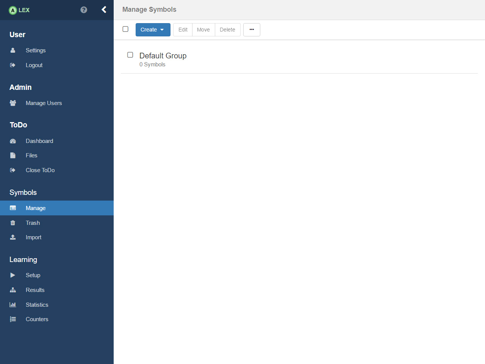
    </template>
    <template slot="text">
      At first, only the default group and no symbols are displayed.
    </template>
  </slide>
</slides>

Now, we create the symbols that should model features of the application under learning. 
Before we do so, let us list the features of ToDo that we want to test. 
In ToDo, we can:

* Create a new user
* Login a user in the system
* Logout the current user
* Delete the current user
* Create a task
* Update a task
* Delete a task
* Create a category
* Update a category
* Delete a category
* Assign a category to a task

As a consequence, we will create the symbols _Create User_, _Login_, _Logout_, _Delete User_, _Create Task_, _Update
Task_, _Delete Task_, _Create Category_, _Update Category_, _Delete Category_ and _Assign category_.

In addition to that, we will also create a symbol __Reset__ with which we model the logic for the reset of the application. 
This is required since for every query that is posed, the application should be in its initial state.

<slides>
  <slide>
    <template slot="image">
      
    </template>
    <template slot="text">
      In order to create a symbol, click on the menu button <em>Create</em> in the bar on the top and choose the entry with the text <em>Symbol</em>. 
      A modal window pops up, asking for a name, an abbreviation and a group.
    </template>
  </slide>
  <slide>
    <template slot="image">
      
    </template>
    <template slot="text">
      As the name, we use the ones from above and for the abbreviation, we use the lower camel case variant of the name.
      For example, We create a symbol <em>Create User</em> with the abbreviation <em>createUser</em>. 
      The field for the group is left empty. 
      After the click on the <em>Create</em> button, the symbol should be listed under the default group.
    </template>
  </slide>
  <slide>
    <template slot="image">
      
    </template>
    <template slot="text">
      All other symbols including the reset symbol are created analogously.
    </template>
  </slide>
  <slide>
    <template slot="image">
      
    </template>
    <template slot="text">
    </template>
  </slide>
</slides>

## Implement symbols

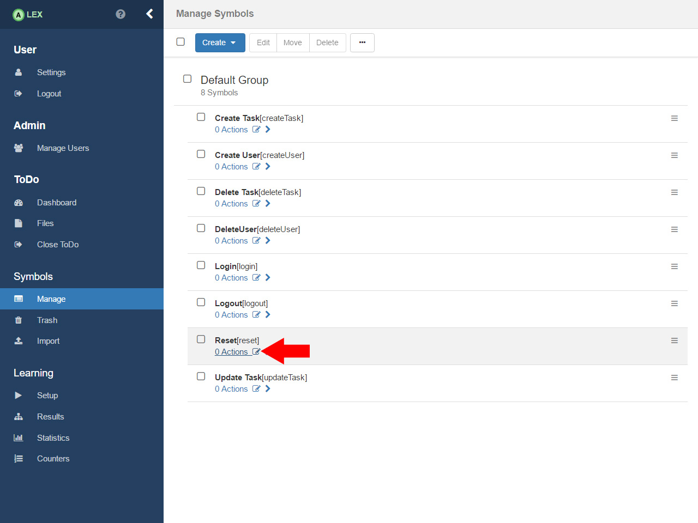

The first symbol we want to model is the reset symbol.
In this case, we first have to think about what the initial state of ToDo is.
Here, it is the case when no user except the admin is registered in the system. 
Via actions that are assigned to the symbol, we have to reach that state.

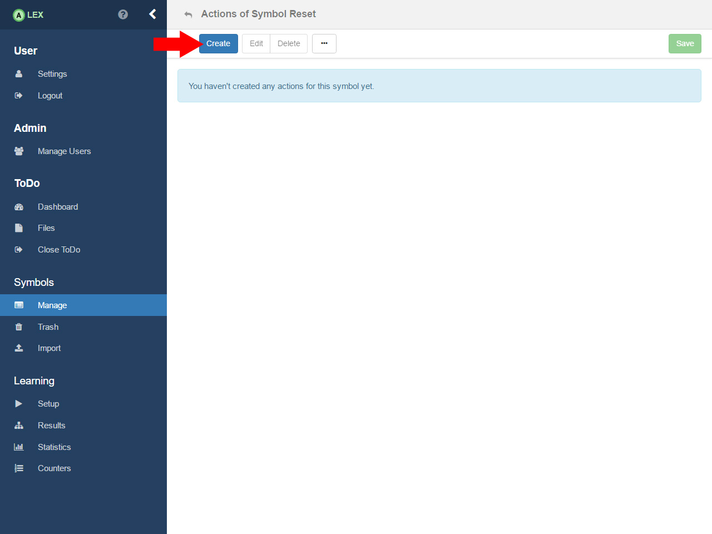

Therefor, click on the link under the correspondent action to open the view for managing actions of a symbols. 
At first, no actions are created. 
To create the first action, click on the __Create__ in the top bar which results in a new modal window which displays the action editor.

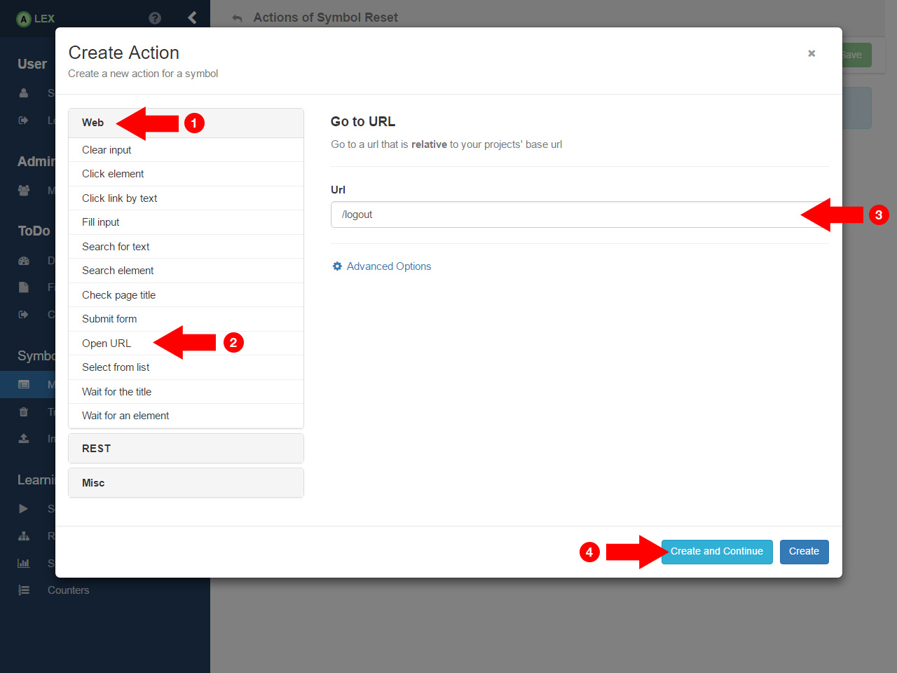

The first thing we want to do is logout the user that is potentially logged in. 
Because we want to model an action on the real browser, we __(1)__ click on the __Web__ group on the left and in the collapsing menu, __(2)__ click on the item __Open URL__. 
On the right side, a form is displayed where __(3)__ we enter the URL _/logout_. 
Note that the entered URL is relative to the root URL of the project. 
Finally __(4)__ we create the action by clicking on the button __Create and Continue__, which creates the action, but does not close the modal window, contrary to the __Create__ button.

After the logout, we should be on the index page of ToDo which displays the login form.
We now want to login as the administrator. 
To fill out the form, __(1)__ select the action __Fill input__ from the left menu. 
You are prompted to enter the CSS selector of the input element and the value that should be entered in the input. 
To find out the selector, you can use the _Element Picker_ to extract the selector automatically from ToDo. 
Click on the corresponding button and the Element Picker pops up and loads the root URL of ToDo.

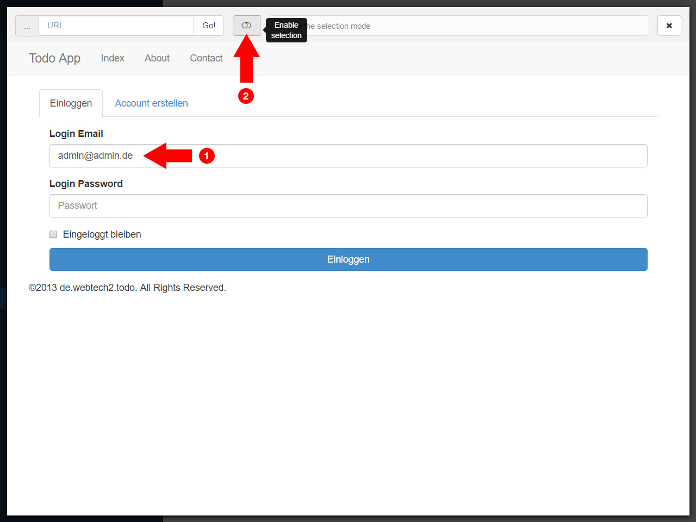

You can navigate freely within ToDo via the Element Picker. 
First __(1)__, enter _admin@admin.de_ in the email field. 
Then __(2)__ toggle the button in order to enable the selection mode.

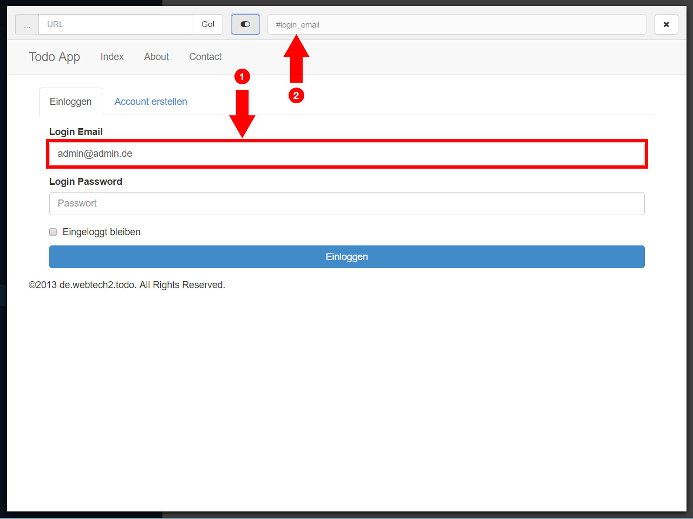

Hover over the input field __(1)__ and it should be highlighted with a thick, red border while at the same time, its selector is displayed on the top __(2)__. 
Click on it to confirm the selection and disable the selection mode. 

Click on the green button which closes the Element Picker. 
As you can see, the selector and the value you have entered are adopted automatically.
Press the __Create__ button to create the action.

You can now continue to create further actions which are displayed here. What it does it the following:

1. Logout the current user (redirects to the index page)
2. Enter the credentials of the admin (2,3) and login (4)
3. Go to the user management page (_/users/all_)
4. On this page there is a button to delete all users with the selector _body > div.page.container > div > div.col-md-9 > a_ which is clicked on
5. The admin is logged out

After that, we save the symbol by clicking on the __Save__ button on the top. 
Note: Don't worry if you accidentally created an action. 
You can safely remove and reorder via drag-and-drop.

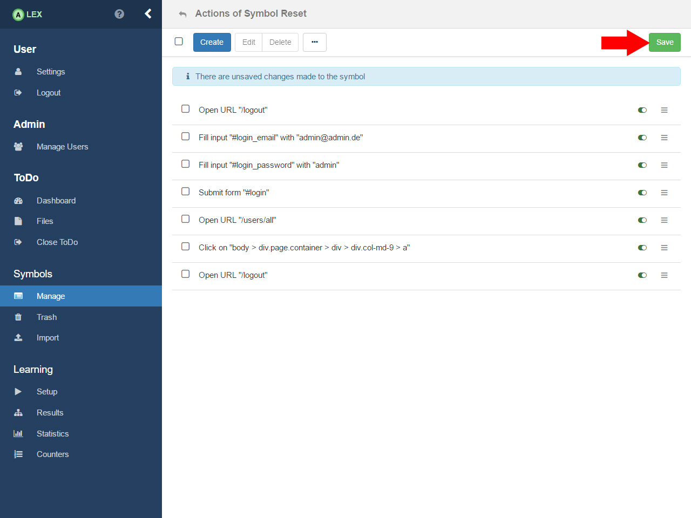

As a practice, you can now continue to model all remaining symbols on your own.

## Learn ToDo

After the symbols have been modeled, you can start learning ToDo. 
Navigate to the setup view by clicking on the item __Setup__ in the sidebar. 

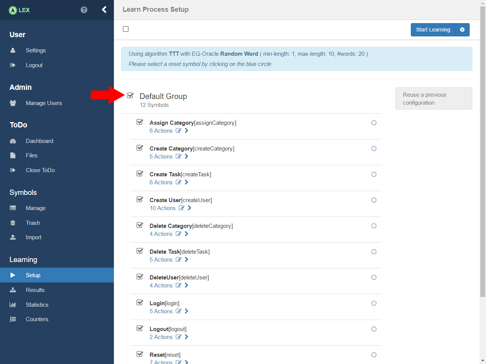

The view looks similar to the one for managing symbols. 
Now, select the symbols that should be learned, but exclude the reset symbol. 

Then, you have to mark the reset symbol as reset symbol explicitly by clicking on the blue circle beside the symbol item.

Before we learn ToDo, we want to configure some parameters for the learning process. 
By clicking on the gear icon on the top right, we open a new modal window that reveals options to configure the process.

Here, we only adjust the equivalence oracle as seen in the image. 
Save the changes by clicking on the __Save__ button.

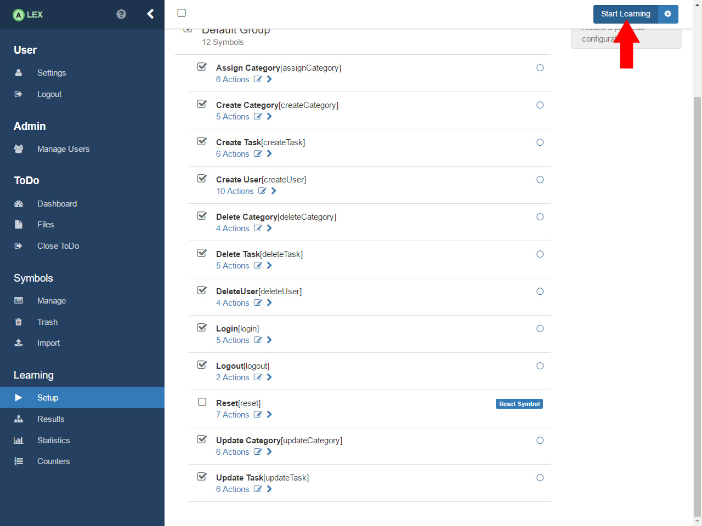

Now, click on the button __Start Learning__ in order to start the learning process with the selected set of symbols and the configuration. 
You are then redirected to a loading page where the current status is displayed. 
After some time, the result will be displayed as a mealy machine of ToDo.

## Model refinement

In the previous section, we learned ToDo and generated a hypothesis of the application, but can we be sure that it really reflects the behaviour of ToDo? 
Because of the nature of black-box systems, we can not. 
So, we now look manually at the automaton and search for paths in the model where we assume they differ from the actual behaviour.

On a closer look, one can see that the path _createUser_, _login_, _createTask_, _createCategory_, _assignCategory_ seems to have a different output than ToDo.
Because after having created a task and a category, we are able to assign the category to the task. 
The expected output is *OK OK OK OK* instead we got *of OK OK OK FAILED(4)*
So we have to check it.

Therefor, click on the gear icon in the top right corner. 
A sidebar appears.

Next, select the __Sample__ eq oracle, which means we want to search for counterexamples manually. 

Then, click the labels of the hypothesis in the order we discussed above. 
By clicking on the button __Add counterexample__, ALEX checks if the sequence differs from the application. 

In case the sequence is a counterexample, a success message will pop up and it is added to the configuration.
To refine the hypothesis, click on the __Resume__ button which will redirect you to the loading page again.

The learner refines the hypothesis with the given counterexample.
 
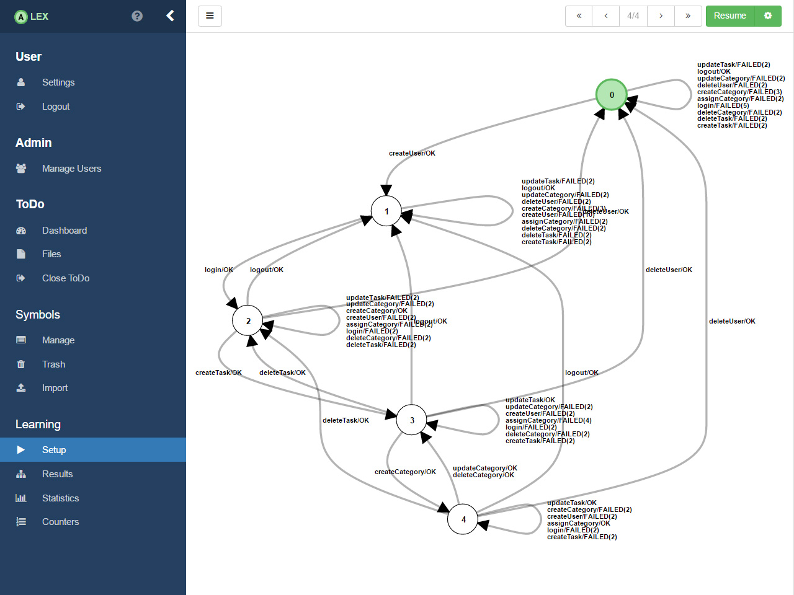
 
After some time, it will output a refined hypothesis which has now one more state than before. 
The sequence now matches the actual behaviour. 
This process can now be continued as long as you think it is necessary.

## Statistics

In ALEX, you can generate statistics of a learning process if you are interested in it.

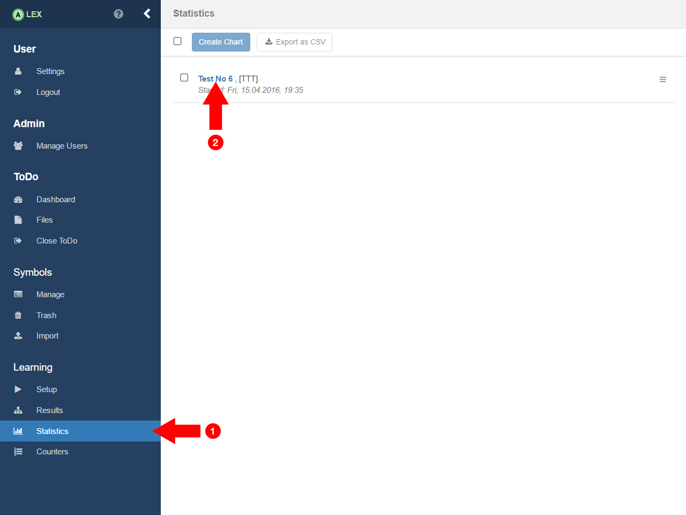

In this case, click on the __Statistics__ item from the sidebar. 
The view opens that lists all learned processes. 
Click on the result you want to view statistics from and some plots are generated.

 
    In the current version of ALEX, the menu item does not exist.
    To get statisitics, go to "Learning > Results" instead.
    There are buttons in the action bar for generating charts.

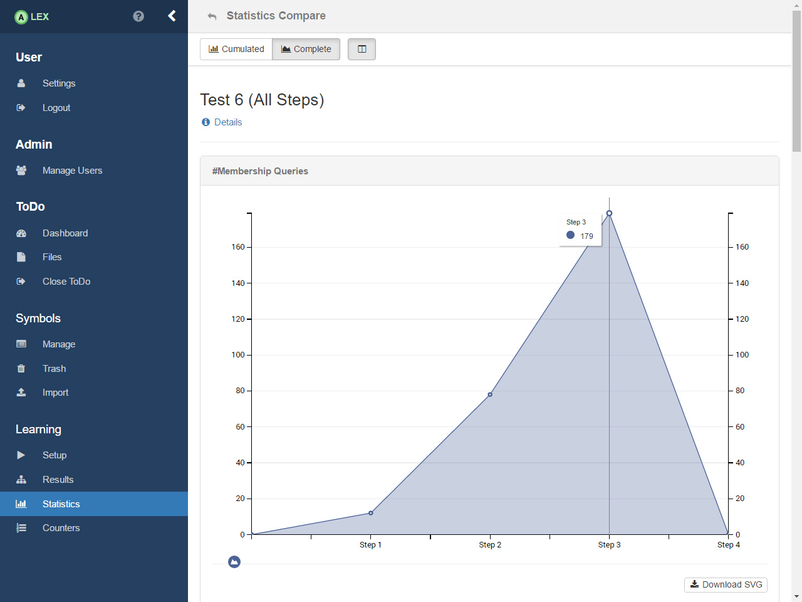

