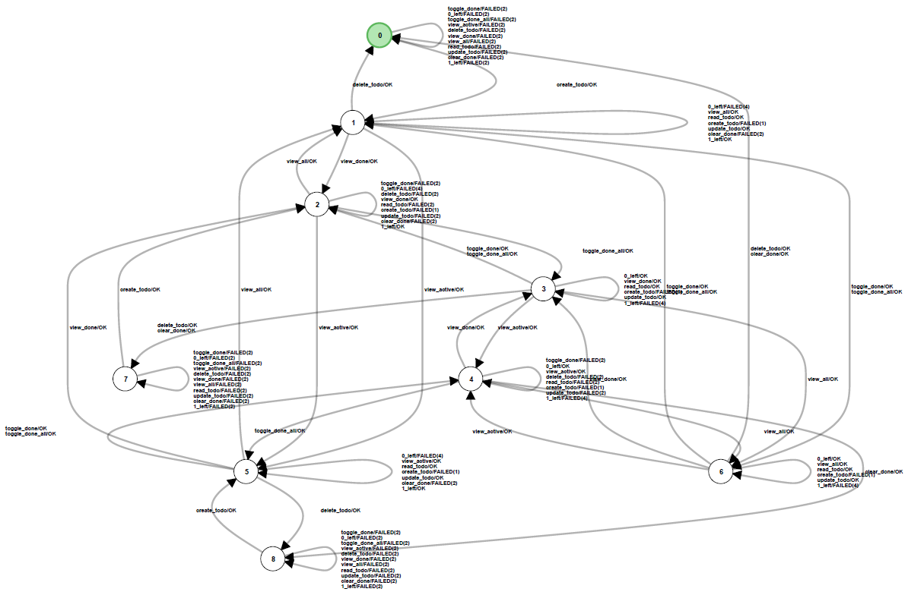
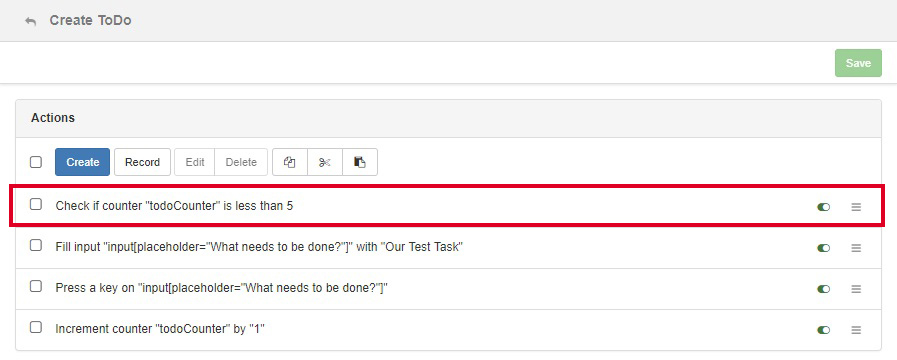

# TodoMVC

In this section, we present all the necessary files and steps in order to learn the majority of all stable implementation of the [TodoMVC](http://todomvc.com/) project.
The symbol sets that we used to learn implementation of TodoMVC can be downloaded from here: [todomvc-symbols.zip](./assets/todomvc-symbols.zip).
In the archive, there is directory *"single"* and a directory *"multiple""*.
The first one contains symbol sets for learning TodoMVC with only one todo at a time.
The latter directory contains symbol sets for learning TodoMVC with two todos at a time.

## Requirements

* A system with Node.js and NPM installed
* Global access to gulp `npm install -g gulp gulp-cli`
* The latest version of ALEX
* Version 1.3 of [TodoMVC](http://todomvc.com/)

## Instructions

Before we start, make sure that TodoMVC is running.
Follow the instructions on the [homepage](http://todomvc.com/) of TodoMVC in order to start the application.
In the following, we assume that TodoMVC runs on port 8080 and is accessible at *http://localhost:8080*.
Further, we learn the *AngularJS* implementation.

### Setup a project

1. In the project overview, create a new project with the URL of a TodoMVC implementation as a base URL, e.g. *http://localhost:8080/examples/angularjs* if you want to learn AngularJS
2. Click on the newly created project

### Import symbols

3. In the sidebar, click on **Symbols > Manage**
4. In the action bar, click on the *Import* button
4. Drop the *angular-symbols.json* from the *single* or *multiple* directory in the provided field and click on *Import*

### Learn TodoMVC

1. In the left menu, under the group *Learn*, click on the item *Setup*
2. Select all symbols except the one called *Reset*
3. Mark the symbol *Reset* as reset symbol
4. In the top right corner, click on the settings button
5. As equivalence oracle, select *Random Word*. We executed all experiments with the parameters (min=30, max=80, words=60, seed=42)
6. In the dialog, select the web driver that you have set up previously
7. Click on *Save*
8. Start the learning process and wait ...

*Note: On our setup with a Core i5 6600k, 16Gb RAM and an SSD the final hypothesis is computed after about one hour.
Depending on your learn setup, e.g. higher parameters for the equivalence oracle, or your pc hardware, the execution time of the learning process may vary.*

The final hypothesis should, in most cases, look like the following:

### Increasing the number of parallel todos

All symbol sets in the *multiple* directory are designed to learn TodoMVC with a maximum of two parallel todo items.
If you want to lean TodoMVC with *n* parallel todo items, open the *Create ToDo* symbol and edit the first action accordingly (see image above for *n = 5*).
