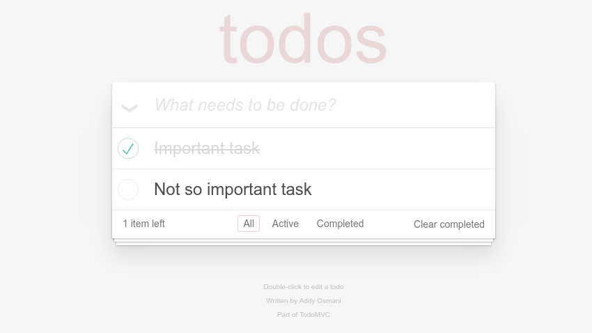

# TodoMVC

In this section, we present all the necessary files and steps in order to learn the majority of all stable implementation of the [TodoMVC](http://todomvc.com/) project.

## Requirements

* The latest version of ALEX
* Version 1.3 of [TodoMVC](http://todomvc.com/)

## Instructions

Before we start, make sure that TodoMVC is running.
Follow the instructions on the [homepage](http://todomvc.com/) of TodoMVC in order to start the application.
In the following, we assume that TodoMVC runs on port 8080 and is accessible at *http://localhost:8080*.
Further, we learn the *React* implementation.

### Import the project

1. In the project overview, click on the import icon in the action bar and select the project in the file *todomvc-react.project.json*
2. Open the project by clicking on the corresponding item in the list.

### Learn TodoMVC

1. In the left menu, under the group *Learn*, click on the item *Setup*
2. Select all symbols except the one called *Reset*
3. Mark the symbol *Reset* as reset symbol
4. In the top right corner, click on the settings button
5. As equivalence oracle, select *Random Word*. We executed all experiments with the parameters (min=30, max=80, words=60, seed=42)
6. In the dialog, select the web driver that you have set up previously
7. Click on *Save*
8. Start the learning process and wait ...