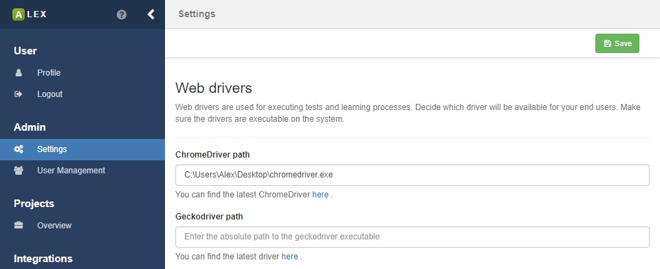

# Configuration

On this page, you find information on how to configure ALEX.


## Command line arguments

The following arguments can be passed to the bundled version of ALEX:

| Argument          | Description                                                                                   |
|-------------------|-----------------------------------------------------------------------------------------------|
| `server.port`     | The port under which ALEX is available <br> `java -jar alex-1.7.0.war --server.port=8000`     |
| `alex.dbpath`     | The path where the HSQLDB is stored. <br> `java -jar alex-1.7.0.war --alex.dbpath=mem:testdb` |
| `chromeDriver`    | The absolute path to the Chrome driver executable on your system                              |
| `edgeDriver`      | The absolute path to the Edge driver executable on your system                                |
| `firefoxDriver`   | The absolute path to the Gecko driver executable on your system                               |
| `remoteDriver`    | The URI to the remote Selenium server                                                         |
| `ltsmin.path`    | The path to the compiles binaries of the LTSmin library                                       |


## Using MySQL

Per default, ALEX uses an embedded [HSQL database][hsqldb] which is stored in the *target/alex-database* directory.
You can however also connect ALEX to a [MySQL 5.7][mysql57] database.
Other databases have not been tested yet.
Create a file called *application.properties* and add the following contents (and change the values according to your setup):

```bash
# application.properties
spring.datasource.url=jdbc:mysql://localhost:3306/alex
spring.datasource.username=root
spring.datasource.password=root
spring.jpa.hibernate.ddl-auto=update
```

Here, we assume that a MySQL server is running under port *3306* and a database called *alex* has been created.
Then, start ALEX and include the *application.properties* file as command line argument:

`java -jar alex-1.7.0.war "--spring.config.location=/path/to/your/application.properties"`

<div class="alert alert-info">
    Note that there is no automated migration to a MySQL database if the file-based HSQLDB has been used before.
    However, we found that [RazorSQL](razorsql) can help in the migration process.
</div>


## WebDrivers

By default, ALEX allows to execute tests in the headless [HtmlUnit](html-unit) browser.
When logged in as a user with **admin** rights, you can also configure all other common web browsers.



On the settings page, various web browsers can be configured.
For each browser, download the corresponding driver executable (as described in the UI) and specify the *absolute path* to the executable in the corresponding field.


There is also the possibility to set a default web driver for executing tests.
Therefor, select the corresponding browser from a dropdown list on the same page.
Ensure that the driver executable is setup before selecting a browser.


## User registration


On the bottom of the settings page, there is the option to enable/disable the user registration.
When disabled, it is not possible for new users to create an account, not via the UI and the REST API.
However, accounts that have already been created can still be used to login.


[hsqldb]: http://hsqldb.org/
[mysql57]: https://dev.mysql.com/downloads/mysql/5.7.html
[html-unit]: http://htmlunit.sourceforge.net/
[razorsql]: https://razorsql.com/
