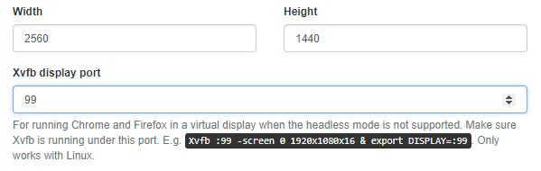

# Installation

In order to use ALEX on your system, make sure that **Java 8** installed.
Further, a **modern browser** like Google Chrome, Mozilla Firefox or Microsoft Edge with JavaScript enabled is required to use the web interface.


## Bundled version

1. [Download][download] the latest version.
2. Open a terminal and start ALEX via `java -jar alex-1.6.0.war`.
3. Wait until the command line prints something like `Started App in XX.XXX seconds`.
3. Open *http://localhost:8000* in a web browser.

After the first start, you can login as an admin using the account below:

Email: *admin@alex.example* <br>
Password: *admin*


## From source

In order to build ALEX from source, make sure that you have the following software installed:

* Java JDK 8
* Maven 3
* Node.js (v10.0.0) and the NPM (v6.0.0)

To build ALEX, open a terminal and follow the instructions below:

```bash
# clone the repository
git clone https://github.com/LearnLib/alex.git

# navigate to the project directory
cd alex

# build ALEX
mvn install package [-DskipTests]
```

The bundle can then be found at `build/target/alex-build-1.6.0.war`.
Run it using the instructions for running the bundled version from above.


## Docker

We also offer a Docker image that contains a Linux environment with the following software:

* ALEX v1.6.0
* Chrome v69
* Firefox v63

The image can be found [here](docker).
The Docker container exposes the **port 8000** under which ALEX is available after the start.
Additionally, tests and learning processes are executed in a virtual [Xvfb](xvfb) display with a Full HD resolution **(1920x1080)**.
In order to run tests and learning processes, specify the display port **99** in ALEX in the configuration menu:

<figure class="bordered">
    
</figure>

[download]: https://github.com/LearnLib/alex/releases/download/v1.6.0/alex-1.6.0.war
[docker]: https://github.com/scce/docker-images/tree/master/alex-server
[xvfb]: https://packages.debian.org/en/sid/xvfb
