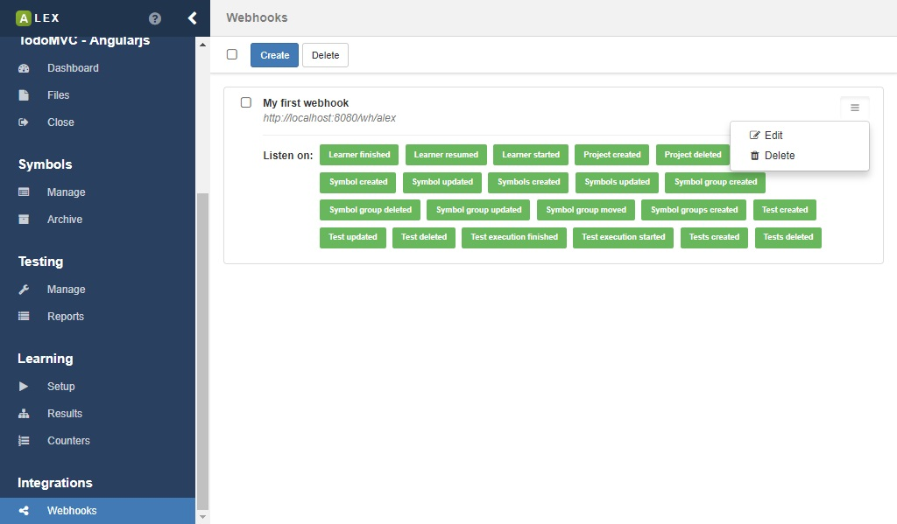
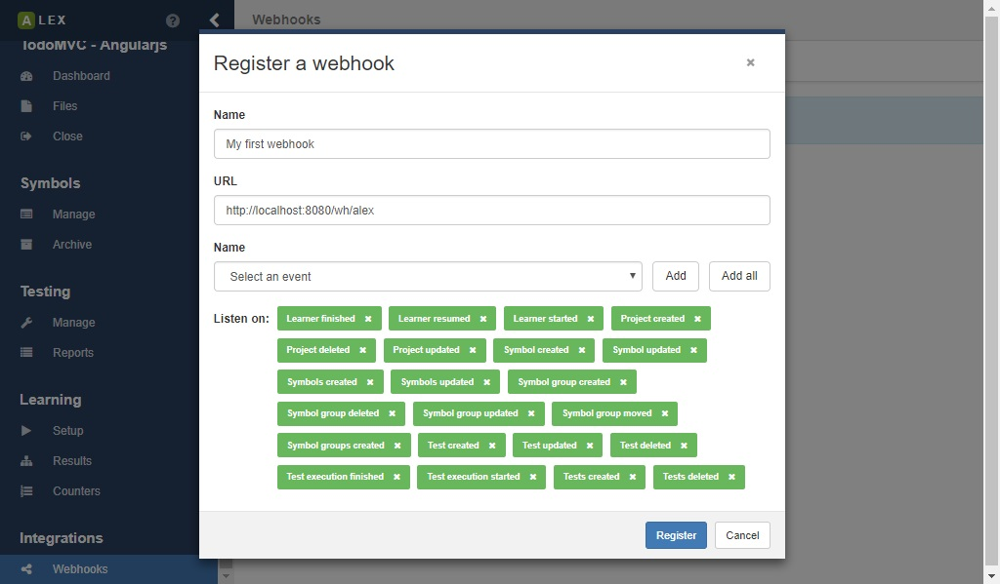

# Integrations

ALEX offers some ways for integration in third party applications.

## Webhooks

[Webhooks][webhooks] are a way to let third party applications know about events that happen in your system.
These application have to register a webhook by specifying a URL.
When an event occurs, e.g. a learning process finished, ALEX sends a HTTP request to the registered URL.
If a body is send along the HTTP request, it is formatted as JSON object.

    Currently, if the target server cannot be reached within 3 seconds, the request is cancelled.
    ALEX also does not provide a retry mechanism at the moment.

You can manage webhooks under the **Integrations > Webhooks** item in the sidebar.
On the page a list of registered webhooks is displayed.

To create a new webhook, click on the **Create**-button.
In the dialog, specify the following properties in the modal dialog:

| Property | Description                                            | Required |
|----------|--------------------------------------------------------|----------|
| Name     | The name of the webhook, e.g. the name of the service. | no       |
| URL      | The URL where events are send to.                      | yes      |
| Events   | The list of subscribed events.                         | yes      |

There are numerous events for all kind of actions that are performed in ALEX internally.
The names of the events should be self explaining. 
For almost all events, the corresponding entity that the event deals with is send as a JSON object to the registered endpoint.
Only for *... deleted* events, the ID of the entity is send to the client.

[webhooks]: https://en.wikipedia.org/wiki/Webhook
