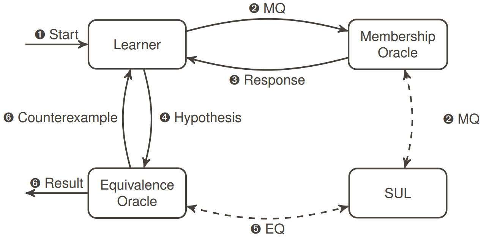
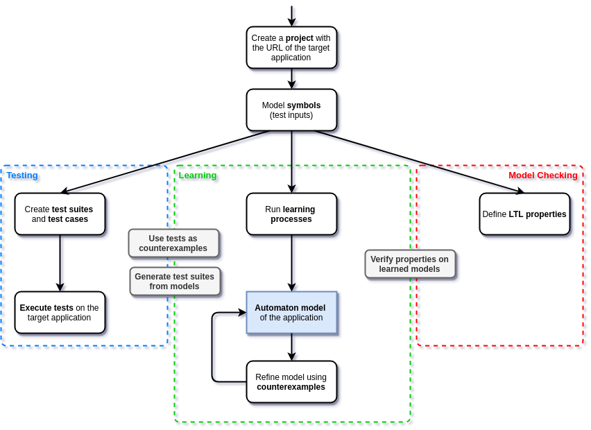

# User manual

Here and in the following sections, we present a detailed explanation of the concepts and ways to use ALEX.
If you find bugs of any kind relating this application or inaccuracies in this manual, [let us][mails] know.

[mails]: mailto:alexander.bainczyk@tu-dortmund.de,alexander.schieweck@tu-dortmund.de

## Features

ALEX offers a simplicity-oriented way to model and execute learning experiments for web applications and web services using active automata learning. 
Since version 1.5.0 ALEX has been extended to support conventional testing as well.
Based on features of [LearnLib][learnlib] and inspired by the [LearnLib Studio][learnlibStudio], ALEX lays a focus on the ease to use of the tool while offering an extensive feature set, including:

* Inferring Mealy machines of web applications and web services using active automata learning techniques
* Graphical symbol and learning process modelling
* Automatic generation and visualization of
    * Models
    * Algorithmic data structures (observation table and discrimination tree)
    * Statistics of learning experiments
* Simultaneous learning of web applications and web services
* Various learning algorithms and equivalence approximation strategies
* GUI testing capabilities
* And much more...

## Required skills

As a user of ALEX and tester of web applications, you should

* be familiar with HTML and CSS
* be familiar with REST interfaces and exchange formats like JSON
* have logical thinking abilities
* have a basic understanding of active automata learning
* have a basic understanding of web application testing

It helps if you are familiar with programming in general and have already used Selenium.

## Terminology

This document contains some terms related to automata learning which are listed in the following:

<definition term="System under Learning">
    The system we want to infer an automaton model from.
    Often also called system under testing (SUT).
</definition>

<definition term="Symbol">
    We differentiate between input and output symbols.
    Input symbols are modeled by the user and define possible inputs to a system.
    Output symbols specify how the system reacts to inputs.
</definition>

<definition term="Word">
    A sequence of symbols, e.g. *Authenticate, Create Entity, Read Entity, Delete Entity, Logout*.
</definition>

<definition term="Learner">
    A learner infers an automaton model of an application by posing words to the SUL and analyzing its outputs.
</definition>

<definition term="Membership query">
    The words the learner poses to the system are called membership queries.
</definition>

<definition term="Equivalence query">
    An equivalence query is posed by an equivalence oracle. 
    It checks whether the learned automaton represents the behavior of the tested application correctly.
</definition>

<definition term="Hypothesis">
    A hypothesis is the behavioral automaton model that is learned.
    The model is called hypothesis due to the black box nature of the SUL. 
    Theoretically, there can always exist a behavior that is not captured by the model.
</definition>

<definition term="Counterexample">
    A counterexample is a word, where the output of the system and the learned model differ.
    Counterexamples are used to trigger the refinement of the model.
    We call a model the <em>final hypothesis</em>, if no counterexamples can be found.
</definition>

The following graphic illustrates the general learning process and thus the relation between the terms listed above.

## Workflow

Roughly speaking, the functionality of ALEX can be separated in two aspects: *testing* and *learning*.
The following diagram illustrates the basic workflow.

As you can see, the difference between testing and learning is that while tests either pass or fail to execute, a behavioral model is generated while learning.
In this user manual, we will go deeper into the single steps listed in the diagram.

[learnlib]: https://learnlib.de/
[learnlibStudio]: http://ls5-www.cs.tu-dortmund.de/projects/learnlib/download.php
