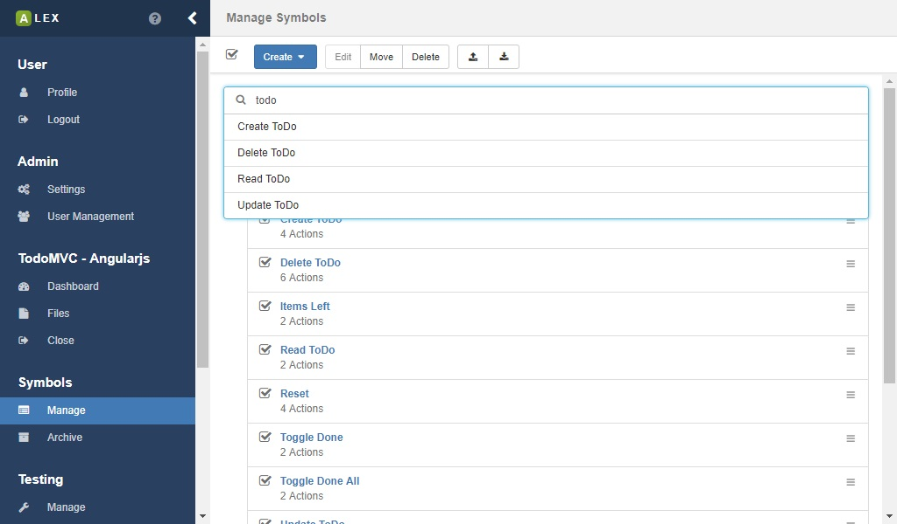
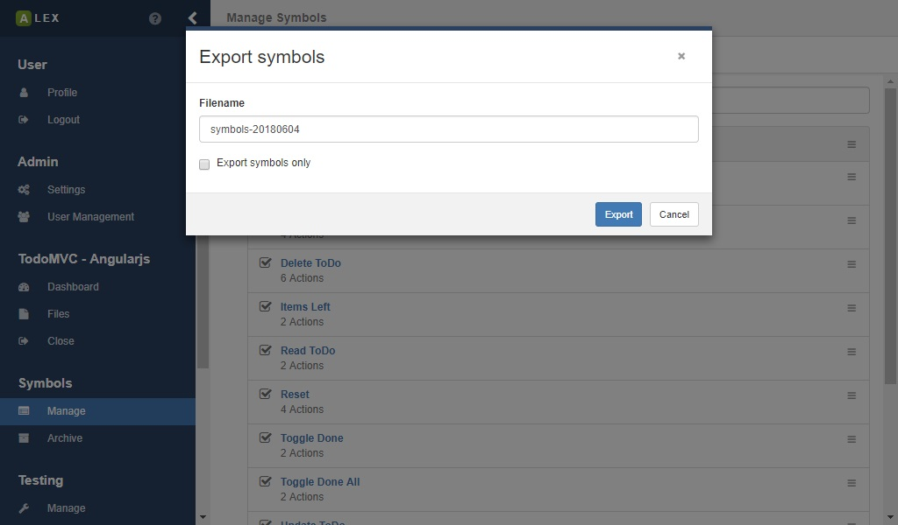
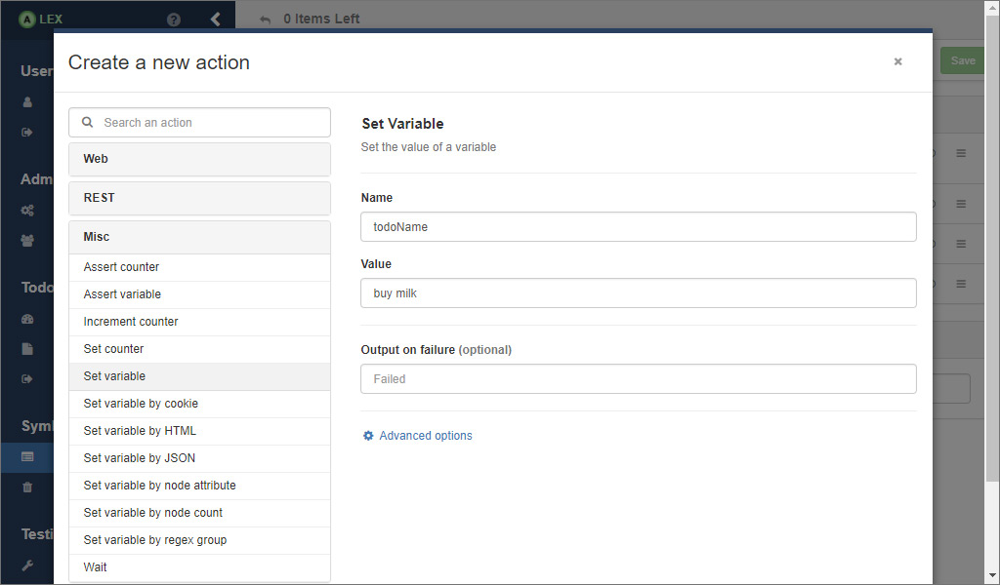
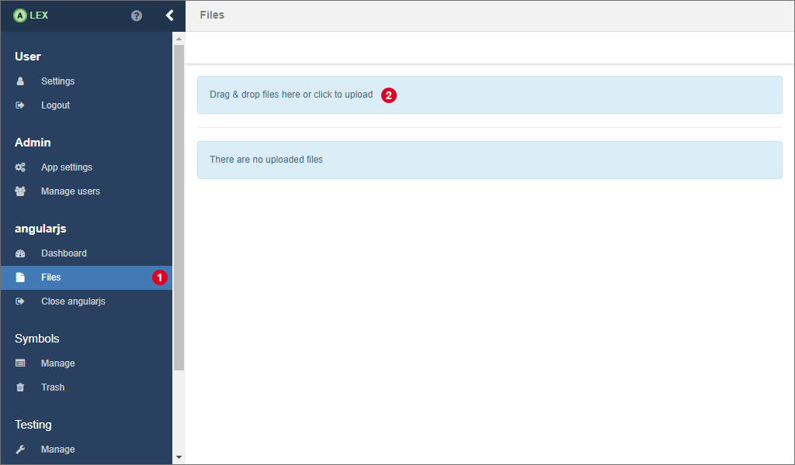

# Symbol management

The modelling of input symbols is a key aspect of using ALEX.
They define interactions with the system under learning and thus are the building blocks of every learning process and test case.


Once you have logged in and opened a project, click on <span class="label">1</span> to open the view for the symbol management.


## Symbol groups

Symbol groups are logical container for symbols.
Per default, there is a default group that is created during the creation of the project.
The default group can not be deleted, and all symbols, if not specified otherwise, are put into it.
You can create a new group by clicking on <span class="label">2</span> and select the corresponding item from the dropdown menu.
You are then asked for a name for the group, which has to be unique.
Once a group has been created, you can edit and delete it, by clicking on the *gear* icon that is found on the right.


## Symbols

When creating a new symbol (see <span class="label">2</span>), you have to specify two properties:

| Name          | Description                                                                             |
|---------------|-----------------------------------------------------------------------------------------|
| Name          | A unique name of the symbol                                                             |
| Symbol group  | The group the symbol belongs to. Per default, the default group of the project is used. |

Once the symbol has been created successfully, it appears in the specified group.
For each symbol, there is a list of operations that are accessible by clicking on the menu <span class="label">3</span> of which most are self explanatory.
In the menu on top of the page, these operations are available for a batch of symbols.

Each symbol contains of a sequence of actions, that are managed in a separate view.
Click on the link below the symbol name or the item *Actions* in menu <span class="label">3</span> to open the action management for the symbol.

### Searching symbols



Directly below the action bar, a search input is displayed which you can use to quickly find symbols.
A click on a result redirects you to the symbol page.

### Restoring archived symbols

Once you archived a symbol, it is not really removed from the database, instead, they are put into the symbol archived.
Symbols cannot be deleted permanently, because they still might be referenced by e.g. learner results or test cases you have created.


You can see all archived symbols in the archive overview which can be accessed via the item *Archive* in the sidebar.
Here you can do here is to recover symbols or edit their name.
A recovered symbol is then moved into the default group.

### Export & import

If you want to save a set of symbols for another project or use existing ones, ALEX offers an export and import feature.
Note that existing symbol groups are not exported in order to be compatible with other projects.



In order to export symbols, select the corresponding symbols in the overview and click on the export button <span class="label">1</span>.
You are then asked for name of the JSON file which will be downloaded.
Additionally, you can decide if only the selected symbols are exported, or if the symbol groups that they are in are exported as well.


In the same view, you can import existing symbols from a JSON file by clicking on <span class="label">2</span> which opens a modal window.
Here, drag and drop the JSON file you exported in the previous step.
The import will not work unless the names of the symbols are unique within the project.
If everything goes fine, the modal window will close automatically and the symbols appear in the selected group.

### Symbol parameters


Symbols have input and output parameters for variables and counters (see next section for more information).


Variables and counters are read from and written into and a global store during a membership query, see the image above.
Before a variable or counter can be used in a symbol, it has to be defined in as input parameter for the symbol.
Local modifications of variables and counters do not affect the global context unless they are written back as output.

If you use a variable or a counter that has not been defined, the execution of the symbols fails and the output is: *Undefined variable: Name*, or *Undefined counter: Name* respectively.


## Actions

The function of a symbol is defined by its actions and their execution order. 
An action can be understood as an atomic interaction with a system, like clicking on a button, submitting a form, making an HTTP request to a REST API and so on.


In the actions view of a symbol, the sequence of actions, which can be rearranged via drag and drop, is displayed.
Everything you do here is not saved automatically.
Instead, a notification on the top <span class="label">3</span> notifies you that something has changed.
A click on the *Save* button saves the action and you are safe to navigate to another page.


A click on the create button opens a modal window, where, on the left, the list of all possible actions is listed.
On the right, the form for a selected action is displayed. 
With <span class="label">4</span> you can search for an action by its name instead of searching it in the list.

Each action can be marked with three different flags which are

| Flag          | Description                                                                                                        |
|---------------|--------------------------------------------------------------------------------------------------------------------|
| negated       | Negates the outcome of an action.                                                                                  |
| ignoreFailure | If this flag is set to "true" proceeding actions are executed although the action failed.                          |
| disabled      | If this flag is set to "true" its execution is skipped during the call of its symbol. <span class="label">2</span> |

Normally, the output of a system is either *"Ok"* or *"Failed"* depending on success of the execution of the symbol.
If this is not expressive enough, you can also specify a custom failure output of each action that is propagated to the symbol.
Insert the custom output in <span class="label">6</span> (image above).
In this field, dynamic values can be inserted as well (see section about variables and counters below).

In the overview, you see another input field for the custom success output of the symbol.
The value that is inserted here will be the output in case all actions can be executed successfully.
Note that there can be dynamic outputs as well via variables and counters (see below).


A useful feature is that you can also use copy, cut and paste operations on actions, if e.g. symbols behave similar.
The option for this can be found in the dropdown menu on the right of each action or for a batch operation on selection actions in the action bar on top <span class="label">7</span>.

In the next sections, we go a little deeper into the single categories of actions.

### Web actions

Web actions are used to interact with a browser interface like a normal user would. 
They are based on Selenium and ALEX offers a subset of the Selenium functionality that are presented in the table below.

| Name                   | Description                                                                  |
|------------------------|------------------------------------------------------------------------------|
| Alert - Accept/Dismiss | Accepts or dismisses an alert dialog.                                        |
| Alert - Get Text       | Save the displayed text of an alert/confirm/prompt window in a variable.     |
| Alert - Send keys      | Send user input to a prompt alert.                                           |
| Browser                | Refresh or restart the browser instance.                                     |
| Check Attribute        | Checks the value of an attribute of an element                               |
| Check Node             | Check if a certain element is present on the website.                        |
| Check Node Selected    | Check if a radio button, a checkbox or an option in a select box is selected.|
| Check Text             | Check if a certain text is part of the website body.                         |
| Check Title            | Checks if the page title is a certain string.                                |
| Clear                  | Clear an input field.                                                        |
| Click                  | Click or double click on an element.                                         |
| Click Link By Text     | Click on a link with a specific text value.                                  |
| Execute JavaScript     | Execute a JavaScript snipped in the page.                                    |
| Fill                   | Clear and fill an input field with some text.                                |
| Open URL               | Request a specific site.                                                     |
| Move Mouse             | Move the cursor to a specific element or coordinates                         |
| Press Key              | Press a special key on the keyboard                                          |
| Submit                 | Submit a form.                                                               |
| Select                 | Select an option form an select input field.                                 |
| Switch to              | Switch back to the parent content or the default content from another frame. |
| Switch to Frame        | Switch the Selenium context to another frame.                                |
| Wait for Attribute     | Wait until an attribute of an element has or contains a specific value.      |
| Wait for Text          | Wait until a specific text is visible on the website.                        |
| Wait for Title         | Wait until the title of a page changes.                                      |
| Wait for Node          | Wait until the state of an element changes.                                  |

More detailed information about the parameters of each web action is omitted here, since the forms in the frontend should be labeled sufficiently.

If you play around a little with the action editor, you may realize that most web actions require you to enter a CSS or an XPath expression to an element. 
This may be not that easy to find out in case you are not very familiar with HTML, CSS or XPath. 
So, there is a button that is labeled with *"Element Picker"*. 
This is a special feature of ALEX for extracting selectors elements from your website directly without having to know HTML.

### REST actions

REST actions are the counterpart to web actions. They are used to communicate with REST APIs. 
The table below shows a list of available actions.

| Name                   | Description                                                     |
|------------------------|-----------------------------------------------------------------|
| Check Attribute        | Check if the response has an specific attribute.                |
| Check Attribute Type   | Check if an attribute in the response has a specific type.      |
| Check Attribute Value  | Check if an attribute in the response has a specific value.     |
| Check Header Field     | Check if the response has a certain header field.               |
| Check Status           | Check if a previous response returned the expected HTTP status. |
| Make Request           | Makes an HTTP request                                           |
| Search in Body         | Search for a piece of text in the HTTP response body.           |
| Validate JSON          | Validate the body of a response against a JSON schema.          |

Keep in mind that working with HTTP requests and responses follows a certain pattern. 
Normally, you make a request and analyze the results. 
The order of your REST actions should also look like that. 
Start with a *Make Request* action and use other actions to work with the response.
The context of the *Make Request* action, namely the HTTP response, is passed to the following actions until the next *Make Request* action is made.

### General actions

Actions of this group allow the interaction between different symbols and actions, for example by storing and passing String and Integer values to other actions.

| Name                           | Description                                                         |
|--------------------------------|---------------------------------------------------------------------|
| Assert Counter                 | Asserts the value of a counter.                                     |
| Assert Variable                | Asserts the value of a variable.                                    |
| Increment Counter              | Increment a counter by a given value.                               |
| Set Counter                    | Set a counter to a new value.                                       |
| Set Variable                   | Set a variable to a new value.                                      |
| Set Variable by Cookie         | Set a variable to the value of a cookie                             |
| Set Variable by HTML Element   | Set a variable to a value form a website element.                   |
| Set Variable by HTTP Response  | Set a variable to the body of a HTTP response.                      |
| Set Variable by JSON Attribute | Set a variable to a value form a JSON response.                     |
| Set Variable by Node Attribute | Set a variable to the value of an attribute of an element.          |
| Set Variable by Node Count     | Set a variable to the number of elements matching a selector.       |
| Set Variable by Regex Group    | Set a variable to a group in a regex match.                         |
| Wait                           | Wait for a specific amount of time.                                 |

## Variables, counters and files

Many web applications handle dynamic data and allow file uploads. 
In order to model and learn such behaviors and to pass data between symbols, actions and learn processes, *variables*, *counters* and *files* can be used.

<dl>
    <dt>Variables</dt>
    <dd>
        Variables contain (also empty) String values and are kept alive for a single membership query.
    </dd>
    <dt>Counters</dt>
    <dd>
        Counters are positive integer values that are persisted in the database per project. 
        They can be incremented and modified at will using corresponding actions. 
        Usually, they are used to create multiple objects of the same kind, e.g. user1, user2, ... and so on. 
        Further, counters can help to model a system reset and thereby allow a consecutive execution of multiple learn processes without having to manually reset the application in between every test.
    </dd>
    <dt>Files</dt>
    <dd>
        In order to learn websites that allow its users to upload files, this feature can be used as well.
        See <a href="file-upload">this page</a> for a more detailed description and their usage.
    </dd>
</dl>

In order to make use of those in actions, there is a template language that has to be used in action fields:

::: v-pre
| Notation           | Description                                                           |
|--------------------|-----------------------------------------------------------------------|
| {{#counterName}}   | The value of the counter with the name *counterName* is inserted      |
| {{$variableName}}  | The value of the variable with the name *variableName* is inserted    |
| {{\\filename.ext}} | The absolute path of the file *filename.ext* is inserted              |
:::

The following example demonstrates the usage of variables.
The process can be transferred easily for counters and files.



Assume we have an application that manages todo items and the element with the selector `#new-todo` is the input field that allows a user to create a new item.
We now want to insert the content of the item dynamically via a variable.
First, create an action that sets the value of the variable.
As you can see in the picture above, there are some choices for how to do this.


Then, we create another action that inserts the value of the variable into the element `#new-todo`.
In the input field for the value, we use the notation from the table above to indicate that we want to insert the value of the variable *todoName*.

As soon as the action is executed, the value of *todoName* is inserted automatically. 
In the todo list, a todo with the text *"buy milk"* would appear in the application.


## HTML element picker

For modeling actions that interact with the web browser, we need to specify the unique selector to the element we want to interact with.
A HTML document usually looks like this:

```html
<!DOCTYPE html>
<html>
<head>
</head>
<body>
  <div class="container">
    <a id="link" href="#">Link A</a>
    <a href="#">Link B</a>
  </div>
</body>
</html>
```

For example, the first link has an ID, so the selector would simply be `#link`.
The second link does not have an ID, so the selector corresponds to the path from the body (or a parent element with an ID) to that element.
Here, the selector for the second link would be `body > div:nth-child(1) > a:nth-child(2)` which reads as *the second direct child "a" node in the first direct child "div" node of the body*.

As you can imagine, websites are not necessarily structured that simple and elements are nested deeply.
The deeper an element that has no ID is in the tree, the longer and therefore more complex the selector to that element might be.
Writing these selectors by hand is error prone and unnecessary hard.

Because of this, we offer a feature we call *Element Picker* which extracts the selector of an element automatically.


To use the element picker while creating an action, click on the corresponding button <span class="label">1</span>.


The element picker pops up and loads the web application that you specified in the project into an iframe.
Per default, you will get a message in the header that you see in the image above.
Normally, web browsers deny access to the structure of the website inside of an iframe due to security reasons.
In order to use the element picker as intended, follow the following instructions and restart the web browser:

| Browser | Instructions                                                                                                             |
|---------|--------------------------------------------------------------------------------------------------------------------------|
| Firefox | Install a plugin like [CORS Everywhere][cors-everywhere]                                                                 |
| Chrome  | Start chrome with disabled web security parameters: `--disable-web-security --user-data-dir` or install a similar plugin |


Finally, the element picker will look like displayed above.
Start the selection by clicking on the button with the toggle icon <span class="label">2</span>.
The button on the right lets you switch between the CSS selector and an equivalent XPath expression.


Select an element by moving your mouse over the target element, which is highlighted with a big, red border <span class="label">3</span>.
In the header, the selector to the element is displayed.
If you are satisfied with the selection, just click on the element.


Finally, accept your selection by clicking on <span class="label">4</span> or start over.


The selector, and in some cases other data is automatically inserted into the corresponding input field <span class="label">5</span> of the action.

[cors-everywhere]: https://addons.mozilla.org/de/firefox/addon/cors-everywhere/

### Using the web browser

If you encounter issues with the element picker, you can also use your favourite web browser to get the selectors of elements.
Here, the usage of **Chrome** for this is demonstrated, but the procedure can be transferred to other web browsers as well.


First, right click on the target element and click on *"Inspect"* <span class="label">1</span>.


This will open the developer tools of the web browser which displays the structure of the website and highlights the corresponding element in blue.
Perform a right click on the highlighted element and navigate to *"Copy > Copy selector"* <span class="label">2</span> or *"Copy XPath"*.
The unique selector to the element is copied into the clipboard and can be pasted into the input field in ALEX.

<div class="alert alert-info">
    In Firefox, the extracted selector might not be unique, so use them with caution.
</div>


## Using files

### Upload

A special functionality we want to present here is the upload of files to the target application via an action, since there is no dedicated action for that.
For this to work, two requirements have to be met:

1. All files have to be uploaded into ALEX first.
2. The file upload only works with native `<input type="file">` elements.
3. The execution of JavaScript has the be enabled by the targeted web driver.



For uploading files into ALEX, navigate to the *files* page by clicking on the corresponding item in the sidebar <span class="label">1</span>.
Then click on <span class="label">2</span> to open a native file choosing dialog or drag and drop files directly in that element.


Then, click on the upload button <span class="label">3</span> to start the upload.
The progress indicator indicates how much of a file has already been uploaded.


Once the upload is completed, the files are displayed in a list.

### Download

Once you have uploaded a file, you can also download it again.
Therefor, click on the corresponding menu item in the dropdown menu of a file.
